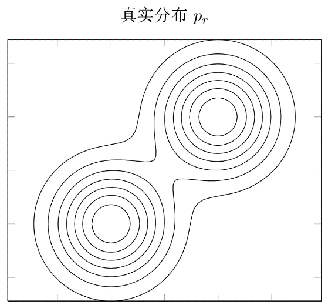
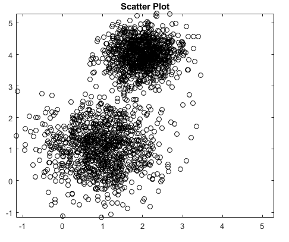

# CH2

## 机器学习基础

### 概要

#### 机器学习的定义

> 让计算机从数据中进行自动学习, 得到某种知识(规律).

- **Definition of ML (Mitchell, 1997): WELL-POSED LEARNING PROBLEMS.**
  - A computer program is said to learn from experience **E** with respect to some class of tasks **T** and performance measure **P**, if its performance at tasks in **T**, as measured by **P**, improves
with experience **E**.

> ##### Examples
>
> - A computer program that learns to play checkers
>   - **T**ask: playing checkers games;
>   - **E**xperience: obtained by playing games against itself;
>   - **P**erformance Measure: percent of games won against opponents
> - A handwriting recognition learning problem:
>   - Task **T**: recognizing and classifying handwritten words within images
>   - Performance measure **P**: percent of words correctly classified
>   - Training experience **E**: a database of handwritten words with given classifications
> - A robot driving learning problem: an example from (Mitchell, 1997)
>   - Task **T**: driving on public four-lane highways using vision sensors;
>   - Pet-fort-nance **p**: average distance traveled before an error (as judged by hut-nan overseer)
>   - Training experience **E**: a sequence of images and steering commands recorded while observing a human driver;
> - Spam classification
>   - Task **T**: determine if emails are Spam or non-Spam.
>   - Experience **E**: Incoming emails with human classification
>   - Performance Measure **P**: percentage of correct decisions

#### 机器学习的分类

依据数据信息的 **监督** (标注)程度, 机器学习可以分为:

- 监督学习(Supervised Learning)
    > 大量数据要(人工)标注
- 半监督学习(Semi-supervised Learning)
    > 部分数据标注 + 大量数据无标注
- 弱监督学习(Weakly Supervised Learning)
    > 数据仅粗粒度标注
- 无监督学习(Unsupervised Learning)
    > 大量数据无标注

##### 分类概览

- 监督学习(Supervised Learning)
    > $$
    > loss(D)= \min_{\theta} \frac{1}{N} \sum _{i = 1} ^{N} loss(f(X_i)Y_i)
    > $$
- 半监督学习(Semi-supervised Learning)
    > $$
    > loss(D_1, D_2)= \min_{\theta} \frac{1}{N} \sum _{i = 1} ^{N} loss(f(X_i)Y_i) + \frac{1}{M} \sum _{i = 1} ^{M} loss(Z_i, R(Z_i, X))
    > $$
    >
    > 其中, $ f(.) $ 属于模型集 $ F $, $ R(Z_i, X) $ 属于task-specific函数, 表示无表记数据 $ Z_i $ 与标记数据 $ X $ 之间的关系
- 弱监督学习(Weakly Supervised Learning)
    > $$
    > loss(D)= \min_{\theta} \frac{1}{N} \sum _{i = 1} ^{N} loss(f(X_i)C_i)
    > $$
    >
    > 其中, $ C_i $ 表示 **粗粒度(coarse-grained)** 标记, 如: 以组给出标记
- 无监督学习(Unsupervised Learning)
    > - 无需任何人工标注信息
    > - 仅一组数据, 在该其中寻找规律, 如子空间描述
    > - **方法: 聚类、降维 (PCA) 、自编码器 (AE/VAE)**

##### 监督学习

- Practical Learning Algorithms
  - Deep Learning
  - Support Vector Machine (SVM)
  - Boosting
  - Random Forest
- Learning Theory
  - Mathematical Formulation of Supervised Learning
  - Generalization
  - Optimization Method
  - Machine Learning Architectures and Approximation Capability

> **Three Components of Deep Learning**
>
> - Model (Architecture)
>   - CNN for images, RNN for speech, Transformers for everything
> - Optimization on Training Data
>   - Learning by optimizing the empirical loss, high-dimensional nonconvex optimization
>   - Practical methods: Stochastic Gradient Descent (SGD) and its variants (Momentum, Adagrad, Adam...)
> - Generalization to Test Data
>   - Generalization bounds
>   - Use regularization to prevent overfitting (dropout, weight decay, early stopping...)

##### 无监督学习

- General Framework:
  - Unlike supervised learning, we do not have the labels of the data in
unsupervised learning framework.
  - Main task: Detect the hidden structure of the "unlabeled" data
  - Two specific tasks:
    - Clustering, a class of methods for discovering unknown subgroups in data.
    - Dimension reduction

> ***P.S.***
>
> Unsupervised Learning by Extreme Value Theory
>
> <https://arxiv.org/abs/2202.09784>

## Details

### 基本概念

1. 样本(示例, sample, instance): 每一个数据对象
2. 特征(属性, attribute, feature): 描述样本某方面表现或性质的数据
3. 数据集(data set): 一组样本构成的集合
4. 训练集(training set): 用于训练的数据集
5. 测试机(testing set): 用于检验模型好坏的数据
6. 函数: 近似每个样本的特征$x$与标签$y$之间的映射关系
7. 算法(学习器, algorithm, learner): 寻找到"最优"函数的方法
8. 学习(训练, leaning, training): 寻找函数的过程

### 机器学习的过程

通过 **算法** 使得机器能从大量 **数据** 中 **学习** 规律, 从而得到输入数据到目标标签的映射 **函数**, 并对新的样本做决策.

### 机器学习的三个基本要素

- 模型
  - 线性模型
    > $$
    > f(x, \theta) = w ^{T}x + b
    > $$
  - 非线性模型
    > $$
    > f(x, \theta) = w ^{T} \Phi(x) + b
    > $$
    > - 如果 "$\Phi(x)$" 为可学习的非线性基函数, "$f(x, \theta)$" 就等价于神经网络
- 学习准则
  - 期望风险
    > $$
    > \mathcal{R}(f) = \mathbb{E} _{(x, y) \sim p(x, y)} [\mathcal{L}(f(x), y)]
    > $$
    > - $\mathcal{L(f(x), y)}$为损失函数
- 优化
  - 梯度下降

#### 模型例子

### 损失函数

- 0-1损失函数(0-1 Loss Function)
  > $$
  > \mathcal{L}(y, f(x, \theta)) = \left\{
  > \begin{aligned}
  > 0, & \quad y = f(x, \theta) \\
  > 1, & \quad y \neq f(x, \theta)
  > \end{aligned}
  > \right.
  > $$
- 平方损失函数(Qudratic Loss)
  > $$
  > \mathcal{L}(y, \hat{y}) = (y - f(x, \theta)) ^{2}
  > $$
- 交叉熵损失函数(Cross Entropy Loss)
  > $$
  > \begin{aligned}
  > & p(y = c|x; \theta) = f _{c}(x; \theta), \\
  > & 并满足 f _{c}(x; \theta) \in [0, 1], \sum _{c = 1} ^{C} f _{c}(x; \theta) = 1
  > \end{aligned}
  > $$
- Hinge 损失函数(Hinge Loss)
  > $$
  > \mathcal{L}(y, f(x, \theta)) = \max(0, 1 - yf(x; \theta))
  > $$

#### 风险最小化准则

- 期望风险未知, 通过经验风险 (Empirical Risk) 来近似, 即训练集的平均损失
  > $$
  > \mathcal{R} _{\mathcal{D}} ^{emp}(f) = \frac{1}{N} \sum _{i = 1} ^{N} \mathcal{L}(y^{(n)} f(x^{(n)}; \theta))
  > $$
- 经验风险最小化
- 在选择合适的风险函数后, 我们寻找一个参数 $\theta _{*}$, 使得经验风险函数最小化
  > $$
  > \theta ^{*} = \arg \min _{\theta} \mathcal{R} _{\mathcal{D}} ^{emp}(\theta)
  > $$

### 最优化问题

> 选择完风险函数后, 机器学习问题就转化成为一个最优化问题

$$
\min _{x} f(x)
$$

#### 梯度下降法(Gradient Descent)

$$
\begin{aligned}
  \theta _{t + 1} & = \theta _{t} - \alpha \frac{\partial \mathcal{R}(\theta)}{\partial \theta _{t}} \\
  & = \theta _{t} - \alpha \frac{1}{N} \sum _{i = 1} ^{N} \frac{\partial \mathcal{L}(\theta _{t}; x^{(i)}, y^{(i)})}{\partial \theta}
\end{aligned}
$$

> 👆 其中, **搜索步长 $\alpha$**, 也叫 **学习率(learning rate)**

##### 随机梯度下降法(Stochastic Gradient Descent, SGD)

- 如果目标函数是整个训练集的风险函数(批量梯度下降), 计算开销很大.
- 为了减少每次迭代的计算复杂度, 可以在每次迭代的时候只采样一个样本, 计算这个样本损失的梯度并更新参数, 即随机梯度下降. 当经过足够次数迭代, 随机梯度下降也可以收敛到局部最优解.
  > $$
  > \theta _{t + 1} = \theta _{t} - \alpha \frac{\partial \mathcal{L}(\theta _{t}; x^{(i)}, y^{(i)})}{\partial \theta}
  > $$
- 小批量随机梯度下降法(mini - batch gradient descent)是批量梯度下降和随机梯度下降的折中, 每次选取一小部分训练样本来进行梯度下降计算. 既兼顾随机梯度下降的优点, 也提高了训练效率.
- 实际应用中, 小批量随机梯度下降法, 逐渐成为大规模机器学习的主流优化算法.

> 流程
>
> 
> $$
> \begin{align*}
> & \quad \textbf{输入} \text{}{: 训练集} \mathcal{D} = \{ (x^{(n)}, y^{(n)}) \} ^{N} _{n = 1}, 验证集 \mathcal{V}, 学习率 \alpha \\
> & 1 \quad 随机初始化 \theta; \\
> & 2 \quad \text{repeat} \\
> & 3 \quad \quad \text{对训练集} \mathcal{D} 中的样本随机重排序; \\
> & 4 \quad \quad for \quad n = 1 \cdots N \quad \text{do} \\
> & 5 \quad \quad \quad \text{从训练集} \mathcal{D} \text{中选取样本} (x^{(n)}, y^{(n)}); \\
> &  \quad \quad \quad \quad // \quad \text{更新参数} \\
> & 6 \quad \quad \quad \theta \leftarrow \theta - \alpha \frac{\partial \mathcal{L}(\theta; x^{(n)}, y^{(n)})}{\partial \theta} \\
> & 7 \quad \quad \text{end} \\
> & 8 \quad \text{until} \quad \text{模型} f(x; \theta) \text{在验证集} \mathcal{V} \text{上的错误率不再下降} \\
> & \quad \textbf{输出} \theta
> \end{align*}
> $$

#### 过拟合

过拟合：经验风险最小化原则很容易导致模型在训练集上错误率很低，但是在未知数据上错误率很高。过拟合问题往往是由于训练数据少和噪声等原因造成的。

#### 泛化错误

- 期望预期
  > $$
  > \mathcal{R}(f) = \mathbb{E} _{(x, y) \sim p(x, y)} [\mathcal{L}(f(x), y)]
  > $$
  >
  > - 真实分布:
  > 
- 经验风险
  > $$
  > \mathcal{R} _{\mathcal{D}} ^{emp}(f) = \frac{1}{N} \sum _{i = 1} ^{N} \mathcal{L}(y^{(n)} f(x^{(n)}; \theta))
  > $$
  >
  > - 训练集分布:
  > 

如何减少泛化错误？
> **正则化!!**

#### 正则化

- 妨碍过度优化
  1. 增加优化约束
     - L1/L2 约束、数据增强
  2. 干扰优化过程
     - 权重衰减，随机梯度下降，提前停止

#### 提前停止

使用一个验证集(validation Dataset)来测试每一次迭代的参数在验证集上是否最优。如果在验证集上的错误率不再下降，就停止迭代。

### 参数学习(以线性回归为例)

- 经验风险最小化(最小二乘法)
- 结构风险最小化(岭回归)
- 最大似然估计
- 最大后验估计

#### 最小二乘法(Least Square Method, LSM)

- 使用平方损失函数 MSE 作为经验风险最小化的损失
  > $$
  > \begin{aligned}
  > \mathcal{R}(w) &= \sum _{n = 1} ^{N} \mathcal{L}(y^{(n)}, f(x^{(n)}; w)) \\
  > &= \frac{1}{2} \sum _{n = 1} ^{N} (y^{(n)} - w ^{T}x^{(n)}) ^{2} \\
  > &= \frac{1}{2} || y - X ^{T}w || ^{2}
  \end{aligned}
  > $$
- 其中 $y$ 是所有样本标签构成的列向量，$X$ 是所有输入样本特征构成的矩阵，损失对参数 $w$ 求偏导得
  > $$
  > \begin{aligned}
  > \frac{\partial \mathcal{R}(w)}{\partial w} &= \frac{1}{2} \frac{\partial || y - X ^{T}w || ^{2}}{\partial w} \\
  > &= - X(y - X ^{T}w)
  > \end{aligned}
  > $$
- 令 $\frac{\partial}{\partial w} \mathcal{R} (w)$, 得到最优的参数 $w ^{*}$ 为
  > $$
  > w ^{*} = (X X ^{T}) ^{-1} X y
  > $$

#### 结构风险最小化(岭回归, Ridge Regression)

使用 LSM 需要保证特征之间互相独立，即 $XX ^{T}$ 可逆。但即使 $XX^{T}$ 可逆，特征之间如果存在线性相关性，仍然会使得 LSM 的计算不稳定。而岭回归则给 $XX^{T}$ 对角线元素加了一个常数, 使 $(XX^{T} + \lambda I)$ 满秩，其最优参数 $w ^{*}$ 为

$$
w ^{*} = (XX^{T} + \lambda I) ^{-1} X y
$$

岭回归也可以看做是结构风险准则下的最小二乘估计(带正则化项)，目标函数为

$$
\mathcal{R}(w) = \frac{1}{2} || y - X ^{T}w || ^{2} + \frac{\lambda}{2} || w || ^{2}
$$

#### 最大似然估计(Maximum Likelihood Estimation, MLE)

> 从条件概率 $p(y|x)$ 建模

假设 $y$ 为一个随机变量，由函数 $f(x; w) = w^{T}x$ 加上一个随机噪声，其中噪声 $\epsilon$ 服从均值 0 ，方差 $\sigma ^{2}$ 的高斯分布，这样目标 $y$ 服从均值 $w^{T}x$，方差 $\sigma ^{2}$ 的高斯分布

$$
\begin{aligned}
  p(y|x; w) &= \mathcal{N}(y; w^{T}x, \sigma ^{2}) \\
  &= \frac{1}{\sqrt{2 \pi \sigma ^{2}}} \exp \left( - \frac{(y - w^{T}x) ^{2}}{2 \sigma ^{2}} \right)
\end{aligned}
$$

参数 $w$ 在训练集上的似然函数为

$$
\begin{aligned}
  p(y|x; w, \sigma) &= \prod _{n = 1} ^{N} p(y^{(n)}|x^{(n)}; w, \sigma) \\
  &= \prod _{n = 1} ^{N} \mathcal{N}(y ^{(n)}; w^{T}x^{(n)}, \sigma ^{2})
\end{aligned}
$$

其对数似然函数(Log Likelihood Function)为:

$$
\log p(y|x; w, \sigma) = \sum _{n = 1} ^{N} \log \mathcal{N}(y ^{(n)}; w^{T}x^{(n)}, \sigma ^{2})
$$

最大似然估计MLE即是找到一组参数 $w$ 使得似然函数$p(y|X; w, \sigma)$最大, 等价于对数似然函数$\log p(y|X; w, \sigma)$最大.

$$
\text{令} \frac{\partial \log p(y|X; w, \sigma)}{\partial w} = 0 \\
\Downarrow \\
w ^{ML} = (X X ^{T}) ^{-1} X y
$$

MLE 可以得到和最小二乘法一样的结果。

#### 最大后验估计(Maximum A Posteriori Estimation, MAP)

为了避免过拟合，可以给参数加上一些先验知识。假设参数 $w$ 为一个随机向量，并服从一个先验分布 $p(w; v)$, 令 $p(w; v)$ 为各向同性高斯分布 $p(w; v) = \mathcal{N}(w; 0, v^{2}I)$, 其中 $v^{2}$ 为方差。

根据贝叶斯公式，参数 $w$ 的后验分布为

$$
\begin{aligned}
  p(w|X, y; v, \sigma) &= \frac{p(w, y|X; v, \sigma)}{\sum _{w} p(w, y|X; v, \sigma)} \\
  & \propto p(y|X, w; \sigma) p(w; v)
\end{aligned}
$$

这种估计参数 $w$ 的后验概率分布的方法为贝叶斯估计，贝叶斯估计是一种参数的区间估计，如果要得到一个最优的参数值（点估计）可以使用最大后验估计 MAP ，即最优参数为后验分布 $p(w|X, y; v, \sigma)$ 中密度最高的参数

$$
w ^{MAP} = \arg \max _{w} p(w|X, y; v, \sigma)p(w; v)
$$

似然函数满足之前推导的高斯密度函数

$$
\begin{aligned}
  p(y|X, w; \sigma) &= \prod _{n = 1} ^{N} p(y^{(n)}|x^{(n)}, w; \sigma) \\
  &= \prod _{n = 1} ^{N} \mathcal{N}(y ^{(n)}; w^{T}x^{(n)}, \sigma ^{2}) \\
\end{aligned}
$$

其对数似然为

$$
\begin{aligned}
  \log p(w|X, y; v, \sigma) & \propto \log p(y|X, w; \sigma) + \log p(w; v) \\
  & \propto - \frac{1}{2 \sigma ^{2}} \sum _{n = 1} ^{N} (y ^{(n)} - w^{T}x^{(n)}) ^{2} - \frac{1}{2v^{2}} w ^{T}w \\
  &= - \frac{1}{2 \sigma ^{2}} || y - X ^{T}w || ^{2} - \frac{1}{2v^{2}} w^{T}w
\end{aligned}
$$

其中正则化系数为 $\lambda = \frac{\sigma ^{2}}{v ^{2}}$

#### 参数学习总结

|  | 无先验 | 引入先验 |
| :---: | :---: | :---: |
| 平方误差 | 经验风险最小化 | 结构风险最小化 |
| 概率 | 最大似然估计 | 最大后验估计 |
|  | $w^{ML} = (XX^{T})^{-1}Xy$ | $w ^{*} = (XX^{T} + \lambda I)^{-1}Xy$ |
