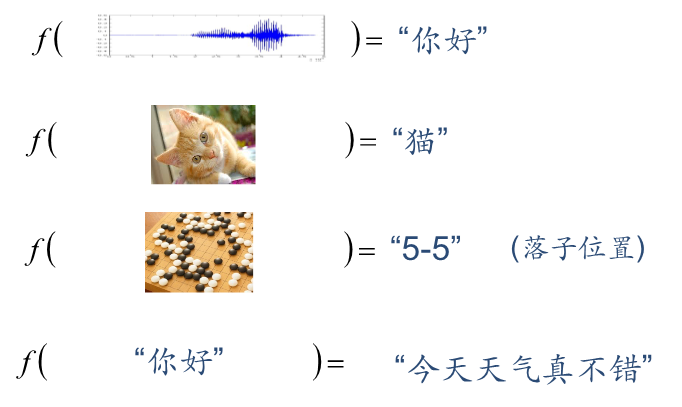
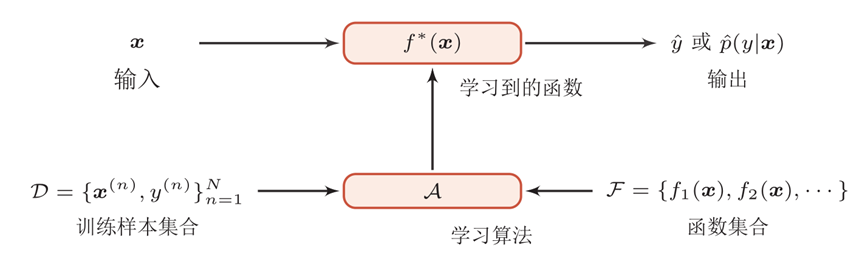

# Abstract

## 1. 机器学习定义

机器学习(Machine Learning, ML)就是让计算机从数据中进行自动学习, 得到某种知识(或规律).作为一门学科, 机器学习通常指一类问题以及解决这类问题的方法, 即如何从观测数据(样本)中寻找规律, 并利用学习到的规律(模型)对未知或无法观测的数据进行预测.

早期的工程领域, 机器学习也经常称为模式识别(Pattern Recognition, PR), 但模式识别更偏向于具体的应用任务, 比如光学字符识别、语音识别、人脸识别等.

为什么要进行机器学习? 现实世界的问题一般都比较复杂, 难以通过手工设计来完成。

## 2. 机器学习基本概念

1. 样本(示例, sample, instance): 每一个被标记好特征以及标签的数据对象
2. 特征(属性, attribute, feature): 描述样本某方面表现或性质的数据
3. 特征向量 (feature vector): 由所有特征构成的向量, 每一维表示一个特征
4. 标签 (label): 需要预测的信息, 可以是连续值, 可以是离散值, 一般由专家进行人工标注
5. 数据集(data set): 一组样本构成的集合, 一般被分为训练集和测试集
6. 训练集(training set): 用来训练模型的数据
7. 测试集(testing set): 用来检验模型好坏的数据
8. 函数: 近似每个样本的特征 $x$ 与标签 $y$ 之间的映射关系, 不同数据类型函数的输入输出均不同, 有如下例子(从左往右分别是, 语音-文字, 图片-类别, 图片-位置, 文字-文字)
    > 
9. 算法 (学习器, algorithm, learner): 寻找到“最优”函数的方法
10. 学习 (训练, learning, training): 在假设空间中寻找函数的过程

## 3. 机器学习的过程

通过算法使得机器能从大量数据中学习规律, 从而得到输入数据到目标标签的映射函数, 并对新的样本做决策。
对一个预测任务, 输入特征向量为 $x$ , 输出标签为 $y$ , 我们选择一个函数集合 $\mathcal{F}$ , 通过学习算法 $\mathcal{A}$ 和一组训练样本 $\mathcal{D}$ , 从F中学习到函数 $f ^{*} (x)$ .这样对新的输入 $x$ , 就可以用函数 $f ^{*} (x)$ 进行预测.

## 机器学习的分类

依据数据信息的 **监督** (标注)程度, 机器学习可以分为:

- 监督学习(Supervised Learning)
    > 大量数据要(人工)标注
- 半监督学习(Semi-supervised Learning)
    > 部分数据标注 + 大量数据无标注
- 弱监督学习(Weakly Supervised Learning)
    > 数据仅粗粒度标注
    > > 比如要将某个张照片中的钟表框选出来就算是好的标注, 而 **粗粒度的标注** 是指的是只对图片本身进行大致的描述
- 无监督学习(Unsupervised Learning)
    > 大量数据无标注
    > > 这种就只能实现对 $X$ 进行聚类, 降维之类的功能

***P.S.***

自监督学习
