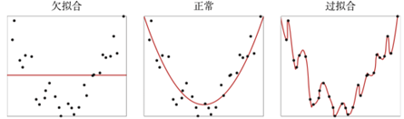
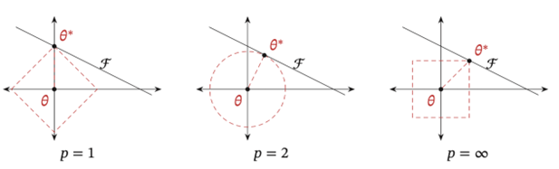
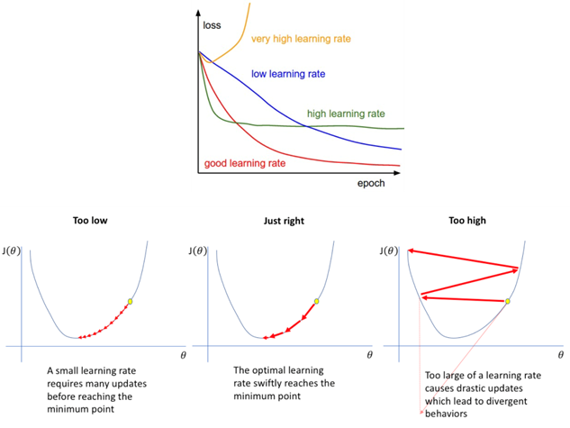
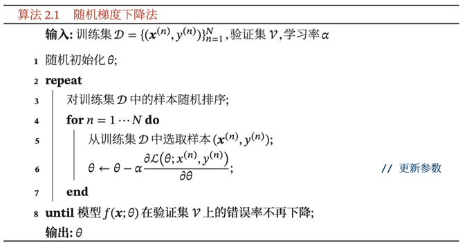
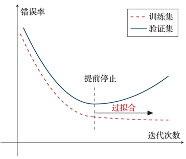

# 4. 机器学习的三要素

## 4.1. 模型

输入空间 $\mathcal{X}$ 和输出空间 $\mathcal{Y}$ 构成了一个样本空间.对于样本空间中的样本 $(x, y) \in \mathcal{X} \times \mathcal{Y}$ , 假定𝒙和𝑦之间的关系可以通过一个未知的真实映射函数 $y = g(x)$ 或真实条件概率分布 $p _{r} (y|x)$ 来描述.机器学习的目标是找到一个模型来近似真实映射函数 $g(x)$ 或真实条件概率分布 $p _{r} (y|x)$ .

由于我们不知道真实的映射函数 $g(x)$ 或条件概率分布 $p _{r} (y|x)$ 的具体形式, 因而只能根据经验来假设一个函数集合F, 称为假设空间(Hypothesis Space), 然后通过观测其在训练集 $\mathcal{D}$ 上的特性, 从中选择一个理想的假设(Hypothesis) $f ^{*} \in \mathcal{F}$ . 假设空间F通常为一个参数化的函数族

$$
\mathcal{F} = {f(x; \theta) | \theta \in \mathbb{R}^{D}}
$$

其中 $f(x; \theta)$ 是参数为 $\theta$ 的函数, 也称为模型(Model), $\mathcal{D}$ 为参数的数量. 常见的假设空间可以分为线性和非线性两种, 对应的模型 $f$ 也分别称为线性模型和非线性模型.

### 4.1.1. 线性模型

线性模型的假设空间为一个参数化的线性函数族, 即

$$
f(x; \theta) = w^{T}x + b
$$

其中参数 $\theta$ 包含了权重向量 $w$ 和偏置 $b$ .

### 4.1.2. 非线性模型

广义的非线性模型可以写为多个非线性基函数 $\Phi(x)$ 的线性组合

$$
f(x; \theta) = w^{T} \Phi(x) + b
$$

其中 $\Phi(x)$ 为 $K$ 个非线性基函数组成的向量, 参数 $\theta$ 包含了权重向量 $w$ 和偏置 $b$ . 如果 $\Phi(x)$ 本身为可学习的基函数, 比如

$$
\Phi_{k}(x) = h(w_{k}^{T}x + b_{k}), \forall 1 \leq k \leq K
$$

其中 $h(⋅)$ 为非线性函数,  $\Phi'(x)$ 为另一组基函数, w_k和b_k为可学习的参数, 则 $f(x; \theta)$ 就等价于神经网络模型. 也即是说, 神经网络就是一种非线性模型

## 4.2. 学习准则

模型 $f(x; \theta)$ 的好坏可以通过期望风险(Expected Risk) $\mathcal{R} (\theta)$ 来衡量, 其定义为

$$
\mathcal{R}(f) = \mathbb{E} _{(x, y) \sim p_{r}(x, y)} [\mathcal{L}(y, f(x; \theta))]
$$

其中 $p _{r}(x, y)$ 为真实的数据分布, $\mathcal{L} (y, f(x; \theta))$ 为损失函数, 用来量化两个变量之间的差异.

### 4.2.1. 损失函数

损失函数是一个非负实数函数, 用来量化模型预测和真实标签之间的差异.

- 0-1损失函数：直观表示损失函数在训练集上的错误率. 但是它数学性质不好, 不连续且倒数为0, 难以优化, 经常被连续可微的函数代替.

$$
\mathcal{L}(y, f(x, \theta)) = \left\{
\begin{aligned}
& 0, \quad y = f(x, \theta) \\
& 1, \quad y \neq f(x, \theta)
\end{aligned}
\right.
$$

- 平方损失函数(Quadratic Loss Function)经常用在预测标签 $y$ 为实数值的任务中, 定义为

$$
\mathcal{L}(y, f(x; \theta)) = \frac{1}{2}(y - f(x; \theta))^{2}
$$

- 交叉熵损失函数(Cross-Entropy Loss Function)一般用于分类问题. 假设样本的标签 $y \in {1, \cdots, C}$ 为离散的类别, 模型 $f(x; \theta) \in [0, 1]$ 的输出为类别标签的条件概率分布, 即如下, 且满足函数各类别概率输出和为1, 标签一般由one-hot表示.

$$
p(y = c|x; \theta) = f_{c}(x; \theta)
$$

对于两个概率分布, 一般可以用交叉熵来衡量它们的差异. 标签的真实分布 $y$ 和模型预测分布 $f(x; \theta)$ 之间的交叉熵为

$$
\begin{aligned}
    \mathcal{L}(y, f(x; \theta)) &= -y^{T} \log f(x; \theta) \\
    &= - \sum _{c = 1} ^{C} y_{c} \log f_{c}(x; \theta) \\
\end{aligned}
$$

由于标签是one-hot, 也可以写为

$$
\mathcal{L}(y, f(x; \theta)) = - \log f_{y}(x; \theta)
$$

- Hinge损失函数(Hinge Loss Function)对于二分类问题, 假设 $y$ 的取值为 ${−1, +1}$ , 为

$$
\mathcal{L}(y, f(x; \theta)) = \max(0, 1 - yf(x; \theta))
$$

当 $y=-1$ , $f(x; \theta) = -1$ 则损失为0, 当 $y = +1$ , $f(x; \theta) = + 1$ 则损失为0, 而 $f(x; \theta)$ 大于+1或者小于-1由于max的存在, 不会给予更优的损失. 因此这种损失防止模型过度"自信", 从而在特征空间保留一定的软间隔.

### 4.2.2. 风险最小化准则

值得注意的是, 期望风险中使用的是真实数据的分布, 而我们往往无法在实际中得到真实数据的分布. 所以更常用的是经验风险(Empirical Risk), 即在训练集上的平均损失.

$$
\mathcal{R} _{\mathcal{D}} ^{emp}(\theta) = \frac{1}{N} \sum _{i = 1} ^{N} \mathcal{L}(y^{(n)} f(x^{(n)}; \theta))
$$

在选择合适的风险函数后, 我们寻找一个参数 $θ ^{*}$ , 使得经验风险函数最小化.

$$
\theta ^{*} = \arg \min _{\theta} \mathcal{R} _{\mathcal{D}} ^{emp}(\theta)
$$

这就是经验风险最小化(Empirical Risk Minimization, ERM)准则. 因此机器学习就可以转化为一个最优化问题.

> 👆 如何理解这句话

### 4.2.3. 过拟合和欠拟合

根据大数定理可知, 当训练集大小 $| \mathcal{D} |$ 趋向于无穷大时, 经验风险就趋向于期望风险.然而通常情况下, 我们无法获取无限的训练样本, 并且训练样本往往是真实数据的一个很小的子集或者包含一定的噪声数据, 不能很好地反映全部数据的真实分布.经验风险最小化原则很容易导致模型在训练集上错误率很低, 但是在未知数据上错误率很高.这就是所谓的过拟合(Overfitting). 和过拟合相反的一个概念是欠拟合(Underfitting), 即模型不能很好地拟合训练数据, 在训练集上的错误率比较高. 欠拟合一般是由于模型能力不足造成的.

### 4.2.4. 结构风险最小化

过拟合问题往往是由于训练数据少和噪声以及模型能力强等原因造成的.为了解决过拟合问题, 一般在经验风险最小化的基础上再引入参数的正则化(Regularization)来限制模型能力, 使其不要过度地最小化经验风险.这种准则就是结构风险最小化(Structure Risk Minimization, SRM)准则.

$$
\begin{aligned}
    \theta ^{*} &= \arg \min _{\theta} \mathcal{R} _{\mathcal{D}} ^{struct}(\theta) \\
    &= \arg \min _{\theta} \mathcal{R} _{\mathcal{D}} ^{emp}(\theta) + \frac{1}{2} \lambda || \theta || ^{2} \\
    &= \arg \min _{\theta} \frac{1}{N} \sum _{i = 1} ^{N} \mathcal{L}(y^{(n)} f(x^{(n)}; \theta)) + \frac{1}{2} \lambda || \theta || ^{2}
\end{aligned}
$$

其中 $‖\theta‖$ 是l2范数的正则化项, 用来减少参数空间, 避免过拟合; $\lambda$ 用来控制正则化的强度.

l1和l2正则化是机器学习中最常用的正则化方法, 通过约束参数的l1和l2范数来减小模型在训练数据集上的过拟合现象. 通过加入l1和l2正则化, 优化问题可以写为

$$
\theta ^{*} = \arg \min _{\theta} \frac{1}{N} \sum _{i = 1} ^{N} \mathcal{L}(y^{(n)} f(x^{(n)}; \theta)) + \lambda \ell _{p} (\theta)
$$

其中 $l_p$ 为正则化项, p={1,2}是范数. 带正则化的优化问题等价于下面带约束条件的优化问题. 下述为不等式约束的优化问题, 其中 $m$ 是与 $\theta$ 无关的常数, 但是和 $\lambda$ 有关, $\lambda$ 越大 $\theta$ 越小

$$
\begin{aligned}
    \theta ^{*} &= \arg \min _{\theta} \frac{1}{N} \sum _{i = 1} ^{N} \mathcal{L}(y^{(n)} f(x^{(n)}; \theta)) + \lambda(l_{p}(\theta) - m) \\
    &= \arg \min _{\theta} \frac{1}{N} \sum _{i = 1} ^{N} \mathcal{L}(y^{(n)} f(x^{(n)}; \theta)) \\
    & \quad \text{s.t.} \quad l_{p}(\theta) \leq m
\end{aligned}
$$

给出了不同范数约束条件下的最优化问题示例.红线表示函数 $l_{p}=1$ , $\mathcal{F}$ 为函数 $f(\theta)$ 的等高线(为简单起见, 这里用直线表示).可以看出, **l1范数的约束通常会使得最优解位于坐标轴上, 从而使得最终的参数为稀疏性向量**.

> 👆 这是个好的性质

## 4.3. 优化

> 选择完风险函数后, 机器学习问题就转化成为一个最优化问题

$$
\min _{x} f(x)
$$

在确定了训练集 $\mathcal{D}$ 、假设空间F以及学习准则后, 如何找到最优的模型 $f(x, \theta ^{*})$ 就成了一个最优化(Optimization)问题.机器学习的训练过程其实就是最优化问题的求解过程.

### 4.3.1. 参数和超参数

在机器学习中, 优化又可以分为参数优化和超参数优化.模型 $f(x; \theta)$ 中的𝜃称为模型的**参数**, 可以通过优化算法进行学习.除了可学习的参数 $\theta$ 之外, 还有一类参数是用来定义模型结构或优化策略的, 这类参数叫作**超参数(Hyper-Parameter)**.常见的超参数包括:聚类算法中的类别个数、梯度下降法中的步长、正则化项的系数、神经网络的层数、支持向量机中的核函数等.超参数的选取一般都是组合优化问题, 很难通过优化算法来自动学习.因此, 超参数优化是机器学习的一个经验性很强的技术, 通常是按照人的经验设定, 或者通过搜索的方法对一组超参数组合进行不断试错调整.选择合适的超参数--步长, 也叫做学习率(Learning rate), 对优化很重要. 过低的学习率会导致过慢的收敛速度, 而过高的学习率会导致震荡, 而无法到达最优点.

### 4.3.2. 梯度下降法

为了充分利用凸优化中一些高效、成熟的优化方法, 比如共轭梯度、拟牛顿法等, 很多机器学习方法都倾向于选择合适的模型和损失函数, 以构造一个凸函数作为优化目标.但也有很多模型(比如神经网络)的优化目标是非凸的, 只能退而求其次找到局部最优解.在机器学习中, 最简单、常用的优化算法就是梯度下降法, 即首先初始化参数 $θ_0$ , 然后按下面的迭代公式来计算训练集 $\mathcal{D}$ 上风险函数的最小值.

$$
\begin{aligned}
    \theta _{t + 1} & = \theta _{t} - \alpha \frac{\partial \mathcal{R}(\theta)}{\partial \theta _{t}} \\
    & = \theta _{t} - \alpha \frac{1}{N} \sum _{i = 1} ^{N} \frac{\partial \mathcal{L}(y^{(n)}, f(x^{(n)}; \theta))}{\partial \theta}
\end{aligned}
$$

其中 $θ_t$ 为第 $𝑡$ 次迭代时的参数值, $\alpha$ 为学习率.

### 4.3.3. 随机梯度下降法

普通的梯度下降法目标函数是整个训练集上的风险函数, 这种方式称为批量梯度下降法(Batch Gradient Descent, BGD).批量梯度下降法在每次迭代时需要计算所有样本上损失函数的梯度并求和.当训练集中的样本数量 $\mathcal{N}$ 很大时, 空间复杂度比较高, 每次迭代的计算开销也很大.为了减少每次迭代的计算复杂度, 我们也可以在每次迭代时只采集一个样本, 计算这个样本损失函数的梯度并更新参数, 即随机梯度下降法(Stochastic Gradient Descent, SGD).当经过足够次数的迭代时, 随机梯度下降也可以收敛到局部最优解[1].随机梯度下降法过程如下图所示.

> 因为数据多所以随机. 即每次计算的时候只采一小部分数据以进行计算后进行尽心梯度下降.

### 4.3.4. 小批量梯度下降法

随机梯度下降法的一个缺点是无法充分利用计算机的并行计算能力.小批量梯度下降法(Mini-Batch Gradient Descent)是批量梯度下降和随机梯度下降的折中.每次迭代时, 我们随机选取一小部分训练样本来计算梯度并更新参数, 这样既可以兼顾随机梯度下降法的优点, 也可以提高训练效率.第 $𝑡$ 次迭代时, 随机选取一个包含𝐾个样本的子集 $\mathcal{S}_{t}$ , 计算这个子集上每个 样本损失函数的梯度并进行平均, 然后再进行参数更新:

$$
\theta _{t + 1} \leftarrow \theta _{t} - \alpha \frac{1}{K} \sum _{(x, y) \in \mathcal{S}_{t}} \frac{\partial \mathcal{L}(y, f(x; \theta))}{\partial \theta}
$$

在实际应用中, 小批量随机梯度下降法有收敛快、计算开销小的优点, 因此逐渐成为大规模的机器学习中的主要优化算法[2].

### 4.3.5. 提前停止

针对梯度下降的优化算法, 除了加正则化项之外, 还可以通过提前停止来防止过拟合.在梯度下降训练的过程中, 由于过拟合的原因, 在训练样本上收敛的参数, 并不一定在测试集上最优.因此, 除了训练集和测试集之外, 有时也会使用一个验证集(Validation Set)来进行模型选择, 测试模型在验证集上是否最优.在每次迭代时, 把新得到的模型 $f(x; \theta)$ 在验证集上进行测试, 并计算错误率.如果在验证集上的错误率不再下降, 就停止迭代.这种策略叫提前停止(Early Stop).如果没有验证集, 可以在训练集上划分出一个小比例的子集作为验证集.

