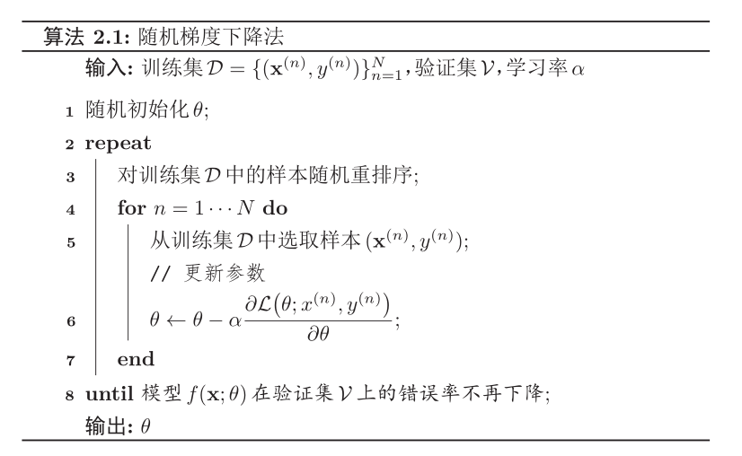
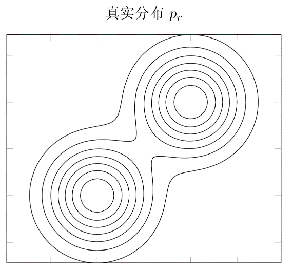
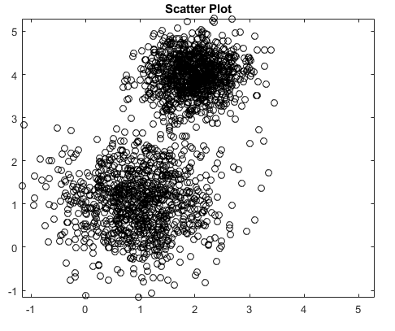

# 学习准则

## 模型例子

## 损失函数

0-1损失函数(0-1 Loss Function)

$$
\mathcal{L}(y, f(x, \theta)) = \left\{
\begin{aligned}
0, & \quad y = f(x, \theta) \\
1, & \quad y \neq f(x, \theta)
\end{aligned}
\right.
$$

平方损失函数(Qudratic Loss)

$$
\mathcal{L}(y, \hat{y}) = (y - f(x, \theta)) ^{2}
$$

交叉熵损失函数(Cross Entropy Loss)

$$
\begin{aligned}
& p(y = c|x; \theta) = f _{c}(x; \theta), \\
& 并满足 f _{c}(x; \theta) \in [0, 1], \sum _{c = 1} ^{C} f _{c}(x; \theta) = 1
\end{aligned}
$$

Hinge 损失函数(Hinge Loss)
$$
\mathcal{L}(y, f(x, \theta)) = \max(0, 1 - yf(x; \theta))
$$

### 风险最小化准则

- 期望风险未知, 通过经验风险 (Empirical Risk) 来近似, 即训练集的平均损失
  $$
  \mathcal{R} _{\mathcal{D}} ^{emp}(f) = \frac{1}{N} \sum _{i = 1} ^{N} \mathcal{L}(y^{(n)} f(x^{(n)}; \theta))
  $$
- 经验风险最小化
- 在选择合适的风险函数后, 我们寻找一个参数 $\theta _{*}$, 使得经验风险函数最小化
  $$
  \theta ^{*} = \arg \min _{\theta} \mathcal{R} _{\mathcal{D}} ^{emp}(\theta)
  $$

## 最优化问题

> 选择完风险函数后, 机器学习问题就转化成为一个最优化问题

$$
\min _{x} f(x)
$$

### 梯度下降法(Gradient Descent)

$$
\begin{aligned}
  \theta _{t + 1} & = \theta _{t} - \alpha \frac{\partial \mathcal{R}(\theta)}{\partial \theta _{t}} \\
  & = \theta _{t} - \alpha \frac{1}{N} \sum _{i = 1} ^{N} \frac{\partial \mathcal{L}(\theta _{t}; x^{(i)}, y^{(i)})}{\partial \theta}
\end{aligned}
$$

> 👆 其中, **搜索步长 $\alpha$**, 也叫 **学习率(learning rate)**

#### 随机梯度下降法(Stochastic Gradient Descent, SGD)

- 如果目标函数是整个训练集的风险函数(批量梯度下降), 计算开销很大.
- 为了减少每次迭代的计算复杂度, 可以在每次迭代的时候只采样一个样本, 计算这个样本损失的梯度并更新参数, 即随机梯度下降. 当经过足够次数迭代, 随机梯度下降也可以收敛到局部最优解.
  $$
  \theta _{t + 1} = \theta _{t} - \alpha \frac{\partial \mathcal{L}(\theta _{t}; x^{(i)}, y^{(i)})}{\partial \theta}
  $$
- 小批量随机梯度下降法(mini - batch gradient descent)是批量梯度下降和随机梯度下降的折中, 每次选取一小部分训练样本来进行梯度下降计算. 既兼顾随机梯度下降的优点, 也提高了训练效率.
- 实际应用中, 小批量随机梯度下降法, 逐渐成为大规模机器学习的主流优化算法.

> 流程
>
> 

$$
\begin{align*}
& \quad \textbf{输入} \text{}{: 训练集} \mathcal{D} = \{ (x^{(n)}, y^{(n)}) \} ^{N} _{n = 1}, 验证集 \mathcal{V}, 学习率 \alpha \\
& 1 \quad 随机初始化 \theta; \\
& 2 \quad \text{repeat} \\
& 3 \quad \quad \text{对训练集} \mathcal{D} 中的样本随机重排序; \\
& 4 \quad \quad for \quad n = 1 \cdots N \quad \text{do} \\
& 5 \quad \quad \quad \text{从训练集} \mathcal{D} \text{中选取样本} (x^{(n)}, y^{(n)}); \\
&  \quad \quad \quad \quad // \quad \text{更新参数} \\
& 6 \quad \quad \quad \theta \leftarrow \theta - \alpha \frac{\partial \mathcal{L}(\theta; x^{(n)}, y^{(n)})}{\partial \theta} \\
& 7 \quad \quad \text{end} \\
& 8 \quad \text{until} \quad \text{模型} f(x; \theta) \text{在验证集} \mathcal{V} \text{上的错误率不再下降} \\
& \quad \textbf{输出} \theta
\end{align*}
$$

### 过拟合

过拟合：经验风险最小化原则很容易导致模型在训练集上错误率很低，但是在未知数据上错误率很高。过拟合问题往往是由于训练数据少和噪声等原因造成的。

### 泛化错误

- 期望预期
  $$
  \mathcal{R}(f) = \mathbb{E} _{(x, y) \sim p(x, y)} [\mathcal{L}(f(x), y)]
  $$
  > - 真实分布:
  > 
- 经验风险
  $$
  \mathcal{R} _{\mathcal{D}} ^{emp}(f) = \frac{1}{N} \sum _{i = 1} ^{N} \mathcal{L}(y^{(n)} f(x^{(n)}; \theta))
  $$
  > - 训练集分布:
  > 

如何减少泛化错误？
> **正则化!!**

### 正则化

- 妨碍过度优化
  1. 增加优化约束
     - L1/L2 约束、数据增强
  2. 干扰优化过程
     - 权重衰减，随机梯度下降，提前停止

### 提前停止

使用一个验证集(validation Dataset)来测试每一次迭代的参数在验证集上是否最优。如果在验证集上的错误率不再下降，就停止迭代。
