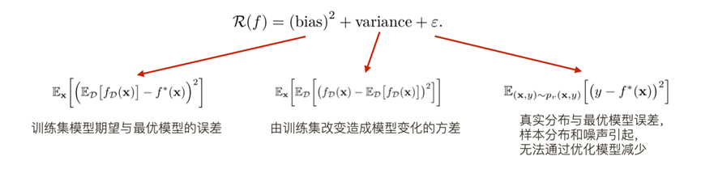
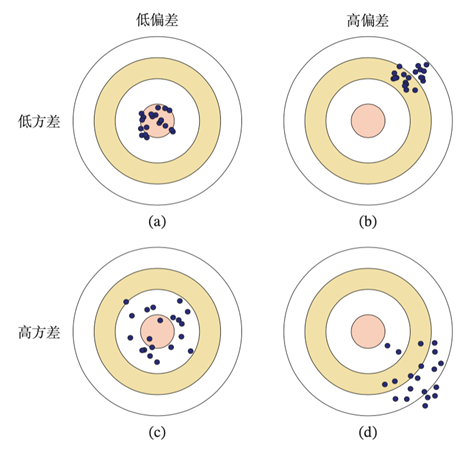
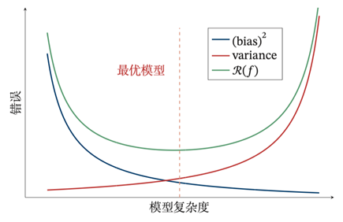

# 6. 偏差-方差

为了避免过拟合，我们经常会在模型的拟合能力和复杂度之间进行权衡.拟合能力强的模型一般复杂度会比较高，容易导致过拟合.相反，如果限制模型的复杂度，降低其拟合能力，又可能会导致欠拟合.因此，如何在模型的拟合能力和复杂度之间取得一个较好的平衡，对一个机器学习算法来讲十分重要.偏差-方差分解(Bias-Variance Decomposition)为我们提供了一个很好的分析和指导工具.假设f^* (x)是优化目标的最优模型，期望误差R(f)可以分解为

$$
\mathcal{R}(f) = (bias ^{①}) ^{2} + variance ^{②} + \epsilon ^{③} \\
\begin{aligned}
    & ①: \mathbb{E}_{\mathbf{x}} [(\mathbb{E}_{\mathcal{D}} [f_{\mathcal{D}}(\mathbf{x})] - f^{*}(\mathbf{x})) ^{2}] \\
    & ②: \mathbb{E}_{\mathcal{x}} [\mathbb{E}_{\mathbf{D}} [(f_{\mathcal{D}}(\mathbf{x}) - \mathbb{E}_{\mathcal{D}} [f_{\mathcal{D}}(\mathbf{x})]) ^{2}]] \\
    & ③: \mathbb{E}_{(\mathbf{x}, y) \sim p_{r}(\mathbf{x}, y)} [(y - f ^{*}(\mathbf{x})) ^{2}]
\end{aligned}
$$

偏差(Bias)，是指一个模型在不同训练集上的平均性能和最优模型的差异，可以用来衡量一个模型的拟合能力.方差(Variance)，是指一个模型在不同训练集上的差异，可以用来衡量一个模型是否容易过拟合.最后一项损失𝜖通常是由于样本分布以及噪声引起的，无法通过优化模型来减少.最小化期望错误等价于最小化偏差和方差之和.

下图给出了机器学习模型的四种偏差和方差组合情况.每个图的中心点为最优模型f^*(𝒙)，蓝点为不同训练集𝐷上得到的模型f_D(𝒙).图a给出了一种理想情况，方差和偏差都比较低.图b为高偏差低方差的情况，表示模型的泛化能力很好，但拟合能力不足.图c为低偏差高方差的情况，表示模型的拟合能力很好，但泛化能力比较差.当训练数据比较少时会导致过拟合.图d为高偏差高方差的情况，是一种最差的情况.

随着模型复杂度的增加，模型的拟合能力变强，偏差减少而方差增大，从而导致过拟合.以结构风险最小化为例，我们可以调整正则化系数𝜆来控制模型的复杂度.当𝜆变大时，模型复杂度会降低，可以有效地减少方差，避免过拟合，但 偏差会上升.当𝜆过大时，总的期望错误反而会上升.因此，一个好的正则化系数𝜆需要在偏差和方差之间取得比较好的平衡.下图给出了机器学习模型的期望错误、偏差和方差随复杂度的变化情况，其中红色虚线表示最优模型.最优模型并不一定是偏差曲线和方差曲线的交点.

