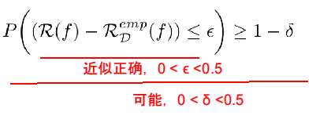

# 10. 常用定理

## 10.1. PAC学习理论

当使用机器学习方法来解决某个特定问题时，通常靠经验或者多次试验来选择合适的模型、训练样本数量以及学习算法收敛的速度等.但是经验判断或多次试验往往成本比较高，也不太可靠，因此希望有一套理论能够分析问题难度、计算模型能力，为学习算法提供理论保证，并指导机器学习模型和学习算法的设计.这就是计算学习理论.计算学习理论(Computational Learning Theory)是机器学习的理论基础，其中最基础的理论就是可能近似正确(Probably Approximately Correct，PAC)学习理论.

机器学习中一个很关键的问题是期望错误和经验错误之间的差异，称为泛化错误(Generalization Error).泛化错误可以衡量一个机器学习模型𝑓是否可以很好地泛化到未知数据.

$$
\mathcal{G} _{\mathcal{D}} (f) = \mathcal{R} (f) - \mathcal{R} _{\mathcal{D}} ^{emp} (f)
$$

根据大数定律，当训练集大小|𝒟|趋向于无穷大时，泛化错误趋向于0，即经验风险趋近于期望风险.

$$
\lim _{|\mathcal{D}| \rightarrow \infty} \mathcal{R} (f) - \mathcal{R} _{\mathcal{D}} ^{emp} (f) = 0
$$

无法追求期望错误为0的模型，只要求学习算法可以以一定的概率学习到一个近似正确的假设，即PAC学习(PAC Learning).一个PAC可学习(PAC-Learnable)的算法是指该学习算法能够在多项式时间内从合理数量的训练数据中学习到一个近似正确的𝑓(𝒙).一个PAC可学习(PAC-Learnable)的算法是指该学习算法能够在多项式时间内从合理数量的训练数据中学习到一个近似正确的𝑓(𝒙).

- 近似正确(Approximately Correct):f(x)是近似正确的，指泛化错误小于一个界限ϵ，一般在0~0.5之间.
- 可能(Probably): 一个学习算法有“可能”以1−𝛿的概率学习到这样一个“近似正确”的假设. 𝛿一般在0~0.5之间.

如果固定ϵ,δ，可以反过来计算出样本复杂度为

$$
n(\epsilon, \delta) \geq \frac{1}{2 \epsilon ^{2}} (\ln |\mathcal{F}| + \ln \frac{2}{\delta})
$$

其中|ℱ|为假设空间的大小，可以用Rademacher复杂性或VC维来衡量。模型的假设空间越大，泛化错误越小，其需要的样本数量越多.

## 10.2. 没有免费午餐定理

没有免费午餐定理(No Free Lunch Theorem，NFL)是由Wolpert和Macerday在最优化理论中提出的.没有免费午餐定理证明:对于基于迭代的最优化算法，不存在某种算法对所有问题(有限的搜索空间内)都有效.如果一个算法对某些问题有效，那么它一定在另外一些问题上比纯随机搜索算法更差.也就是说，不能脱离具体问题来谈论算法的优劣，任何算法都有局限性.必须要“具体问题具体分析”.没有免费午餐定理对于机器学习算法也同样适用.不存在一种机器学习算法适合于任何领域或任务.

## 10.3. 奥卡姆剃刀原理

奥卡姆剃刀(Occam’s Razor)原理是由14世纪逻辑学家 William of Occam 提出的一个解决问题的法则:“如无必要，勿增实体”.奥卡姆剃刀的思想和机器学习中的正则化思想十分类似:简单的模型泛化能力更好.如果有两个性能相近的模型，我们应该选择更简单的模型.因此，在机器学习的学习准则上，我们经常会引入参数正则化来限制模型能力，避免过拟合.

## 10.4. 丑小鸭定理

丑小鸭定理(Ugly Duckling Theorem)是1969年由渡边慧提出的[Watanable, 1969].“丑小鸭与白天鹅之间的区别和两只白天鹅之间的区别一样大”.这个定理初看好像不符合常识，但是仔细思考后是非常有道理的.因为世界上不存在相似性的客观标准，一切相似性的标准都是主观的.如果从体型大小或外貌的角度来看，丑小鸭和白天鹅的区别大于两只白天鹅的区别;但是如果从基因的角度来看，丑小鸭与它父母的差别要小于它父母和其他白天鹅之间的差别.

## 10.5. 归纳偏置

在机器学习中，很多学习算法经常会对学习的问题做一些假设，这些假设就称为归纳偏置[Inductive Bias](3).比如在最近邻分类器中，我们会假设在特征空间中，一个小的局部区域中的大部分样本同属一类.在朴素贝叶斯分类器中，我们会假设每个特征的条件概率是互相独立的.归纳偏置在贝叶斯学习中也经常称为先验(Prior).
