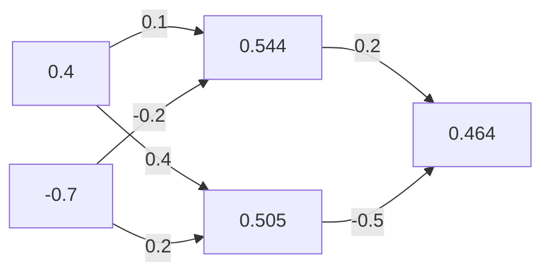

# CH3

## 神经网络基础模型

```mermaid
graph LR
    A_1[0.4] -->| 0.1 | B_1[0.544] -->| 0.2 | C_1[0.464]
    A_1 -->| 0.4 | B_2
    A_2[-0.7] -->| 0.2 | B_2[0.505] -->| -0.5 | C_1
    A_2 -->| -0.2 | B_1
```
