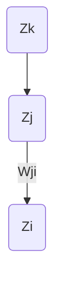

# CH4 - Neural Network and Deep Learning

## BP 算法

例如下面这个例子:

计算目标:

$$
\frac{\partial L}{\partial w_{ij}}
$$

其中 $L$ 为损失函数, $w_{ij}$ 为权重. 但是, $L$ 通常是一个复杂的函数, 无法直接求导. 因此, 我们使用链式法则:

$$
\frac{\partial L}{\partial w_{ij}} = \frac{\partial L}{\partial a_{j}} \cdot \frac{\partial a_{j}}{\partial w_{ij}}
$$

而:

$$
\frac{\partial L}{\partial a_{j}} = \sum_{k} \frac{\partial L}{\partial a_{k}} \cdot \frac{\partial a_{k}}{\partial a_{j}}
$$

这里的 $\frac{\partial L}{\partial a_{j}}$ 和 $\frac{\partial L}{\partial a_{k}}$ 被称为误差项

### Summary

$$
\begin{align}
    \frac{dz}{dx} &= \frac{dz}{dy} \cdot \frac{dy}{dx} \tag{6.44} \\
    \nabla _{x} z &= (\frac{\partial y}{\partial x}) ^{T} \nabla _{y} z \tag{6.46}
\end{align}
$$

$$
\text{gradient} = \frac{\partial L}{\partial w _{ji}} = \frac{\partial L}{\partial a _{j}} \cdot \frac{\partial a _{j}}{\partial w _{ji}} = \text{backward error} \times \text(forward activation)
$$

## Convolutional Neural Network(CNN)

### A brief history

> amodal: 无论物体的位置、大小、姿态如何变化，我们都能识别出它. 比如陷于沙子中的瓶子即使只露出一部分，我们也能识别出它的整体的形状.

- 1980s: Neocognitron

### Motivation

P.S. **ad hoc**: 临时的

> 1. 提取视觉特征: 为给定任务处理视觉数据的设计算法.
> 2. 例如, 对象识别: 给定输入图像, 识别它包含的对象.

#### Key Ideas of Conv-Net

- **局部连接性对稀疏交互**：这意味着在神经网络中，每个神经元只与输入数据的一个局部区域相连接，而不是与整个前一层相连接. 这有助于减少计算量并提高效率.
    > 即把一个图片切分成多个部分——“感受野”去进行训练
- **参数共享**：在CNN中，参数共享是指使用相同的权重对输入数据的不同部分进行处理. 这样可以减少模型的参数数量，从而减少过拟合的风险并提高模型的泛化能力.
    > 就是某个特征在图片的不同位置是一样的,作为一个特征信息不受位置等因素的影响
- **卷积**：卷积是一种数学运算，它将两个函数(例如，图像和滤波器)结合起来生成一个新的函数(特征图). 在CNN中，卷积操作用于提取输入数据(如图像)中的特征.
    > 离散卷积
    > $$
    > (x \times k) _{ij} = \sum _{pq} x _{i+p, j+q} k _{r-p, r-q}
    > $$
    > > 每次滑动到一个新位置，就计算核与图像该位置的重叠部分的加权和
- **池化或子采样隐藏单元**：池化是一种降低特征图维度的操作，通常是通过取区域内的最大值(最大池化)或平均值(平均池化)来实现. 这有助于使网络对输入数据中的小变化更加鲁棒.
    > 池化是在卷积层之后应用的，用于减小特征图的尺寸，同时保留重要的信息.
    >
    > 它通过在特征图上滑动一个窗口(通常是2x2或3x3大小)，并在该窗口内应用某种聚合函数(如取最大值或平均值)来实现.
    >
    > **具体操作**：
    >
    > - 最大池化(Max Pooling)：选择窗口内的最大值作为该窗口的代表值.
    > - 平均池化(Average Pooling)：计算窗口内所有值的平均值作为该窗口的代表值.
    >
    > 图片很多冗余所以需要可以进行下采样.

## 卷积运算符

### 卷积与卷积转置

$$
 ( \text{vec} , y = \text{transpose}(M) \text{vec} , x )
$$

卷积转置(有时也称为反卷积或上采样)在深度学习中有其特定的用途，尤其是在需要从压缩表示中重建信号或图像的场景中. 这种操作通常用于以下情况：

1. **生成模型**：在生成对抗网络(GANs)或变分自编码器(VAEs)中，卷积转置可以从较低维度的潜在空间中生成或重建高分辨率的图像.
2. **图像分割**：在图像分割任务中，卷积转置可以帮助从特征图中重建出更精细的图像，以便进行像素级的分类.
3. **自动编码器**：在自动编码器中，卷积转置用于解码过程，将编码的压缩表示恢复成接近原始输入的数据.

与一维卷积相比，卷积转置的主要差异在于它的目标是扩展信号而不是压缩信号. 一维卷积通过应用滤波器来提取信号的特征，通常会减少数据的维度. 而卷积转置则是将这一过程反转，从而增加数据的维度.

关联性在于，卷积转置可以看作是卷积操作的逆操作. 在数学上，如果卷积可以表示为矩阵乘法 $\text{vec} \, x = M \text{vec} \, y$ ，那么卷积转置就是这个矩阵的转置 $\text{vec} \, y = \text{transpose}(M) \text{vec} \, x$ . 这意味着如果我们知道卷积操作和滤波器，我们可以通过卷积转置来推断出原始信号.

## CNN 基本结构

### Input Images

比如 CIFAR-10 数据集, 32x32x3 的图片

### Local connectivity

- **Local connectivity**：在CNN中，每个神经元只与输入数据的一个局部区域相连接，而不是与整个前一层相连接. 这有助于减少计算量并提高效率.

比如: 一个神经元(或称为单元)只连接到图像中的一个小块，例如 $5 \times 5 \times 3$ 的区域，而非整个 $32 \times 32 \times 3$ 的图像.

### Convolution

即卷积核与图像轮流的加权求和.

**SOS**: 对于一个 $32 \times 32 \times 3$ 的原图片, 用一个 $3 \times 3 \times 3$ 的卷积核, 得到的结果是什么?
> 一个 $30 \times 30 \times 64$ 的特征图? (为什么喵🐱~)

#### pedding

> 为什么pedding number的值是0? 偶尔也有用比较大的pedding number值的情况吗?

可以更好地提取边缘的信息.

### Convolutiona: a 2-D example

$$
y[n, m] = \sum_{i = -r}^{r} \sum_{j = -r}^{r} w[i, j]x[n + i, m + j]
$$

经典的边缘检测算子: Sobel 算子

$$
\begin{matrix}
    1 & 2 & 1 \\
    0 & 0 & 0 \\
    -1 & -2 & -1
\end{matrix}
$$

#### Q

> 如果对于一个视频, 需要对其进行卷积操作, 比如, 如何构建一个4-D的卷积?

对于视频数据，构建一个4维卷积（通常称为3D卷积，因为时间被视为第三个空间维度）涉及到考虑时间维度以及空间维度。在这种情况下，卷积核将在视频的宽度、高度和时间轴上移动。这里是一个简化的解释：

1. **视频数据的形状**：通常，一个视频可以表示为一个4维数组，形状为 $(\text{帧数}, \text{高度}, \text{宽度}, \text{通道数})$。例如，一个有10帧、每帧32x32像素大小、3个颜色通道的视频可以表示为一个 $10 \times 32 \times 32 \times 3$ 的数组。

2. **4维卷积核**：卷积核也将是一个4维数组，形状为 $(\text{时间深度}, \text{核高度}, \text{核宽度}, \text{通道数})$。例如，一个在时间上深度为3、空间上大小为5x5、并且适用于3个通道的卷积核将有形状 $3 \times 5 \times 5 \times 3$.

3. **卷积操作**：卷积核在视频的时间和空间维度上滑动，计算核与视频数据对应部分的点乘和求和。这样，卷积核不仅捕捉空间特征，也捕捉随时间变化的特征。

4. **结果**：卷积操作的结果是一个新的4维数组，其中包含了视频数据的压缩表示，突出了时间和空间上的特征。

## Pooling Layers

用 max pooling 会...

用 average pooling 会...

> 在选择最大池化（Max Pooling）和平均池化（Average Pooling）时，通常考虑以下因素：
>
> 1. **特征突出**：最大池化倾向于突出特征图中的最强特征，因为它只保留最大值。如果你想要网络更关注最显著的特征，最大池化可能是更好的选择。
>
> 2. **特征平滑**：平均池化通过计算窗口内所有值的平均来平滑特征图。这可以帮助网络学习更平滑、更一般的特征表示。
>
> 3. **过拟合风险**：最大池化可能会导致模型对训练数据中的特定模式过度敏感，从而增加过拟合的风险。平均池化由于特征表示更加平滑，可能有助于减少过拟合。
>
> 4. **任务相关**：不同的任务可能会受益于不同类型的池化。例如，在某些图像识别任务中，最大池化可能更有效，因为它能够捕捉到关键特征。而在需要更全面理解图像内容的任务中，平均池化可能更合适。
>
> 5. **实验结果**：最终，选择哪种池化方法往往取决于实验结果。在实践中，你可能需要尝试两种方法，看看哪一种在验证集上表现更好。

## AlexNet 基本结构

### Cov1

> LRN 层

### Cov2

### Cov3 - Cov5

### 全连接层 FC6

### 全连接层 FC7 && 输出层

## VGG

P.S.卷积层不会大幅降低参数数量, 是pooling可以大幅降低.
