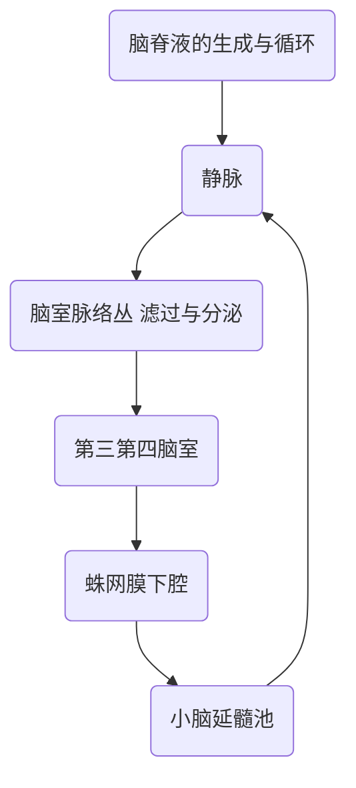

# 胸肺检查、浆膜腔积液、脑脊液

### 5. 气胸
1. 症状
    有诱因，突然胸痛，进行性呼吸困难，不能平卧，可有咳嗽，严重者有伴烦躁不安，大汗淋漓，脉速，发绀等。
2. 体征
    少量积气，无明显体征。量多时，望诊患侧胸廓饱满，肋间隙增宽，呼吸运动减弱或消失。触诊气管移向健侧，语颤减弱或消失。叩诊呈==鼓音==。听诊呼吸音减弱或消失。

>***PS.***
>对比胸膜炎&气胸
>- 望：
>	- 相同点——在气胸出现胸腔积液的时候在患侧的胸侧会突起，往外有饱满感→说明里面有水或气
>- 触：
>	- 气胸有时会合并皮下气肿，皮下气肿在触诊是会有捻发感
>- 叩：
>	- 不同点：
>		- 气胸：两侧不同，患侧为==鼓音==，健侧为正常的清音
>		- 胸膜炎：两侧不同，患侧为==浊音==，检测为正常的清音
>- 听：
>	- 相同点：
>		- 语音震颤都下降，呼吸音都消失
>		治疗：
>	- 胸腔积液——肺的下沿抽水
>	- 气胸——第二肋间抽气

>***PS.***
>气多——鼓音；水多——浊音

---

# 浆膜腔积液和脑脊液检查

>***PS.***
>正常情况下这些液体是24h不停循环的，只有当可以正常形成而回收不正常或者产生过多(如压力过高) 超出正常回收的限度的情况下才会出现

- 在正常情况下，浆膜腔内有少量液体起润滑作用。若有多量液体贮留，形成积液，即为病理变化。
- 这些积液因部位不同而分别称为胸膜积液(胸水)、腹膜积液(腹水)、心包积液等。
- 临床上分为漏出液和渗出液两类，漏出液为非炎症所致，渗出液为炎症、肿瘤等所致。
- 正常值:
	-  胸膜液:<20ml;
    - 腹膜液:<50ml;
    - 心包膜液:10-50ml。
- 浆膜腔液颜色:==淡黄色或草绿色。==

## 胸腔积液
### <临床意义>
#### 一般性状检测:
- 颜色:漏出液清晰或微混、淡黄色，渗出液多混浊，草黄色或红色。
	- 漏出液为水分为主所以是非常淡，非常清，和正常胸膜腔液很相似的
	- 渗出液由于有蛋白等物质，其甚至可以变为和血一样的颜色。
		- 但是其与血管中的血液不同点为，血管中抽出的血极早就凝血了，但是渗出液中的则会凝血很慢
- 比重: <1.018为漏出液; ≥1.018为渗出液。
	- 正常血液为1.018，漏出液由于水多所以比重低，而渗出液可以比血液的比重更高
- 凝固性:漏出液一般不易凝固，渗出液易凝固。
#### 化学检测:
- 黏蛋白定性、定量试验: 
	- 漏出液==李凡它试验==阴性，定量 <30g/L，常由心功能不全、肾病、肝硬化腹水引起。
	- 渗出液蛋白定性阳性，定量≥ 30g/L，常见于化脓性、结核性疾患，恶性肿瘤，肝静脉血栓形成综合征等。
	  >***PS.***
	 >==30g/L==: 分界点
	 >有混合型的，这个情况下既有渗出液的特征也有漏出液的特征 
	 >当为肾病、肝功能不全引起的胶体渗透压降低，也可以形成积液，此时多为漏出液
	 >渗出液往往有感染、肿瘤转移、或者胸腔本身就有结核性胸膜炎等，之后由于这些毛细血管有损伤而带来的有形成分漏出
	 >***日本人***  18:00
	 >化脓性胸膜炎——痛，渗出性的(白细胞含量非常高)

	- PH测定:浆膜腔积液pH测定，恶性积液pH多 >7.4，而化脓性积液则多<7.2。
	>***PS.***
	>漏出液的pH和血液内的一样，如果pH高则怀疑肿瘤，pH低则怀疑感染(由于细菌感染后会消耗糖之后产生酸性物质，从而使得pH下降)
	- 乳酸测定:乳酸含量>10mmol/L, 感染性渗出液，10mmol/L为漏出液
   - 细胞:在胸腹水中检查肿瘤细胞，对诊断胸、腹腔肿瘤十分必要，其敏感度和特异性均达90%。

#### 显微镜检查:
- 细胞计数、细胞分类计数、脱落细胞检查和寄生虫等。
     >***PS.***
     > - 感染性——中性细胞为主
     > - 过敏性、酸性肉芽肿——嗜酸性粒细胞为主
     > - 结核——淋巴细胞增高
     > - 转移到胸腔的肿瘤或者原发在胸腔的肿瘤——需要也对脱离细胞进行检测
     > 	- 难以诊断，细胞长期在胸水中浸泡细胞会变形，难以判断，所以需要多次检测(把管子留在那里，几天内连续多次送病理科检验)
#### 细菌学检查
> ***PS.***
> 由于类似结核这类的培养时间过久，所以可以用PCR
### 一般性状检测<临床意义>
- <u>红色血性</u>:常见于急性结核性胸、腹膜炎，出血性疾病，恶性肿瘤，穿刺损伤等。
	>***PS.***
	>血性的胸水临床上称为：洗肉水样的胸水
	>	- 临床出现多为结核性的胸膜炎；此时应该询问病史
	>		- 最近一个月有低热，最高38.5°C
	>		- 有胸痛，但是这段时间后不痛
	>			- 胸痛是由于先前胸膜炎时脏层与壁层之间摩擦，在产生胸腔积液后两层胸膜分开，于是从而不痛了(胸腔积液的典型表现)
	>		- 午后潮热
	>		- 下午脸红
	>		- 发热感觉
	>		- 晚上有盗汗
	> - 年轻人出现血型胸水多考虑结核性胸膜炎
	> - 中年人或者老年人出现多考虑肿瘤
	> 如果血性胸水与血的性状更接近的往往是外伤或者肿瘤
	> 	- 肿瘤破坏胸膜腔的毛细血管，较大的毛细血管就会有血液的渗出 
- <u>黄色脓性或脓血性</u>:常见于化脓性细菌感染如葡萄球菌性肺炎合并脓胸时。
	> 化脓性的胸膜炎，往往为黄色有时又带血性的
	> 	- 多为肺炎引起：大叶性肺炎影响到胸膜最后进入到胸膜腔，细菌感染从而脓性
	> 葡萄球菌感染——免疫因素：糖尿病患者、长期服用免疫抑制剂的患者
	> 	- 也是肺炎穿破肺之后进入胸膜腔
- <u>乳白色</u>:常见于丝虫病、淋巴结结核及肿瘤、肾病变、肝硬化、腹膜癌等。
	> 多为丝虫病、阿米巴等阻塞了淋巴系统的回流
	> 肿瘤转移也可以阻塞淋巴系统(由于肿瘤转移大多依靠淋巴转移和静脉转移)
- <u>绿色</u>:见于铜绿假单胞菌感染。
	> 老年人或者院内感染多
- <u>黑色</u>:提示胸膜曲霉菌感染。
	> 真菌
- <u>粘稠样积液</u>:提示恶性间皮瘤。
	> 粘稠/产生也非常快
	> 胸膜原发的间皮瘤(预后很差)
- <u>含“碎屑”样积液</u>:常见类风湿性病变。
	> 狼疮、类风关、肉芽肿性疾病、血管炎等免疫性疾病
	> 	- 这些免疫性疾病也可以引起其他地方的浆膜腔的积水，有时可以引起心包积液
- <u>混浊性积液</u>:见于结核性胸、腹膜炎，阑尾炎穿孔，肠梗阻等引起的腹膜炎等。

### 浆膜腔液细胞计数及分类<临床意义>
1. 漏出液细胞较少，常 <0.1×109/L，以淋巴细胞为主，并有少量间皮细胞。
	> 远远低于血液中的细胞数
1. 渗出液细胞较多，常 >0.5×109/L，各种细胞增高见于:
	1. 中性分叶核粒细胞增多:化脓性，结核性浆膜炎早期亦可见中性粒细胞增多。
	2. 淋巴细胞增多:主要提示慢性疾病，如结核、梅毒、肿瘤等。慢性淋巴细胞性白血病如乳糜性积液时。
	> 结合最多见，但是近段时间梅毒有增多的趋势
	> 梅毒原本青霉素即可治好，但是现在梅毒耐药性有增多，但仍是可治的 
	 3. 嗜酸性粒细胞增多:==变态反应==和==寄生虫==病所致的渗出液。多次穿刺刺激、人工气胸、脓胸、手术后积液、肺梗塞、充血性心力衰竭、系统性红斑狼疮、何杰金病、间皮瘤等。
	> 气胸早期如果有液气胸也是嗜酸性粒细胞高为主、肺栓塞
	 4. 组织细胞增多:在炎症情况下，或组织细胞病。
	5. 间皮细胞增多:表示浆膜刺激或受损，在肿瘤性积液时常见明显增多

### 浆膜腔液葡萄糖测定<临床意义>
- 漏出液中葡萄糖含量与血糖相似，
- 渗出液中葡萄糖含量低于血糖
	- 如积液中葡萄糖含量低于3.63mmol/L，或积液中含量同血中含量的比值<0.5，常见于风湿性积液、积脓、恶性肿瘤性积液、结核性积液、狼疮性积液或食管破裂等。
	> 糖低多为感染性的(同时pH酸性的)
	> 结核性、狼疮等的也低，但是相对没有化脓性那么低
	
### 浆膜腔液乳酸脱氢酶(LDH)活性测定<临床意义>
- 当浆膜腔积液中LDH与血清LDH之比值≥0.6时，多为渗出液;反之则为漏出液。
	> LDH高为渗出液，低为漏出液
- 当胸水或腹水中LDH与血清LDH比值>1时，对胸、腹膜恶性肿瘤或转移癌的诊断有一定意义。
	> 结核性升高，肿瘤性一般不高
	
### 浆膜腔液溶菌酶检测<临床意义
 
结核性胸水患者胸水LZM的含量同血清LZM含量的比值常>1.0，而恶性胸水患者此比值皆<1.0，故对二者的鉴别诊断有一定意义。

> 特异性不高，但是与一定意义
> 比血中高(>1.0)一般不是恶性
> 比血低一般是恶性 

### 浆膜腔液淀粉酶检测<临床意义>
- AMY增高见于急性胰腺炎引起的胸腔积液; 食道破裂时胸腔积液中增高，10%恶性肿瘤积液中淀粉酶活性增高。
> 如果高的非常明显则一般考虑为良性：胰腺炎、食管炎等引起

### 浆膜腔液铁蛋白(1BP)测定<临床意义>
- 胸腔积液中IBP可作为肿瘤性积液与结核性胸膜炎性积液的鉴别诊断指标，若胸水中IBP>1500ng/ml，则为肿瘤性积液的可能性较大。
 
### 漏出与渗出液鉴别
|                 |              漏出液               |                                                  渗出液                                                  |
|:---------------:|:---------------------------------:|:--------------------------------------------------------------------------------------------------------:|
|      外观       |             清澈透明              |                                          草黄色或洗肉水样、血样                                          |
|      比重       |              <1.018               |                                                  >1.018                                                  |
|      细胞       | 总数<100×10/L，淋巴和间皮细胞为主 | 总数>500x106/L，中性粒细胞为主一急性炎症淋巴细胞为主一结核性或癌性酸性粒细胞为主一寄生虫感染或结缔组织病 |
|       pH        |             正常范围              |                                    PH<7.30-结核性、感染PH >7.40一肿瘤                                    |
|     病原菌      |                无                 |                                               有相应病原菌                                               |
|      蛋白       |     <30g/L, Rivalta试验（ - )     |                                         >30g/L, Rivalta试验( + )                                         |
|     葡萄糖      |             >3.34mmol             |                                                 <334mmol                                                 |
|       LDH       |             <200IU/L              |                                                 >200IU/L                                                 |
| 胸液LDH/血清LDH |               <0.6                |                                                   >0.6                                                   |

|                |      结核性胸液       |       癌性胸液        |
|:--------------:|:---------------------:|:---------------------:|
|    胸液外观    |     草黄色，血性      |       血性为主        |
|      细胞      | >500×106/L | >500×106/L |
| 细胞染色体变异 |          无           |          有           |
|     癌细胞     |          无           |       60%可检出       |
|       pH       |         <7.30         |         >7.40         |
|   结核菌培养   |        20%(+)         |          (-)          |
|      CEA       |        <5μg/L         |        >10μg/L        |
|     铁蛋白     |         正常          |         增高          |
|  OROSO粘蛋白   |         正常          |         增高          |
|     葡萄糖     |      < 3.34mmol/L     |      > 3.34mmol/L     |
|      LDH       |      200-400IU/L      |       >500IU/L        |
|      ADA       |        >45U/L         |        <25U/L         |
|      LZM       |         增高          |         不高          | 

---
## 脑脊液检查

> ***PS.***
> 脑脊液的感染一般由神经科来进行，但是如果发生例如==隐球菌==感染之类的会引起中枢感染的，呼吸科也会进行脑脊液的检查以确定是由有颅内感染/中枢感染

### 脑脊液(CSF)
- 脑脊液(Cerebrospinal Fluid,CSF)是循环流动于脑和脊髓表面的一种==无色透明==液体，大约70%来自脑室系统脉络丛的超滤和分泌，其余由脑室的室管膜和珠网膜下腔所产生，通过蛛网膜绒毛回吸收入静脉。
> ***PS.***
> 无色透明是因为超滤
> 脑脊液起到润滑、促进脑功能的作用 

- 正常脑脊液容量成人为90~150ml，新生儿10~60ml;
- 正常成人卧位时脑脊液压力超过200mmH2O，为压力增高﹔
	> 正常人脑脊液压力不超过200mmH2O, 部分教科书上面是不超过180mmH2O
- 观测初压时应注意脑脊液液面有无呼吸性搏动和脉搏性搏动。
	> 有随着呼吸、脉搏搏动说明脑脊液是在循环的状态，如果没有则检查检测的针筒位置
- 待压力测定后将脑脊液分别收集于3个无菌试管中，第一管作细菌培养，第二管作化学分析和免疫学检查，第三管作一般性状及显微镜检查。每管收集1-2毫升。
- 脑脊液标本必须立即送验及时检查。

#### 脑脊液标本采集
- 腰椎穿刺
- 小脑延髓池或侧脑室
	

	
	
	穿刺成功后先作脑脊液压力
		*正常值: 0.78-1.76kpa(80-180mmH-O)*
	

#### 脑脊液的功能
- 参与脑组织代谢，通过血管周围间隙运送营养物质至脑细胞并带走其代谢产物，提供了必要的相对稳定的理化微环境。
	> ***PS.*** 不能正常循环的话会很浑浊 
- 脑脊液充满于脑室系统、和脊髓蛛网膜下腔内很少一部分存在于脊髓中央管内，形成脑的“保护垫”，避免在震动或损伤时减少震荡，保护脑髓，起缓冲作用。
- 脑脊液循着一定的方向流动，对调节颅内压变化和维持神经细胞的渗透压平衡，调节碱储量，保持PH在7.28-7.32等方面起作用。
	> ***PS.*** 比血液相对偏酸
- 脑脊液还通过转运生物胺类物质来影响垂体功能，参与神经内分泌调节。
	> ***PS.*** PD中脑脊液也会循环障碍，以至于之后影响智力因素

#### 穿刺出血和病理出血鉴别

- 穿刺出血第一管颜色是很红的，之后越来越淡，沉淀之后底下是RBC，上面是清澈的
- 病理性出血则是，则是一直都是红的，且沉淀之后底下是RBC，但是上面也是红色的

### 常规检查的临床意义
- 正常CSF是无色水样液体
- 异常CSF:
	1. 红色:常见于蛛网膜下腔出血、脑出血、硬膜下血肿等。如腰椎穿刺时观察到流出的脑脊液先红后转无色，为穿刺损伤性出血。
	2. 黄色:见于陈旧性蛛网膜下腔出血及脑出血、包囊性硬膜下血肿、==化脓性脑膜==炎、脑膜粘连、脑栓塞;椎管梗阻;脑、脊髓肿瘤及严重的结核性脑膜炎;各种原因引起的重症黄疽;心功能不全、含铁血黄素沉着症、胡萝卜素血症、早产儿等。
	> ***PS.*** 比胸腔积液的草黄色还要再淡一点 
	3. 乳白色:见于==化脓性脑膜炎==。
	> ***PS.*** 这种是疾病已经非常严重了的脑膜炎，死亡率极高
	> 黄色-->乳白色 
	4. 微绿色:见于绿脓假单胞菌性脑膜炎、甲型链球菌性脑膜炎。
	5. 褐色或黑色:见于中枢神经系统的黑色素瘤、黑色素肉瘤等。

> 脑膜炎：
> 	- 病毒性的脑膜炎：轻微浑浊，颜色稍微有点淡淡的黄色
> 	- 化脓性的脑膜炎：为很明显的脓性的，粘稠的浓的，黄色的
> 	- 结核性的脑膜炎：草黄色，稍有浑浊，但是不会很浓
> 	- 寄生虫的脑膜炎：也会有黄色的浑浊的脑脊液

#### 透明度临床意义
- 微混:常见于乙型脑炎、脊髓灰质炎、脑脓肿(未破裂者)。
	> ***PS.***
	> 乙型脑炎：
	> 	- 脑脊液微混
	> 	- 细胞数偏高
	> 	- 磁共振脑腔有肿胀，脑膜有增厚
	> 脊髓灰质炎：
	> 	- 白中带点灰色的
- 混浊:常见于化脓性脑膜炎、结核性脑膜炎等。
- 毛玻璃状:常见于结核性脑膜炎、病毒性脑膜炎等。
- 凝块:见于化脓性脑膜炎、脑梅毒、脊髓灰质炎等。
	> ***PS.*** 最常见的为梅毒
- 薄膜:常见于结核性脑膜炎等。

#### 细胞计数临床意义
- [正常参考值]
	- 成人:(O-8)×106/L;
	- 儿童:(O-15)×106/L;
	- 新生儿:(O-30)×10/L。
- [临床意义]
	1. 细胞数明显增高(>200×106/L):常见于==化脓性脑膜炎==、==流行性脑脊髓膜炎==。
	2. 中度增高(<200×106/L):常见于==结核性脑膜炎==。
	3. 正常或轻度增高:常见于==浆液性脑膜炎==、==流行性脑炎(病毒性脑炎)==、==脑水肿==等。
	> 很清澈，蛋白质也稍微增高，细胞数也稍微增高，怀疑脑水肿

#### 蛋白定性的临床意义
- [正常参考值]：阴性
- [临床意义]
	1. 脑脊液蛋白明显增高(＋＋以上):常见于化脓性脑膜炎、结核性脑膜炎、脊髓腔等中枢神经系统恶性肿瘤及其转移癌、脑出血、蛛网膜下腔出血及梗阻等。
	2. 脑脊液蛋白轻度增高(+--十十):常见于病毒性脑膜炎、霉菌性脑膜性、乙型脑炎、脊髓灰质炎、脑膜血管梅毒、麻痹性痴呆、脑血栓形成等。
	3. 正常脑脊液蛋白含量在蛛网膜下腔为150-400mg/L，新生儿为1g/伦，早产儿可高达2g/L。
	4. 蛋白增高多与细胞增多同时发生:见于各种中枢神经系统感染。
	5. 也可仅有蛋白增高而白细胞计数正常或略多，称为“蛋白—细胞分离”，多见于颅内及脊髓肿瘤、椎管梗阻、急性感染性多发性神经炎、甲亢、糖尿病和铅、汞等金属中毒等。
	> 蛋白高，细胞不高

#### 葡萄糖试验的临床意义
- 正常参考值:2.5-4.5mmol/L或450-750mg/L，约为血糖值的1/2-2/3左右。
- 临床意义:
	- 脑脊液葡萄糖增高:常见于饱餐或静脉注射葡萄糖后、血性脑脊液、糖尿病、脑干急性外伤或中毒、早产儿或新生儿等。
	- 脑脊液葡萄糖降低:常见于急性化脓性脑膜炎、结核性脑膜炎、霉菌性脑膜炎、神经梅毒、脑瘤、低血糖等。
	> 高的多是正常的，或者是糖尿病之类的正常的病理变化，应注意的为降低的，降低的多考虑感染的因素
	
#### 氯化物的临床意义
- 正常参考值:120-130mmol/L或72-75g/L，较血液氯化物含量高。
- 临床意义:
	- 脑脊液氯化物增高:常见于慢性肾功能不全、肾炎、尿毒症、呼吸性酸中毒等。
	- 脑脊液葡萄糖降低:常见于结核性脑膜炎、化脓性脑膜炎、呕吐、腹泻等。

#### 细菌及寄生虫检查的临床意义
- 正常参考值:阴性。
- 临床意义：
	- 脑脊液中有细菌，可引起细菌性脑膜炎。如急性化脓性脑膜炎常由脑膜炎奈瑟菌、肺炎链球菌、溶血性链球菌、葡萄球菌等引起;病程较慢的脑膜炎常由结核杆菌、新型隐球菌等引起。
	- 脑脊液中若发现血吸虫卵或肺吸虫卵等，可诊断为脑型血吸虫病或脑型肺吸虫病等。
	> 脑囊虫病: 影响智力

#### 免疫学检查
- 补体结合试验:对囊虫、肺吸虫、钩端螺旋体及病毒等感染有一定助诊价值;
- 免疫球蛋白:lgG、lgA、 lgM、lgD、 lgE以及其它免疫球蛋白，其中以lgG浓度最高，IgM不易查得。如lgG增高和查得lgM时，提示中枢神经系统有感染、脱髓鞘性疾病或血脑屏障通透性增加。

#### 细胞分类(DC)的临床意义
- [正常参考值]
	- 红细胞:无或少量;
	- 淋巴及单核细胞:少量;
	- 间皮细胞:偶见;
	- 其他细胞:无。
- [临床意义]
	1. ==红细胞==增多:常见于脑出血等。
	2. ==淋巴细胞==增多:见于结核性脑膜炎、霉菌性脑膜炎、病毒性脑膜炎、麻痹性痴呆、乙型脑炎后期、脊髓灰质炎、脑肿瘤、脑溢血、多发性神经炎。
	3. ==嗜中性粒细胞==增多:见于化脓性脑膜炎、流行性脑脊髓膜炎、流行性脑炎、脑出血、脑脓肿、结核性脑膜炎恶化期。
	4. ==嗜酸性粒细胞==增多:见于寄生虫性脑病等。
	5. ==单核细胞==增多:常见于浆液性脑膜炎。
	6. ==吞噬细胞==:常见于麻痹性痴呆、脑膜炎。
	> ***PS.*** 脑膜炎后期可见吞噬细胞
	8. ==肿瘤细胞==:见于脑、脊髓肿瘤。
	9. ==白血病细胞==:见于中枢神经系统白血病

### 化学检验:
#### 蛋白定量
- [正常参考值]
	- 腰椎穿刺:0.20-0.45g/L;
	- 脑室穿刺:0.05-0.15g/1;
	- 脑池穿刺:0.10-0.25g/L。
- [临床意义]
	- 化脓性脑膜炎，流行性脑膜炎蛋白质含量为3-6.5g/L;
	- 结核性脑膜炎刺激症状期蛋白质含量为0.3-2.0g/L,压迫症状期为1.9-7g/L，麻痹期为0.5-6.5g/L;
	- 脑炎蛋白质含量为0.5-3.0g/L。
	- 引起脑脊液循环梗阻的疾病，如脊髓蛛网膜炎与脊髓肿瘤等，其蛋白质含量可在1.0g/L以上;
	> 阻塞因为不流通了，之后蛋白一直沉积，于是就会越来越高，最后非常高
	- 脑软化、肿瘤、退行性病等，脑脊液蛋白可增至0.25-0.8g/L。
	> 脑软化，比如一些遗传性的先天性的脑软化，或者例如中风也会在中风几年之后出现脑软化，但是这种情况下的蛋白升高不会很高 
	- 多发性神经根炎、浆液性脑膜炎、脑脊髓梅毒、麻痹性痴呆、脑溢血、脑栓塞、蛛网膜下腔出血、流行性脑炎、脊髓灰质炎等脑脊液蛋白亦增加。

#### 蛋白电泳的临床意义
- 正常参考值
	- 前白蛋白:0.02-0.07;
	- 白蛋白:0.56-0.76; 
	- α1-球蛋白:0.02-0.07;
	- α2-球蛋白: 0.04-0.12;
	- β-球蛋白:0.08-0.18;
	- γ-球蛋白:0.03-0.12。
- 临床意义
	- 前白蛋白增高:常见于舞蹈症、帕金森病、手足徐动症等﹔前白蛋白减少常见于脑膜炎。
	- 白蛋白增高:常见于脑血管病，如脑梗塞、脑出血等;白蛋白减少见于脑外伤急性期。
	- α1-球蛋白增高:常见于脑膜炎、脑脊髓灰质炎等。
	- α2-球蛋白增高:常见于脑肿瘤、转移癌、胶质瘤等。
	- β-球蛋白增高:常见于某些退行性变如帕金森病、外伤后偏瘫等。
	- γ-球蛋白增高:常见于脑胶质瘤、重症脑外伤、癫痫、视神经脊髓炎、多发性硬化症、脑部感染、周围神经炎等。

#### 髓鞘碱性蛋白测定
- 正常参考值:0~4ug/L
- 临床意义:是组成髓鞘的主要蛋白，占髓鞘蛋白质总量的30%，是反映中枢神经系统实质性损害的指标，尤其是髓鞘脱失的诊断指标。外伤和神经系统疾病增高，如多发性硬化症等。

#### TAU蛋白测定
- 参考值:诊断阿尔茨海默病的临界值为375ng/L。
- 临床意义:最有意义的阿尔茨海默病诊断指标。其他急慢性脑损伤、脑膜病变等也可增高。

### 常见中枢神经系统脑脊液的特点

|                | 压力(mmH2O) | 外观                             | 细胞数(×106/L)及分类 | 蛋白质定性 | 蛋白质定量(g/L) | 葡萄糖(mmol/L) | 氯化物(mmol/L) | 细菌                   |
| -------------- | ---------------------- | -------------------------------- | ------------------------------- | ---------- | --------------- | -------------- | -------------- | ---------------------- |
| 正常           | 侧卧位 70-180          | 无色透明                         | 0~8，多为淋巴细胞               | (-)        | 0.2-0.4         | 2.5-4.5        | 120-130        | 无                     |
| 化脓性脑膜炎   | ⬆⬆⬆                    | 混浊脓性，可有脓块               | 显著增加，以中性粒细胞为主      | +++以上    | ⬆⬆⬆             | ⬇⬇⬇            | ⬇              | 有致病菌               |
| 结核性脑膜炎   | ⬆⬆                     | 微混，毛玻璃样，静置后有薄膜形成 | 增加，以淋巴细胞为主            | + ~ +++    | ⬆⬆              | ⬇⬇             | ⬇⬇             | 抗酸染色可找到结核杆菌 |
| 病毒性脑膜炎   | ⬆                      | 清晰或微浊                       | 增加，以淋巴细胞为主            | + ~ ++     | ⬆               | 正常           | 正常           | 无                     |
| 蛛网膜下腔出血 | ⬆                      | 血性为主                         | 增加，以红细胞为主              | + ~ ++     | ⬆               | 正常           | 正常           | 无                     |
| 脑脓肿(未破裂) | ⬆⬆                     | 无色或黄色微浊                   | 稍增加，以淋巴细胞为主          | +          | ⬆               | 正常           | 正常           | 有或无                 |
| 脑肿瘤         | ⬆                      | 黄色或无色                       | 正常或稍增加，以淋巴细胞为主    | ± ~ +      | ⬆               | 正常           | 正常           | 无                     | 

### 酶学与免疫学测定
#### 脑脊液酶学测定
- 正常参考值:
	- 转氨酶(ALT、AST):约为血清酶活性的1/2;
	- 乳酸脱氢酶(LDH);约为血清酶活性的1/10;
	- 磷酸肌酸激酶(CPK):低于血清酶活性。
- 临床意义:
	- ALT、AST活性增高:常见于脑梗塞、脑萎缩、急性颅脑损伤、中毒性脑病及中枢转移癌等。
	- LDH活性增高:常见于细菌性脑膜炎、脑血管病、脑瘤及脱髓鞘病等有脑组织坏死时。
	- CPK活性增高:见于化脓性、结核性脑膜炎、脑积水、继发性癫痫、多发性硬化症、蛛网膜下腔出血、慢性硬膜下水肿、脑供血不足及脑肿瘤等。
#### 脑脊液免疫球蛋白测定
- 正常参考值;
	- lgG:10-40mg/L;
	- lgA: O-6mg/L;
	- lgM:O-0.22mg/L; 
	- lgE:极少量。
- 临床意义:
	- lgG增高:常见于多发性硬化、神经梅毒、化脓性脑膜炎、结核性脑膜炎、病毒性脑膜炎、小舞蹈病、神经系统肿瘤。
	- lgA增高:常见于化脓性脑膜炎、结核性脑膜炎、病毒性脑膜炎、脑血管疾病等。
	- lgM增高:常见于近期有化脓性脑膜炎、病毒性脑膜炎、肿瘤、多发性硬化症等。
	- lgE增高:常见于脑寄生虫病等。

### 其他测定
#### 压力测定:
- 正常参考值:病人取测卧位时测定:
	- 成人:0.78～1.76kPa
	- 儿童:0.4-1.OkPa;
	- 婴儿:0.29-0.78kPa。
- 临床意义:
	1. 压力增高见于:
		1. 颅内各种炎症性病变；
		2. 颅内非炎症性病变；
		3. 颅外因素；
		> 比如呼吸衰竭，二氧化碳潴留
		4. 其他因素；
	2. 压力降低见于:
		1. 脑脊液循环受阻:枕大区阻塞、脊髓压迫症、脊髓蛛网膜下腔粘连、硬膜下血肿。
		2. 脑脊液流失过多:颅脑损伤后脑脊液漏、短期内多次放脑脊液、持续性脑室引流。
		3. 脑脊液分泌减少。
		4. 不明原因的颅内压降低(低颅压症候群)。
		5. 穿刺针头不完全在椎管内。
#### 比重测定:
- 正常参考值:1.005-1.009。
- 临床意义:脑脊液比重增高常见于脑系炎症、肿瘤、出血性脑病、尿毒症、糖尿病等。
#### 酸碱度及气体张力测定
- 正常参考值:
	- pH: 7.28-7.32;
	- HCO3-: 22mmol/L;
	- Po2:5.3-5.9KPa;
	- PCO2: 5.9-6.7kPa。
- 临床意义:
	1. 脑膜炎双球菌性脑膜炎、糖尿病昏迷、结核性脑膜炎时，脑脊液pH值常减低。
	2. 急性脑梗塞时，脑脊液pH值及PO2降低，而乳酸升高，对判断脑缺氧、代谢和脑血流有帮助。
#### 色氨酸试验
- 正常参考值:阴性。
- 临床意义:化脓性脑膜炎、结核性脑膜炎、流行性脑膜炎，均可出现阳性反应。凡外观为无色透明的脑脊液，本试验阳性，则多为结核性脑膜炎。
#### 乳酸定量试验
- 正常参考值:1.0-2.8mmol/L。
- 临床意义:脑脊液乳酸含量增高常见于化脓性脑膜炎、结核性脑膜炎、脑血流量明显减少、低碳酸血症、脑积水、癫痫大发作或持续状态、脑脓肿、急性脑梗塞、脑死亡等。
#### 谷氨酰胺测定
- 正常参考值:0.41-1.61mmol/L。
- 临床意义:脑脊液谷氨酰胺增高常见于肝硬化晚期，进入肝昏迷期时可高达3.4mmol/L，出血性脑膜炎呈轻度增高。
