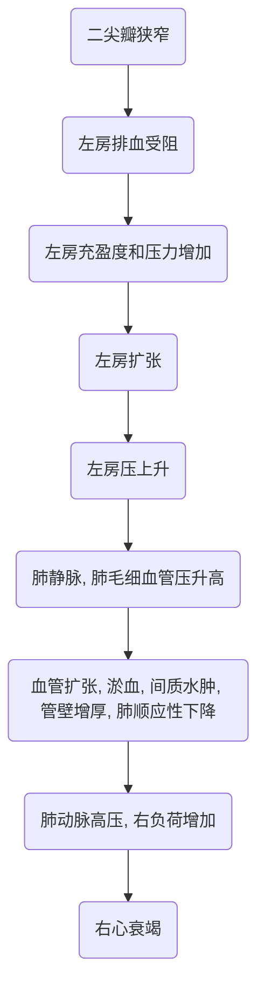
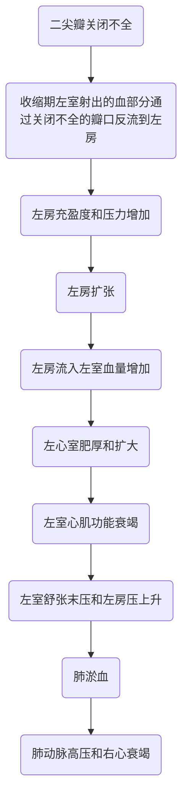
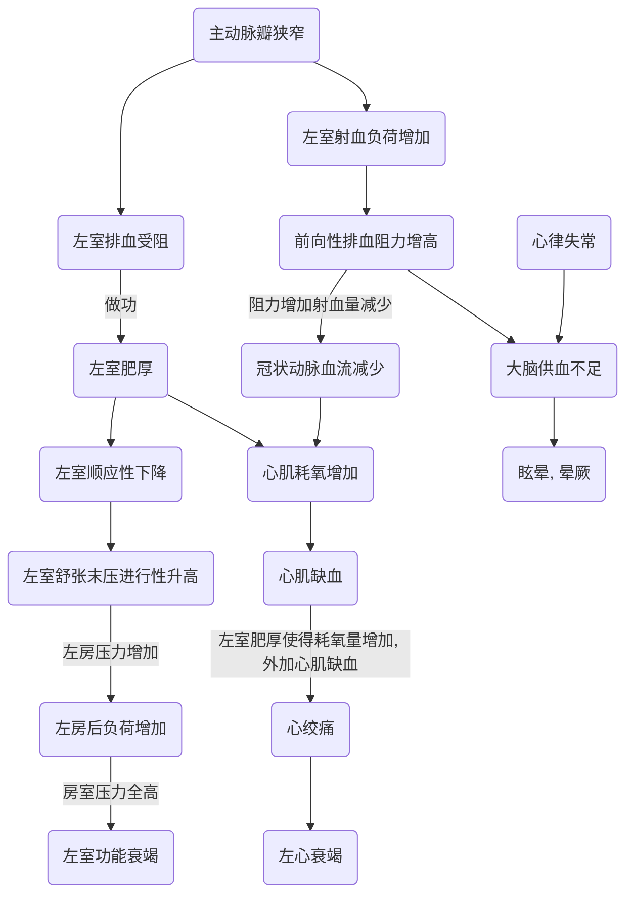
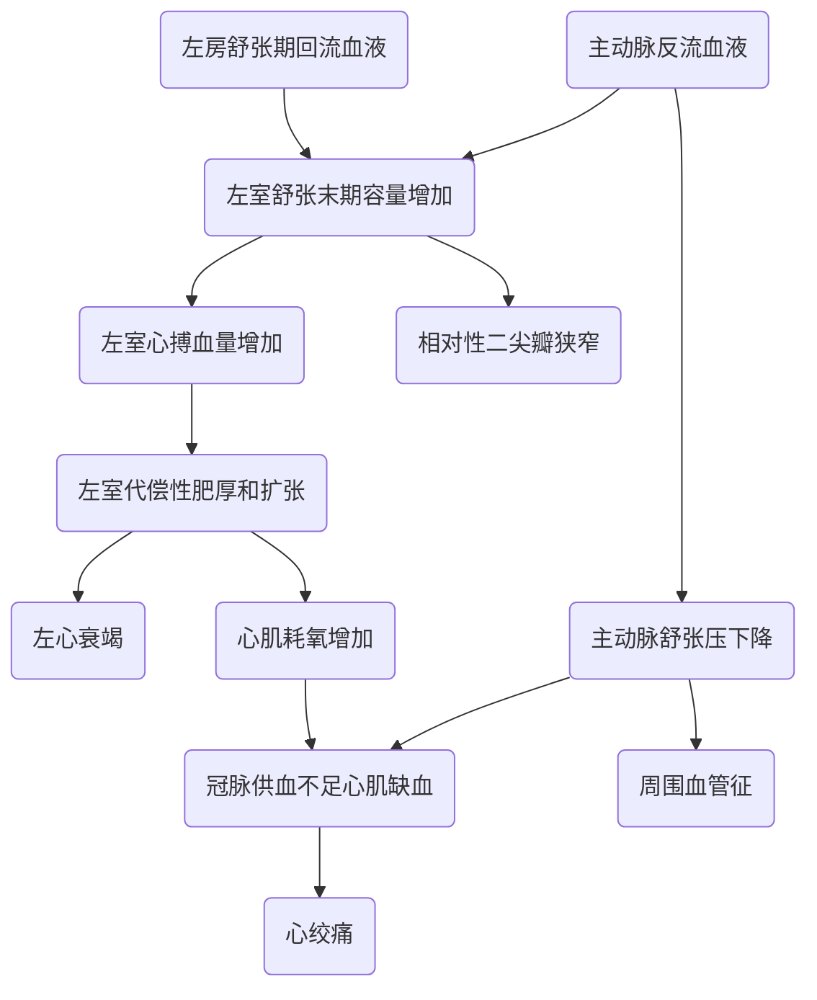
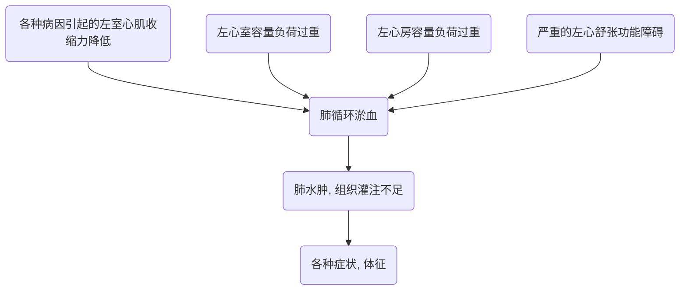
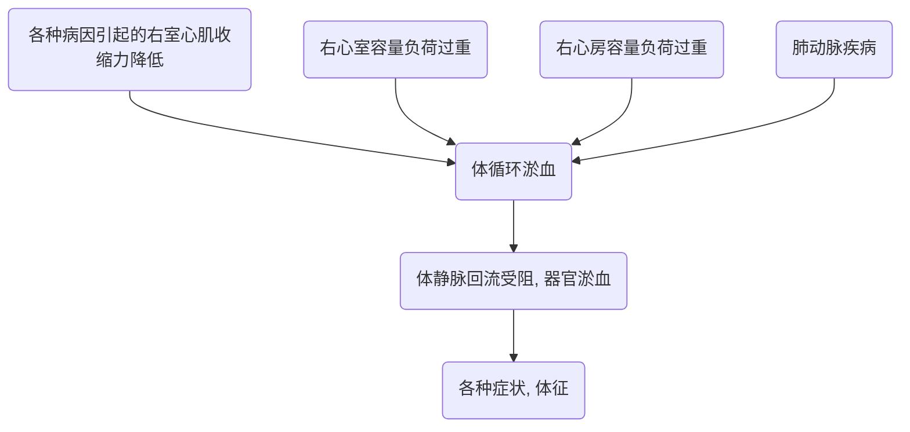

# 循环系统常见症状

## 二尖瓣狭窄
- 概述主要病因
	- 风湿热反复发作
	- 瓣膜钙化
	- 先天性
- 主要病理解剖
	- 瓣叶交界处炎症、水肿、粘连及融合;
	- 严重病变时瓣膜增厚、硬化和腱索缩短及相互粘连
### 二尖瓣瓣口面积
- 正常:4.0-6.0 cm2
- 轻度狭窄:1.5-2.0cm2
- 中度狭窄:1.0-1.5cm2
- 重度狭窄:< 1.0cm2
>***PS.***
>二尖瓣狭窄典型特征：
> - 圆顶征
> - 鱼口征

### 血流动力学

### 根据狭窄程度和代偿状态分为三期
- 代偿期:<2.0cm2，左房代偿性扩张肥厚
- 左房失代偿:<1.5cm2，左房压显著升高导致失代偿，肺淤血，间质水肿
- 右室衰竭期:肺动脉高压，右心室负荷增加、肥厚、扩张导致右心衰

### 症状
1. 呼吸困难
	1. 劳力性呼吸困难
	2. 阵发性夜间呼吸困难
	> ***PS.***
	> 夜间呼吸困难原因：
	> 	- 夜间迷走张力增强
	> 	- 夜间躺下，下肢血液回流心脏使得心脏负荷增加
	> 	- 躺下是横隔抬高，呼吸作用减弱
	2. 休息时呼吸困难
	3. 端坐呼吸
	4. 急性肺水肿
	> 心衰发作时就会是急性肺水肿
2. 咳嗽
	1. 干咳——血丝痰
	>这是肺部牵拉造成的不一定是感染
	>血丝痰——毛细血管破裂
	3. 咯血——粉红色泡沫痰
	> 咯血——支气管静脉破裂
	> 粉红色泡沫痰——血性痰
3. 吞咽困难
	>增大的左房向后压到了食道引起吞咽苦难
4. 声音嘶哑
	> 增大的左房向后压到了喉返神经
### 体征
#### 视诊
- 二尖瓣面容
	> 大面积的暗红，由于长期缺氧引起的毛细血管的扩张，类似于高原红
- 口唇轻度发绀
- 心尖搏动向左移位
- 心前区隆起（儿童期)
#### 触诊
- 舒张期震颤心
- 尖搏动左移
- 收缩期抬举样搏动
#### 叩诊
- 轻度狭窄
	- 心浊音界无异常
- 中度以上
	- 心腰消失心浊音界呈梨形
	- 胸骨左缘第2、3肋间心浊音界向左扩大
#### 听诊
- 心尖区低调、隆隆样、舒张中晚期递增型杂音

| 心尖区     | S1亢进、二尖瓣开瓣音                                                          |
| ---------- | ----------------------------------------------------------------------------- |
| 肺动脉高压 | P2亢进和分裂, 肺动脉瓣区递减型高调叹气样舒张早期Graham Steell杂音，吸气末增强 |
| 右室扩大   | 胸骨左缘第4、5肋间收缩期吹风样杂音，吸气时增加                                |
| 晚期房颤   | 心音强弱不等，心律绝对不规则，脉搏短绌                                        | 

## 二尖瓣关闭不全
概述主要病因
- 急性：
	- 感染、缺血→腱索断裂、乳头肌坏死
	> 常见的比如金葡菌感染
	- 人工瓣膜置换术→瓣周漏
	> 人工瓣膜周边没缝合好
- 慢性
	- 风湿性
	- 二尖瓣脱垂
	> 有些家族会有遗传
	- 冠心病乳头肌功能失调
	- 老年性二尖瓣退行性变

### 血流动力学

> ***PS.***
> 一旦病人出现感觉，出现症状，病情就急转直下了

### 症状
- 心悸
- 咳嗽
> 由于肺的顺应性下降
- 劳力性呼吸困难
- 疲乏无力
### 体征
- 视诊
	- 视左室增大
	- 心尖搏动向左下移位
	- 心尖搏动开始是增强的，发展都心衰的时候是变弱的
- 触诊
	- 心尖搏动有力呈抬举样
	- 重度时可触及收缩期震颤
- 叩诊
	- 心浊音界向左下扩大
	- 晚期向两侧扩大
	- 左右心室增大
- 听诊
	- 心尖区响亮、粗糙、音调较高的3/6级以上全收缩期吹风样杂音,向左腋下和左肩胛区传导。
	- 后叶损害为主时，杂音向胸骨左缘和心底部传导。
	- S1减弱，P2亢进和分裂。
	- 严重反流时心尖区可及S3,以及紧随S3后短促舒张期隆隆样杂音。

## 主动脉瓣狭窄
- 概述主要病因
	- 风湿性
	- 先天性
	> 比如有的人主动脉瓣天生不是三叶的，而是二叶或者四叶的
	- 老年退行性主动脉瓣钙化

### 血流动力学

### 主动脉瓣瓣口面积
- 正常瓣口面积：3.0-4.0cm2

|                                                  | 轻度狭窄 | 中度狭窄  | 重度狭窄 |
| ------------------------------------------------ | -------- | --------- | -------- |
| 峰值流速(m/s)                                    | 2.6-2.9  | 3.0-4.0   | ≥4.0     |
| 平均跨瓣压差(mmH)                                | <20      | 20-40     | ≥40      |
| 主动脉瓣口面积(cm<sup2>2)                  | >1.5     | 1.0-1.5   | <1.0     |
| 主动脉瓣口面积指数(cm2/m2) | >0.85    | 0.60-0.85 | <0.6     |
| 速度比值                                         | >0.5     | 0.25-0.50 | <0.25    | 

> 注：1mmHg=0.133kPa

### 症状
- 轻度狭窄：无症状
- 中重度狭窄：主动脉瓣狭窄三联症
> ***PS.***
> 主动脉瓣狭窄三联症即：
> - 呼吸困难
> - 心绞痛
> - 晕厥

### 体征
- 视:
	- 心尖搏动增强位置可稍移左下
- 触:
	- 心尖搏动有力呈抬举样
	- 胸骨右缘第二肋间可及收缩期震颤
	- 迟脉
	>迟脉：
	>- 由于射出的血流比较少，所以摸到的脉搏比较少
- 叩:
	- 心浊音界正常或可稍向左下增大
- 听
	- 胸骨右缘第2肋间可及3/6级以上收缩期粗糙喷射性杂音,呈递增递减型，向颈部传导。主动脉瓣区S2减弱，S2逆分裂偶可及心尖区S4

## 主动脉瓣关闭不全
- 概述主要病因：
	- 风湿性
	- 非风湿性
		- 先天性
		- 瓣膜脱垂
		- 感染性心内膜炎

### 血流动力学

- 急性
	- 左室舒张末期压力迅速上升，可引起心内膜下心肌缺血和急性左心功能不全，诱发急性肺水肿。
- 慢性
	- 10-15年后才出现症状
### 症状
- 心悸
- 头部搏动感
- 体位性头晕
- 胸痛（心绞痛)
- 劳力性呼吸困难

### 体征
- 视
	- 心尖搏动向左下移位
	- 颈动脉搏动明显
	- 点头运动
- 触
	- 心尖搏动移向左下，呈抬举样
	- 水冲脉
	- 毛细血管搏动
- 叩
	- 心向左下增大而心腰不大,呈靴形界
- 听
	- 主动脉瓣第二听诊区可及叹气样、递减型、舒张期杂音，向胸骨左下方和心尖区传导（前倾位清晰）。
	- 如为重度反流，则有Austin Flint杂音
	- 周围血管可及枪击声和Duroziez双重杂音

### 靴型心

## 心包积液
- 概述
	- 心包积液指心包腔内积聚过多液体(正常30—50ml)，包括液性、浆液纤维蛋白性、脓性和血性等。
### 病因
- 感染性
	- 细菌性；病毒性；真菌性；其它。
	> 细菌性的在过去结核性心包炎引起的很多，病毒性的如病毒性心包炎
- 非感染性
	- 特发性：肿瘤性；肾病性；放射性；外伤性；其它。
	> 放射性：做放疗也可能会有
	- 过敏性：血清病；过敏性肺炎；过敏性肉芽肿。
	- 结缔组织性：风湿性；SLE；心梗后综合征；不明原因性。

### 症状
***取决于心包渗液的量与速度***
- 胸闷
- 心悸
- 呼吸困难
- 腹胀
> 出现消化道的淤血 
- 浮肿
> 外周血流的循环受阻
- 休克

### 体征
- 视
	- 心尖搏动明显减弱甚至消失
- 触
	- 心尖搏动弱，不易触及，如能触及则在心相对浊音界内侧
- 叩
	- 心浊音界向两侧扩大,随体位改变
- 听
	- 少量积液
		- 心前区可及心包摩擦音
		- 心率快心音弱而远
		- 偶可及心包叩击音
	- 大量积液
		- 颈静脉怒张
		- 肝肿大和肝一颈反流征阳性
		- EWART征（左肺受压)
		- 奇脉
		> 吸气的时候摸不到脉

## 心力衰竭
- 概述
	- 在静脉回流无器质性障碍的情况下，由于心肌收缩力下降引起心排血量减少,不能满足机体代谢需要的一种综合征。临床上以肺和(或）体循环淤血以及组织灌注不足为特征,又称充血性心力衰竭。

### 病因
- 心肌本身病变
	- 心肌缺血
	- 心肌坏死
	> 心梗
	- 心肌炎症
	> 感冒等后的爆发性心肌炎
	> - 多数是可以痊愈的
	> - 如果发展为扩张性心肌病预后很差
- 心室负荷过重
	- 阻力负荷：
		- 高血压
		- 瓣膜狭窄
	- 容量负荷
		- 瓣膜关闭不全
		- 大量输液
### 诱因
***促使其发病或者在原有基础上加重的因素***
- 感染
- 心律失常
- 钠盐摄入过多
- 输液过多和(或）过快
- 过度劳累
- 药物

### 血流动力学
#### 左心衰

#### 右心衰
***临床常见的右心衰大多发生于左心衰之后，是由于肺循环阻力增加，右心代偿性压力增高，最终导致右心失代偿，产生右心衰。***

### 症状
- 左心衰
	- （肺淤血)乏力
	- 进行性劳力性呼吸困难
	- 夜间阵发性呼吸困难
	- 端坐呼吸
	- 咳嗽、咯血、泡沫痰
- 右心衰（体循环淤血)
	- 腹胀
	- 少尿
	- 食欲不振
	- 恶心呕吐

### 体征
- 左心衰
	- 视
		- 呼吸急促
		- 轻微发绀
		- 高枕卧位或端坐体位
		- 如果急性肺水肿时口鼻涌出大量粉红色泡沫痰，呼吸窘迫，并大汗淋漓(冷汗)
	- 触
		- 严重者可及交替脉
	- 叩
		- 除原发性心脏病体征外，通常无特殊发现
	- 听
		- 心率增快，心尖区及其内侧可及舒张期奔马律，P2亢进。
		- 根据心力衰竭程度轻重，单侧或双侧由肺底往上有不同程度的对称性细小湿罗音，也可伴少量哮鸣音;急性肺水肿时双侧布满湿罗音和哮鸣音。
- 右心衰
	- 视
		- 颈静脉怒张，周围性发绀、浮肿。
	- 触
		- 不同程度肝肿大、压痛及肝一颈静脉返流征阳性。下肢或腰骶部等下垂部位凹陷性浮肿，严重者全身浮肿。
	- 叩
		- 可有胸水及腹水体征。
	- 听
		- 三尖瓣区闻及相对关闭不全的收缩期吹风样杂音，右心室舒张期奔马律。