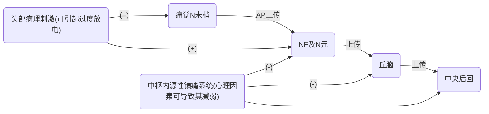
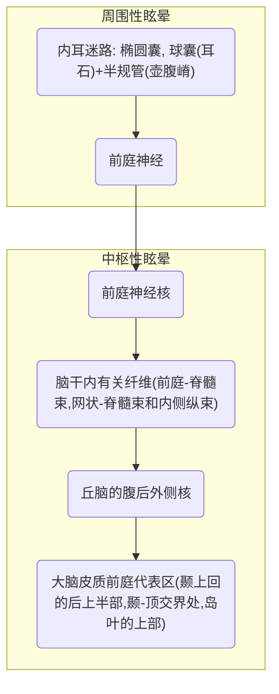

# 目录
1. 头痛
2. 眩晕
3. 晕厥
4. 抽搐与惊厥
5. 意识障碍

# 头痛Headache

## 定义
- 广义定义:泛指头、面部，甚至枕部、颈部疼痛
- 狭义定义:指眉弓、耳廊上部、枕外隆突连线以上部位的疼痛。
## 头痛分类—ICHD-3
- 原发性头痛
	- 偏头痛
	- 紧张型头痛
	- 从集性头痛和其他三叉自主神经性痛
	- 其他原发性头痛
- 继发性头痛
	- 归因于头和/或颈创伤的头痛
	- 归因于颅或颈部血管疾病的头痛
	- 归因于非血管性颅内疾病的头痛
	- 归因于某种物质或其戒断的头痛
	- 归因于感染的头痛
	- 归因于代谢性疾病的头痛
	- 归因于颅、颈、眼、耳、鼻、鼻窦、牙齿、口腔、和其他头面部结构疾病的头痛
	- 归因于精神疾患的头痛
- 颅神经痛、中枢性和原发性面痛及其他头痛
	- 颅神经痛和与中枢疾病引起的面痛
	- 其他类头痛、颅神经痛、中枢或原发性面痛
## 头痛的发生机制
- 颅内外的致痛机制
	- 血管因素
	> 动脉、静脉
	- 脑膜
	> 软脑膜、硬脑膜 
	- 神经
	> 三叉神经、迷走神经、舌咽神经、舌下神经
	- 肌肉
	> 头面部的一些肌肉
	- 眼、耳、鼻、鼻窦以及牙齿等病变的疼痛
	- 精神因素

### 头痛的神经传递通路

> 病理刺激
> 1. 血管(颅内外):收缩、扩张、牵拉或压迫
> 2. 神经(V,VII,IX,X,C1~3):受刺激、压迫或牵拉
> 3. 脑膜:受刺激或牵拉
> 4. 肌肉:紧张或收缩
> 5. 精神因素:痛阈下降
> 	> 中枢有内源性的镇痛系统，心理因素可以导致这个镇痛系统的作用减弱→对==痛觉神经元、丘脑和中央后回==的抑制减弱

## 头痛病因
1. 颅脑病变
	1. 感染:脑膜炎、脑膜脑炎、脑炎、脑胜肿等。
	2. 血管病变.蛛网膜下腔出血、脑出血、脑血栓形成、脑栓塞、高血压脑病、脑供血不足，脑血管畸形、风湿性脑脉管炎和血栓闭塞性脑脉管炎等。
	3. 占位性病变:脑肿瘤、颅内转移出、颅内囊虫病或棘球呦病等。
	4. 颅脑脑外伤、脑震荡、脑挫伤、硬膜下血肿、颅内血肿、脑外伤后遗症等。
	5. 其他：腰椎穿刺后及腰椎麻醉后头痛等。
	> 包括医源性：腰穿之后可能会出现低颅压的情况；麻醉穿刺后也可能会引起低颅压的情况
2. 颅外病变
	1. 颅骨疾病:颅底凹陷症、颅骨肿瘤等。
	2. 颈部疾病:颈椎病及其他颈部疾病。
	3. 神经痛:三叉神经、舌咽神经及枕神经痛等。
	> 临床上常见；剧烈的疼痛、想闪电样的头痛(时间短而剧烈) 
	5. 其他:眼、耳、鼻和齿等疾病所致的头痛。
	> 鼻窦炎、青光眼、中耳炎
3. 全身性疾病
	1. 急性感染:流感、伤寒、肺炎等发热性疾病。
	2. 心血管疾病:高血压、心力衰竭等。
	3. 中毒:铅、酒精、一氧化碳、有机磷、药物等中毒。
	> 喝完酒之后头痛——实际就是酒精中毒的表现 
	5. 其他:尿毒症、低血糖、贫血、肺性脑病、系统性红斑狼疮、中暑等。
	> 本质——引起缺氧而后引起的头痛
4. 精神心理因素:
	1. 抑郁、焦虑、躯体化障碍。

### 起病方式
- 急性头痛
	> ***PS.***
	> 以分以秒计的
	- 蛛网膜下腔出血、脑出血、脑梗死、脑炎、脑膜脑炎、癫痫、高血压脑病、腰穿所致的低颅压、青光眼、急性虹膜炎等
	> ***PS.***
	> 蛛网膜下腔出血——炸裂样的头痛
- 亚急性头痛
	> ***PS.***
	> 以天计的
	- 颅内占位性病变、良性颅高压、高血压头痛等
	> 由于在头痛发展的过程中，病人可能会产生耐受，所以病人对此可能不是很敏感，所以很多病人描述会是:"轻微的疼痛"
	> 良性颅高压——中等程度的疼痛，腰穿脑脊液压力是高的，排除其他器质性因素之后就可以大概确定是良性的颅高压 
- 慢性头痛
	> ***PS.***
	> 以月以年计的
	- 偏头痛、紧张型头痛、丛集性头痛、药物依赖性头痛、鼻窦炎等

### 头痛部位
- 原发性的头痛(Primary headaches)
	- 紧张性的头痛(Tension headaches)
		- 与肌肉的紧张相关
		- 表现为：前额部与后枕部的压迫性的头痛
		- 病人描述：很紧的帽子、砖头压在头上
	- 偏头痛(Migraine)
		- 单侧或双侧发作的波动性的头痛，位于顶部或者面部的位置
		- 偏侧多见，但是也可以是双侧的
	- 丛集性头痛(Cluster headaches)
		- 主要位于眼周的反复发作的头痛，同时病人还会有组胺的表现，比如流涕、流泪、结膜充血
- 继发性头痛(Secondary headaches)
	> 往往与原发疾病的位置是相关的
	-  窦性的头痛(Sinus)
		- 可能与副鼻窦的炎症或副鼻窦内的占位性的病变是相关的，一般位于鼻窦的附近：额窦、筛窦、蝶窦
	- 慢性每日痛(New daily persistent headaches, NDPH)
		- 长期的反复的精神紧张外加不合理的用药；青中年女性多见
		- 两侧颞部，慢性反复性发作的头痛 
	- 高血压性头痛(Hpertension)
		- 后枕部头痛，压迫性头痛
		- 有高血压病史，测量血压一般在180-200，甚至更高
	- 颞下颌关节紊乱(TMJ disorders)
		- 下颌关节的功能紊乱之后，引起关节周围的疼痛，与咬合相关 

| 部位     | 相关疾病                                             |
| -------- | ---------------------------------------------------- |
| 全头痛   | 脑肿瘤、颅内出血、颅内感染、紧张性头痛、低颅压头痛   |
| 偏侧头痛 | 偏头痛、副鼻窦炎性头痛、耳源性头痛、牙源性头痛       |
| 前头痛   | 后颅凹肿瘤、小脑幕上肿瘤、副鼻窦炎性头痛、丛集性头痛 |
| 眼部头痛 | 高颅压头痛、丛集性头痛、青光眼、痛性眼肌麻痹         |
| 颞部头痛 | 垂体瘤、蝶鞍附近肿瘤、颞动脉炎                       | 

### 头痛程度
> ***PS.***
> 头痛严重程度不一定与病情严重程度平行

|      |                                                      |
| ---- | ---------------------------------------------------- |
| 轻度 | ==可忍受==，不影响日常工作、生活                         |
| 中度 | ==较重==，影响日常工作、生活                             |
| 重度 | ==难以忍受==，严重影响生活和工作；神经痛、脑膜刺激的疼痛 | 

> 临床上常见的重度的头痛一般是神经痛和脑膜刺激的疼痛；其中例如蛛网膜下腔出血就是典型的脑膜刺激的疼痛

### 性质、时间、诱发因素
| 性质                                                                                                      | 出现时间                                                                                                                                  | 持续时间               | 诱发缓解                                               |
| --------------------------------------------------------------------------------------------------------- | ----------------------------------------------------------------------------------------------------------------------------------------- | ---------------------- | ------------------------------------------------------ |
| 闪电样 搏动性  压榨性 胀痛 放射性  ==多样性== | 清晨 上午 下午 夜间 固定时间（月经期） | 秒 小时 天 月 | 屏气、咳嗽 改变体位 腰穿 颈部运动 特殊食物 |

性质
- 闪电样——神经性的痛；搏动性——血管性的；压榨性、胀痛——紧张性的
出现时间
- 清晨——颅内占位清晨往往有加重；鼻窦炎由于有分泌物的堆积，在清晨上午往往也会有加重；紧张性疼痛——下午和晚上，比如丛集性头痛夜间比较明显；偏头痛由于与激素相关所以部分女性会在月经期间出现偏头痛
持续时间
- 神经性大多是以秒计的；其他的大多数为以小时、天计；而慢性的，例如颅内占位大多是以月计的
诱发因素
- 屏息、咳嗽等会增加颅内压与颅内一些占位性病变以及一些会导致颅内压增加的病变都是会诱发头痛的因素 
- 改变体位——最常见的是体位性的低颅压的头痛：躺下时还好，站起时颅压进一步降低
- 动手术、腰麻、腰穿——医源性的头痛
- 特殊食物——偏头痛；进食柑橘、奶酪制品、牛奶、奶油蛋糕、奶茶等会诱发偏头痛

### 伴随症状及全身情况
- 剧烈呕吐:颅内压增高，头痛在呕吐后减轻者见于偏头痛
- 眩晕:小脑肿瘤、椎基底动脉供血不足等
> 后循环缺血
- 发热:感染性疾病，包括颅内或全身性感染
- 慢性进行性头痛出现精神症状:颅内肿瘤
> 颞叶部位占位性肿瘤、额叶部位占位肿瘤
- 慢性头痛突然加剧并有意识障碍:发生脑疝
> 最常见——枕骨大孔疝
- 视力障碍:青光眼或脑肿瘤
> 压迫视交叉神经等
- 脑膜刺激征:脑膜炎、蛛网膜下腔出血
- 癫痫发作:可见于脑血管畸形、脑内寄生虫病或脑肿瘤等

## 头痛问诊要点
- 基本要点
	- 头痛的起病方式
	- 头痛的部位
	- 头痛的性质
	- 头痛的程度
	- 头痛出现时间和持续时间
	- 诱发、加重、缓解因素
- 伴随症状和全身状况
- 其他

# 眩晕
***定义:病人感到自身或周围环境物体旋转或摇动的一种==主观感觉障碍==，常伴有客观的==平衡障碍==，一般==无意识障碍==。***

## 区分几个概念
- 头昏:头脑不清晰感，头沉，伴/不伴头痛，不伴神经系统定位体征。不受视觉和听觉影响，可能有轻度恶心。
> 往往有焦虑抑郁的情绪
- 头晕:自身摇晃不稳为主，运动状态下加重，不愿睁眼，==不伴视物旋转==，可有神经系统定位体征，可伴恶心，不伴呕吐。头晕有时比眩晕病情严重
> 主要表现为自身的摇晃(走路加重)，睁眼"晕"
- 眩晕:一种==运动性幻觉==，感觉自身或外界物体在旋转、升降、直线运动、倾斜、头重脚轻等感觉。往往有眼震等神经系统体征。
### 严重程度
1. 头昏一般没什么问题，安抚，严重者给抗焦虑、抗抑郁药，就好了
2. 眩晕一般与前庭、前庭中枢病变相关
3. 头晕一般与颅内病变有关

头晕>眩晕>头昏

## 发病机制
### 眩晕的解剖基础
***==平衡三联==：维持正常的空间位象有赖于***
- 视觉:提供周围物体的方位和机体与周围物体的关系
- 深感觉:传导肢体关节与体位姿势的感觉
> 与后索密切相关
- 前庭系统:辨认机体的方位和运动速度
虽然视觉和深感觉参与维持正常的空间位象，但是它们的病变很少主诉眩晕。==前庭病变是引起病理性眩晕的主要病因==。

> 区分中枢和外周是因为中枢和外周的眩晕是由不同的疾病引起的

## 周围性和中枢性眩晕的鉴别要点
|                    | 周围性    | 中枢性    |
| ------------------ | --------- | --------- |
| Sudden (Onset)     | 是        | 慢，逐渐  |
| Positional         | 是        | 无        |
| Intensity          | 严重      | 不定      |
| Nausea/Diaphoresis | 频繁      | 少见      |
| Nystagmus          | 旋转/水平 | 旋转/垂直 |
| Ear (hearing loss) | 可有      | 无        |
| Duration           | 发作性    | 持续性    |
| CNS signs          | 无        | 多有      | 

## 眩晕的病因分类
- 中枢性眩晕
	- ==后循环TIA/梗死/出血==
	- 肿瘤
	- MS
	> 多发性硬化
	- 延髓空洞症
	- 颞叶癫痫
	- ==偏头痛==
- 周围性眩晕
	- 生理性（晕动症)
	- ==BPPV==
	> 良性位置性眩晕：动就晕，不懂就不晕
	- ==前庭神经元炎==
	- 迷路炎
	- ==Meniére病==
	> 必定会伴有听力下降
	- 迷路瘘
- 其他
	- 全身疾病（心血管、血液病、中毒)
	- 眼源性
	- 神经精神性

 ## 发作时间
 | 持续时间 | 周围性               | 中枢性             |
 | -------- | -------------------- | ------------------ |
 | 秒       | BPPV                 | VB-TIA, 癫痫先兆   |
 | 分       | 迷路瘘               | VB-TIA，偏头痛先兆 |
 | (半)小时 | Meniére病            | 偏头痛             |
 | 天       | 前庭神经元炎；迷路炎 | 卒中               |
 | 周，月   | 听神经瘤，药物       | MS,小脑变性        | 

## 眩晕问诊要点
- 基本要点
	- 起病方式
	- 持续时间病程
	- 视物旋转
	- 诱发、加重、缓解因素
- 伴随症状
	- 听力、耳鸣、共济失调、迷走激惹、情绪
	> 伴随症状==主要关心有无听力和耳鸣==，有则多为周围性的，但如有颞叶有病变的中枢性的也会伴有耳鸣
	> 共济失调——小脑
	> 迷走激惹：恶心呕吐、出冷汗、心慌等都是
	> 情绪——偏执有无
- 全身状况
- 既往病史

# 晕厥 Syncope
***定义:因各种原因导致==一过性脑供血不足==引起的意识障碍。==肌张力消失==不能保持正常姿势而倒地。==突然发作，迅速恢复==，很少有后遗症。***

*与猝死的不同是——能“醒过来”*

## 晕厥病因
**大脑灌注压取决于体循环的==动脉压==
任何引起==心排出量下降==或==外周血管阻力降低==的原因都可以引起晕厥**
1. 自主神经调节失常，血管舒缩障碍:==单纯性晕厥(最常见)==、直立位晕厥、==颈动脉窦综合征==;一次性大量排尿或连续咳嗽，迷走神经反射回心血量减少引起晕厥。
> 单纯性晕厥——70%，
> - 年轻女性中常见；密闭环境，空气流动较差、CO2浓度比较高的环境，紧张焦虑，情绪激动之后
> 颈动脉窦综合征——按摩颈动脉窦可以引起晕厥，或者别的原因压迫到颈动脉窦也会引起晕厥
> 一次性大量排尿、连续性咳嗽——胸腔内的压力增高，腹腔内的压力减低→刺激到迷走神经干→迷走神经反射性的亢进→回心血量减少→晕厥
2. 心源性晕厥:这种原因的晕厥最严重，多见于严重的快速或慢速心律失常、心脏骤停。任何体位均可发生，缺血严重时可伴四肢抽搐、大小便失禁。==Adams-stokes综合征==最为严重。
> Adams-stokes综合征/阿-斯综合征——心脏骤停，心源性脑缺血综合征；伴四肢抽搐、大小便失禁
3. 脑源性晕厥:这种情况多为突然发生的脑供血不足所致，因脑干网状结构上行激活系统缺血而不能维持正常的意识状态，应称为后循环短暂性脑缺血发作。
> 上行激活系统与觉醒状态密切相关
4. 血液成分异常:低血糖、重度贫血、过度换气、哭泣性晕厥、高原晕厥。
> 一般来说高糖不太会引起晕厥，一般为低糖引起晕厥——能量供应受阻
> 中度贫血——影响大脑氧供
> 哭泣性晕厥——本质为过度换气引起的晕厥

## 晕厥临床表现
- ==晕厥先兆==:突感头昏、恍惚、视物模糊或两眼发黑、四肢无力
- 随之意识丧失，摔倒在地
- 数秒钟至数分钟内即恢复如常
> 对摔倒的过程是没有回忆的 
- 及时蹲下，则症状很快消失
> 减少下肢静脉血流，增加回心血量，保证大脑有效灌注， 此时晕厥的前兆的症状可以缓解 ，可以避免晕厥  
- ==晕厥时心率减慢或增快、血压下降、面色苍白、可出冷汗。==
> - 心源性晕厥如室颤、室速时是增快的
> - 如为病窦综合征则为减慢的(20-30跳)
> - 伴有植物神经的症状——面色苍白，出冷汗
- 基本上都是站位或坐位发生，卧位发生应注意是否患有心脑血管病如心律失常、短暂性脑缺血发作或癫痫
> 心源性的晕厥和脑源性的晕厥是可以和体位是没有关系的

## 晕厥伴随症状
- 明显的自主神经功能障碍(如面色苍白、出冷汗、恶心、乏力等): ==血管==抑制性晕厥或==低血糖==性晕厥。
> *PS.* 低血糖本来就有面色苍白、出冷汗等的症状
- 面色苍白、==发绀==、呼吸困难:急性左心衰竭。
- 心率和心律明显改变: 心源性晕厥。
> 心跳可快可慢
- 抽搐者:中枢神经系统疾病、心源性晕厥。
- 头痛、呕吐、视听障碍: 中枢神经系统疾病。
> 头痛、呕吐是中枢神经系统颅内压增高的表现
> - 中枢神经系统占位性疾病、中枢神经系统炎症、脑血管疾病→颅高压的表现，颅高压后相关性的晕厥 
- 发热、水肿、杵状指者: 心肺疾病。
> 杵状指提示病人有慢性的缺氧
- 呼吸深而快、手足发麻、抽搐: 通气过度综合征、癔症等。
> 呼吸性碱中毒——嘴巴麻、四肢麻等的

## 晕厥问诊要点
1. 发生年龄、性别。
> 年轻女性多考虑：单纯性晕厥 
2. 诱因、发作与==体位==关系、与咳嗽及排尿关系、与用药关系
> 躺着——心源性、脑源性；其他体位——血管收缩障碍
3. 发生速度、发作持续时间、发作时面色、血压及脉搏情况
4. 伴随症状
5. 有无心、脑血管病史
6. 既往有无相同发作史及家族史
> 单纯性晕厥有一定的家族史
> 洗澡时间久也会诱发晕厥——皮肤血管舒张，血液留在外周

# 抽搐与惊厥 Tic & Convulsion
***抽搐:==全身或局部==成群骨骼肌非自主的抽动或强烈收缩
惊厥:肌群收缩表现为==强直和阵挛==；全身性、对称性、伴或不伴意识障碍***

## 病因
- 特发性–先天性脑部不稳定状态
> 很多小孩子的惊厥和抽搐就是因为脑发育不完全的问题，长大后一般可以缓解  
- 症状性(继发性的)
	- 脑部疾病:
		1. 感染性-脑炎、脑脓肿、脑结核瘤
		2. 外伤-产伤、颅脑外伤
		> 生产时的操作对新生儿造成的损伤——产伤
       3. 肿瘤-原发性肿瘤、脑转移瘤
       > 占位性
		4. 血管疾病-脑出血、蛛血、脑血栓形成
		5. 寄生虫病-脑囊虫病
		> 占位性
		6. 其他:先天性脑发育障碍、结节性硬化
	- 全身性疾病
		1. 感染:中毒性菌痢、链球菌败血症
		2. 中毒:内源性、外源性
		> 包括例如有机磷农药、吗啡等
		3. 心血管疾病:高血压脑病、阿斯综合症
		4. 代谢障碍:低血糖、低血钙
		5. 风湿病:SLE、脑血管炎
		6. 其他:==突然撤抗癫痫药==、窒息、溺水、触电
		> 突然撤抗癫痫药后引起的惊厥一般会发展成难治性的癫痫
	- ==神经官能症==
	> 会有潜意识中的自我的保护意识——与器质性的区别
	> 无器质性的问题，是心理的精神的问题，可以一般抽搐一边交谈，有一些表演化、戏剧化的表现
	- 小儿惊厥
	> 往往与高热相关，降温就好了

## 发生机制
- 未明了
- 可能与神经元的==异常放电==所致
- 代谢、营养、脑皮质病变或疤痕
- 遗传、免疫、内分泌、精神因素
分：
	1. 大脑功能障碍:癫痫大发作
	2. 非大脑功能障碍:破伤风、低钙抽搐

## 临床表现
- 全身性
	- 癫痫大发作:意识丧失、强直阵挛、瞳孔散大
	> 瞳孔直接、间接对光反应都消失
	- 癔症性发作:情绪等诱因，发作样式多样，意识保留
	> 不伴有意识障碍，有自我保护，不会让自我受伤——不用担心捏 
- 局限性:手足搐搠

## 伴随症状
- 发热:急性感染
- 血压增高:高血压病、肾炎、子痫
> 子痫——孕产妇
- 脑膜刺激征:脑膜炎、蛛血
- 瞳孔扩大、舌咬伤、大小便失禁:癫痫大发作
> 要检查瞳孔对光反射
> 瞳孔不一定散大，因为癫痫病人会用很多镇静性的药物(用安定之后瞳孔会缩的很小)，但是瞳孔对光反射仍是不能恢复的
- 剧烈头痛:高血压、急性感染、蛛血
- 意识丧失:癫痫发作、重型颅脑疾病

## 问诊要点
- 发生年龄、病程
> 年纪小的多考虑癫痫，老年多考虑肿瘤、高血压等
- 发作前是否诱因、持续时间
> 询问诱因是为了判断癫痫
- 全身性还是局限性、强直性还是阵挛性
- 是否意识丧失、两便失禁、舌咬伤
- 有无脑部疾病、全身性疾病、毒物接触、外伤等
- 病儿询问分娩史、生长发育史

# 意识障碍 Disturbance of Consciousness
意识：
- 意识的水平：醒与不醒
- 意识的内容：在想什么
***定义:指由于脑干上行网状激活系统及/或中枢整合机构的损害，以致==对周围环境及自身状态的识别和觉察能力==出现障碍。
在临床上表现为不同程度的==意识水平的下降==伴或不伴有==意识内容的改变==。
==不同于睡眠==:不容易清醒
==不同于晕厥==:持续性***

## 意识障碍发生机制
- 各种病因→脑缺血、缺氧、葡萄糖供给不足、酶代谢异常→脑细胞代谢紊乱→网状结构==（“开关”系统)功能损害和/或弥漫性大脑皮层（中枢整合结构）损害==→意识水平下降，意识内容改变→临床表现。
> “开关”系统/网状激活系统：意识水平
> 中枢整合系统：意识内容
- ==意识水平==通常指上行网状系统对大脑皮层的兴奋性、觉醒程度。
- ==意识内容==即高级神经活动，包括:定向力、感知力、注意力、思维、情感和行为等。

## 意识障碍病因
- ==严重==脑部病变
	- 炎症:脑炎、脑膜炎、脑脓肿等。
	- 脑血管病:脑出血、脑梗塞、SAH等。
	- 占位病变:脑肿瘤等。
	- 外伤:脑震荡、脑挫裂伤、颅骨骨折。
	- 癫痫
- ==严重==全身病变
	- 感染、心血管、内分泌与代谢、中毒、物理性及缺氧性损害等。

> **老师的评价是，不会判断，套就好了**

## 临床表现
### 意识水平下降
***根据对言语刺激、疼痛刺激、无意识动作、腱反射、对光反射、生命体征等的观察，将意识水平下降的意识障碍分为以下类型:***
> 言语刺激——交流；疼痛刺激——拿针扎
- 嗜睡(Somnolence)可唤醒，并正确回答和反应，但又再入睡。
> 时间定向(现在是白天还是晚上)、人物定向(周围的这个人是谁)
- 昏睡(Stupor)强刺激下可唤醒，答非所问，很快又再入睡。
> 强刺激：掐眼眶、掐指甲盖
- 昏迷(Coma)意识丧失，对言语刺激无反应。
	- 浅昏迷
	- 中昏迷
	- 深昏迷

| 分级   | 唤醒反应    | 对疼痛的反应 | 无意识动作 | 腱反射 | 光反射 | 生命体征 |
| ------ | ----------- | ------------ | ---------- | ------ | ------ | -------- |
| 嗜睡   | +，叫唤     | +，明显      | +          | +      | +      | 稳定     |
| 昏迷   | +，大声呼唤 | +，迟钝      | +          | +      | +      | 稳定     |
| 浅昏迷 | -           | +            | 可有       | +      | +      | 无变化   |
| 中昏迷 | -           | 重刺激可有   | 很少       | ±      | 迟钝   | 轻度变化 |
| 深昏迷 | -           | -            | -          | -      | -      | 显著变化 | 

> 浅昏迷——对疼痛的刺激有，但是不会醒过来，会与退缩反应，皱眉等的反应

### 意识内容的改变
- 意识模糊Confusion:在嗜睡的基础上，有定向力障碍，突出表现是有==错觉==。
> 分不清情况，地点、人物都会出现错觉，有些病人白天黑夜也无法正确区分
- 澹妄状态Delirium(兴奋性增高)︰在意识模糊的基础上，==定向力==丧失、感觉错乱，突出的表现是出现==错觉、幻觉、躁动不安==。
> 还会有睡眠的节律紊乱

意识障碍评估——GSC

- 轻度昏迷:13到14分
- 中度昏迷:9到12分
- 重度昏迷:3分到8分
***8分以上恢复机会较大,
7分以下预后不良，
3-5分有潜在死亡危险***

## 意识障碍伴随症状
- 伴发热:重症感染性，脑出血、SAH、巴比妥类、中毒
- 伴呼吸减慢:巴比妥类、吗啡、有机磷中毒，银环蛇咬伤
- 伴瞳孔散大:癫痫大发作，低血糖，酒精、颠茄氰化物中毒
- 伴瞳孔缩小:巴比妥、有机磷、吗啡中毒
- 伴心动过缓:颅高压，房室传导阻滞，吗啡重度
- 伴高血压:卒中、高血压脑病、肾炎、尿毒症
- 伴低血压:休克
- 皮肤黏膜改变:严重感染、出血性疾病，一氧化碳中毒
- 脑膜刺激征:脑膜炎、SAH
- 瘫痪:卒中

## 意识障碍问诊要点
- 起病时间
- 发病前后
- 情况诱因
- 病程
- 程度-GCS评分
- 有无颅内病变相关症状
- 有无颅外病变相关症状
