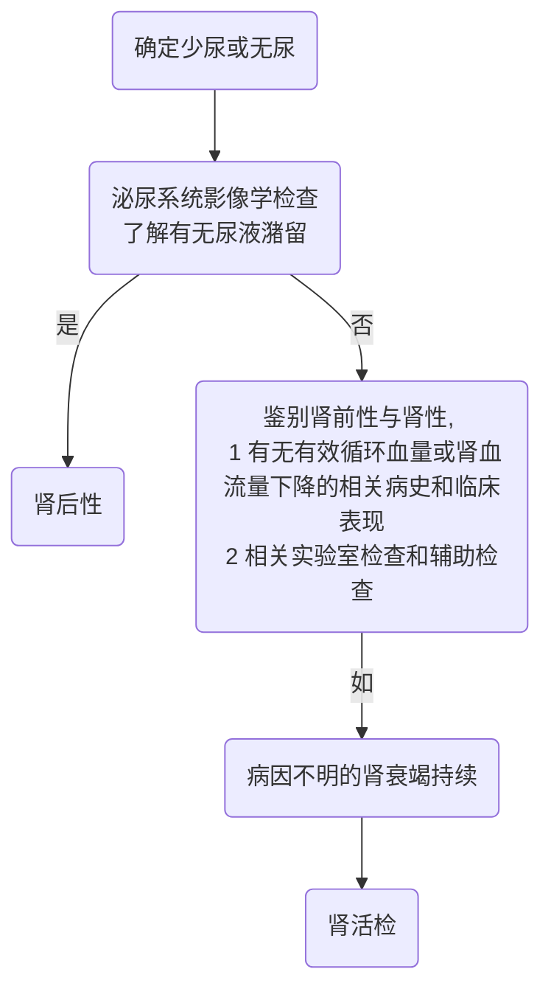

# 《发热，泌尿系统常见症状》补充材料

## 1. 血尿的问诊内容
1. 尿的颜色
2. 是否有红色药物或食物食用史
3. 是否有月经、便血、痔疮出血、脓液等混入可能
4. 是否为全程血尿
5. 伴随症状（全身的、泌尿系统的)
6. 是否有诱因（感染、劳累等)
7. 所有症状的持续时间、发作频率、演变过程
8. 既往就医情况
9. 既往史、个人史、婚育史、月经史、家族史等

## 尿频、尿急、尿痛问诊内容
1. 紧扣定义，确立诊断
2. 尿频是否伴有尿急、尿痛
3. 伴随症状（全身的、泌尿系统的)
4. 是否有诱因(医疗操作、劳累、饮水少等)
5. 所有症状的持续时间、发作频率、演变过程
6. 既往就医情况
7. 既往史、个人史、婚育史、月经史、家族史等

## 少尿(无尿)的病因诊断

## 少尿(无尿)的问诊内容
1. 紧扣定义，确立诊断
2. 伴随症状
3. 所有症状的持续时间、发作频率、演变过程
4. 既往就医情况
5. 既往史，尤其是有可能造成肾前性、肾性、肾后性少尿或无尿的疾病史
6. 个人史、婚育史、月经史、家族史等
