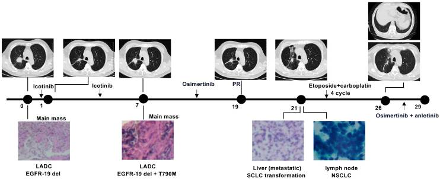
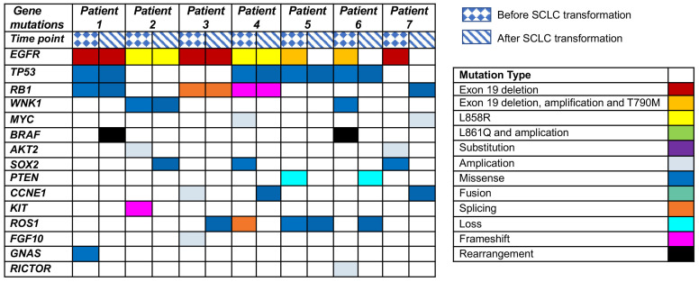

# 病例汇报 - <我们将在所有转移灶上战斗>

## 幻灯片 - 1

患者张玲娣，女，70岁，已婚，籍贯：上海，职业: 退离休人员，上海市市辖区静安区 威海路910弄56号，病史陈述人: 本人，可靠程度: 可靠

## 幻灯片 - 2

患者的主诉: 确诊右肺腺癌2年余。

患者于2021年7月因咳嗽咳痰入院，经检查诊断为右肺腺癌，伴有右侧颞叶转移瘤，分期为IV期，PS0分。患者基因检测显示exon21，L858R突变，于2021年8月开始口服阿美替尼治疗，症状好转，肝功能异常，予保肝治疗后复查正常。2022年7月复查发现颞叶转移瘤未缩小，胸部CT无明显变化，10月发现颅内多发粟粒样及小结节状异常信号，病情进展，调整靶向药物为泰瑞沙，11月复查颅内病灶减少，病情好转。2023年4月评估病情进展，有子宫等其他部位转移可能，拒绝进一步检查，继续口服奥西替尼治疗。6月复查发现右肺上叶团块灶增大，右肺多发结节灶增大，两肺散在纤维索条灶，右侧第9肋骨及胸9椎体高密度影。7月经皮肺穿刺病理检查显示分化较差的腺癌，部分有神经内分泌分化，免疫组化Ki67阳性率40%。8月开始EC方案化疗，同时继续靶向治疗，化疗后症状无明显改善，现为进一步诊治收入院。

患者自本次发病以来，精神可，胃纳略差，睡眠可，大便如常，小便如常，体力轻度下降，体重未见明显下降。

一般健康状况良好。否认肝炎。否认结核史。否认疟疾史。否认脑血管病史。否认精神病史。否认高血压史。否认心脏病史。否认糖尿病史。 否认手术史。否认外伤史。否认输血史。否认食物、药物过敏史，预防接种史不详。

出生于上海，久居当地，否认疫区接触史。无化学性物质、放射性物质、毒物质接触史。无吸烟史。无饮酒史。

月经正常，已绝经，经量正常，无痛经。

已婚，已育，健康状况良好。

否认家族性遗传病史。否认家族性肿瘤史。

## 幻灯片 - 3 - 查体

T:36.7 ℃，P：70次/分，R：12次/min  Bp：126 /76mmHg，神志清楚，呼吸平稳，步入病房，主动体位，对答切题，查体合作。发育正常，营养中等，体型中等。全身皮肤粘膜无黄染，无皮疹，无出血点、瘀点、瘀斑，毛发分布正常，皮肤温度、湿度正常，未见肝掌、蜘蛛痣。全身浅表淋巴结未触及肿大。头颅无畸形，颜面无浮肿，额纹对称，眼裂对称，眼睑无肿，结膜无充血，巩膜无黄染，双侧瞳孔等大等圆，对光反射存在。双耳听力正常，外耳正常，外耳道无脓性分泌。双侧鼻唇沟对称，鼻中隔无偏曲，鼻腔通畅。伸舌居中，鼓腮、露齿可，口唇略紫绀，咽无充血，双扁桃腺无肿大。颈软，气管居中，肝颈静脉回流征阴性，颈动脉搏动良好，双侧甲状腺未扪及肿大。肋间隙正常，无压痛。胸廓两侧对称，呼吸活动对称，两侧触觉语颤对称，无胸膜摩擦感，叩诊过清音，听诊两肺呼吸音清，未闻及明显干湿啰音及哮鸣音，未闻及胸膜摩擦音。心前区无异常隆起，无震颤，心尖搏动于左第五肋间锁骨中线，心相对浊音界不大，HR 75次/分，律齐，各瓣膜区未闻及明显病理性杂音。未见明显周围血管征。腹部平坦，未见腹壁静脉曲张，无皮疹，无肠型，全腹软，无肌卫，无压痛、反跳痛，未扪及包块，肝脾肋下未触及，腹部叩诊鼓音，无肝区肾区叩痛，移动性浊音阴性，肠鸣音可闻及。肛门直肠生殖器未检。脊柱四肢无畸形，各棘突无压痛，各四肢关节无红肿、畸形，肌肉无萎缩，双下肢无明显静脉曲张，无杵状指趾，双下肢无水肿。四肢肌力、肌张力正常，感觉正常，生理反射存在，双侧Babinski征阴性。   4.神清，呼吸平稳，胸廓两侧对称，呼吸活动对称，肋间隙正常，两侧触觉语颤对称，无胸膜摩擦感，叩诊过清音，听诊两肺呼吸音粗，未闻及明显干湿啰音，未闻及哮鸣音，未闻及胸膜摩擦音。双下肢无水肿

以上是病人基本情况，接下来我们将对其病情的进展以时间顺序进行详细的铺开以便清晰展示其在诊断段和治疗经过。

## 幻灯片 - 4

2021.7.19门诊查CT示右肺近肺门团块灶伴右肺中叶阻塞性肺炎，右肺多发团块灶，考虑MT，患者口服甲氧那明、肺力咳等止咳治疗后未见明显好转，为进一步诊治收治入院

2021.7.21因反复咳嗽，少量咳痰入院，入院后予以予头孢西丁、阿奇霉素抗感染，溴己新化痰治疗，疗效不佳，为进一步确诊↓

2021.07.27行气管镜检查取活检病理，由于活检病理结果未出，遂在病情稳定后于2021.7.31出院

2021.9.6，因活检明确为腺癌，遂入院使用肺癌第三代EGFR靶向药: 阿美替尼治疗。9.6胸部CT示肺部，颅内病灶均缩小，评估为部分缓解PR，遂予以9.8出院，继续随访。

2021.11.2日入院进行靶向药物治疗与随访，继续阿美替尼治疗。期间血生化示肝肾指标异常，异常指标包括总胆汁酸10.2μmol/L升高，谷丙转氨酶183U/L升高，谷草转氨酶94U/L升高，估算肾小球滤过率76.35降低，予以抗肿瘤辅助用药: 还原性谷胱甘肽，其适用于各种肝病、和同为辅助治疗保肝药的多烯磷脂酰胆碱保肝治疗，评估：无明显变化

2021.12.28再次入院治疗，继续予以靶向药物治疗及保肝治疗: 复方甘草酸苷、垂盆草颗粒, 评估患者情况: 肺部病灶缩小，颅内病灶无明显变化，部分缓解

2022.3.15再次入院治疗，治疗计划同前，患者评估：颅内病灶减少，部分缓解(PR)

2022.7.5再次入院治疗，维持诊疗计划；肝功能较前好转。无明显不适主诉。
评估: 无明显变化

患者在2021年9月6日至22年7月7日间，予以靶向药后病情较稳定或者说是略有好转

2022.10.11入院评估颅内肿瘤增多，病情进展，调整靶向药物为泰瑞沙，即奥希替尼，其作用与阿美替尼类似，同时建议一月后再次检查，如有进展建议全脑化疗，先患者无明显不适主诉，予以出院

2022.11.15 因颅内病灶减少，继续奥希替尼治疗。

2022.12.13 - 2023.4.18期间每1月随访一次，病情稳定，较之前病情好转，继续奥希替尼治疗

2023-5.23 - 2023.7.11每月随访一次，发现病情再次出现进展，右肺上叶团块灶较前均有增大，密切监测，继续奥希替尼治疗

2023.7.18在CT引导下经皮肺穿刺, 病理检查（2023年07月27日，我院）（右肺穿刺）穿刺组织内见高度异型的腺样及巢团上皮样结构，结合免疫组化首先考虑分化较差的腺癌，部分有神经内分泌分化。免疫组化: CK（少量+），TTF-1（部分+），CgA（部分+），Syn（部分+），P63（-），P40（-），CK7（-），Ki67（40%+）。

2023.8.2 入院后，因为有神经内分泌分化，所以考虑有小细胞癌或者二者合并，这将在之后的讨论中进行阐述。因为考虑小细胞癌的可能，改用化疗治疗，排除化疗禁忌后，开始予EC方案化疗（依托泊苷150mg d1-3，卡铂450mg d1）

2023.8.22胸部CT示: 右肺结节较前缩小，继续化疗，但由于化疗后由于患者白细胞低，结合肾功能异常，卡铂减量。排除禁忌，8月24日行第二次减量EC方案化疗（依托泊苷150mg d1-3，卡铂400mg d1 ）以及其他对症支持治疗，包括止吐护胃的帕洛诺司琼，艾司奥美拉唑；癌症辅助药: 细胞保护剂氨磷汀，减轻化疗药物过敏反应的地塞米松；升白细胞药物: 瑞白，利可君等

2023.9.16复查胸部CT示结节较前缩小，予以瑞白升高白细胞治疗，排除禁忌，9月21日行第三次EC方案化疗（依托泊苷150mg d1-3，卡铂400mg d1）

2023.10.17 与前相似，继续化疗

2023.11.14 颅内不变，肺部部分结节较前稍变大变密，继续化疗

2023.12.12 评估: 部分缓解PR

## 幻灯片 - 5

根据病人的基本情况，我们可以明确，这位病人是一例右肺腺癌伴脑转移的晚期病例，经过基因检测，发现病人具有EGFR突变，因此给予靶向治疗，初期取得了部分缓解的效果，但后期出现了耐药性，病变进展，同时出现了其他部位的转移，包括骨、子宫等。为了控制病情，病人又接受了化学治疗，但疗效尚待观察。

病人的病情复杂，需要我们从多个角度进行分析。对病人进行详细的分析和讨论将有助于我们了解该病人的病理诊断、病情进展和转化的可能性和机制，以及疾病的成因和危险因素。下面，我们将分别对该病人病例的分析、病情分析以及对她的疾病——C-SCLC——的成因进行分析进行详细的阐述:

## 幻灯片 - 6 - 病例分析

患者起初影像学被报道于肺右中叶支气管发现占位性病变，行穿刺后见高度异型的腺样及巢团上皮样结构。免疫组化见: CK（少量+），TTF-1（部分+），CgA（部分+），Syn（部分+），P63（-），P40（-），CK7（-），Ki67（40%+）。提示其为低分化腺+神经内分泌癌。神经内分泌癌分为小细胞、大细胞神经内分泌癌及类癌（可供鉴别诊断），在该患者病例中，几乎可排除类癌可能，由于未见详细病理报告，尚不能确认其是否为小细胞内分泌癌，但根据其生化指标，该患者患有小细胞神经内分泌癌而非大细胞神经内分泌癌的可能性较大，故在病理分析中假设该患者为低分化腺癌+小细胞神经内分泌癌。

患者初期行阿美替尼进行治疗，后转用奥希替尼，此两者均为TKI抑制剂。目前常用的肺癌靶向药物主要分为三大类，TKI抑制剂、ALK抑制剂以及抗血管生成药物。酪氨酸激酶抑制剂 （TKI） 已被证明是携带表皮生长因子受体 （EGFR） 突变的 NSCLC 的高效疗法。与传统化疗相比，这些治疗通常会显著减少肿瘤、缓解症状并改善总体结果。然而，尽管 TKI 最初有效，但几乎不可避免地会遇到耐药性，平均治疗约 12 个月后会出现新进的癌症进展。目前相关研究已经揭露多种获得性耐药机制，这包括继发性 EGFR 突变、替代或旁路通路的激活以及组织学转化现象。

## 幻灯片 - 7 - 病情分析

患者体内同时存在大细胞肺癌及小细胞肺癌，这意味着患者并非单纯的NSCLC或SCLC，而有较大的可能是混合型的复合型小细胞癌（C-SCLC）。C-SCLC的临床表现及影像学表征并未具有相较于SCLC及NSCLC的特异性表现，因而其具有相当大的确诊难度，时常被误诊为NSCLC或SCLC。据相关文献报道，C-SCLC总的发生率(活检+手术)占SCLC的2%-24%，另有数据声称，在手术切除的SCLC病理标本中有28%被证实为C-SCLC。

该患者由于身体原因并未进行手术切除，故对于其癌症的病理学标本局限于其曾接受的两次穿刺，但值得注意的是，小样本上对C-SCLC病理诊断存在局限性，易出现误诊及漏诊，临床上更多的是通过手术病理标本确诊C-SCLC。故该患者其实无法确认是否患有C-SCLC，虽然这一诊断具有相当的可能性，但仍然存在检查的空间。

美国国立综合癌症网络NCCN曾于2014年推荐把C-SCLC列入SCLC的分支中，然而迄今为止，有关C-SCLC治疗的全面分类说明还未得到系统的阐释，在治疗C-SCLC方面更是无明确及统一的治疗方案，目前对于C-SCLC的治疗主要是以基于SCLC治疗基础上的综合模式为主。

化疗方面，在类似于本例分期较晚的C-SCLC病人的治疗中，主要治疗方法仍为EP及EC方案，而其中复合型小细胞肺癌(C-SCLC)对于EP及EC方案治疗的敏感度要高于单纯小细胞肺癌(P-SCLC)，且当肿瘤组织较大及患者的消化道功能及肾功能欠佳时，优先考虑治疗方法为EC方案。同时，在基于化疗的基础上联合胸部放疗的患者在生存率上可获益。

在某项针对病理确诊患C-SCLC的62例患者采取三药联合疗法所进行的研究中，就紫杉醇+卡铂(或顺铂)+依托泊苷联合疗法以及卡铂(或顺铂)+依托泊苷联合疗法进行对比分析，发现在有效率上，三药联合以及两药联合分别为90%、53%，前者高于后者，两类疗法存在显著差别。在疾病控制率(DCR)指标上，前者为100%，后者为86%，在此项指标上两类疗法未见明显差别。然而在不良反应与骨髓抑制方面，三药联合疗法也更为严重。侧面表明，采用EP/EC方案可能无法获得最为满意的临床疗效，但依然应通过大样本数据研究加以证实。另外，就局部晚期患者来说，放疗能够使Ⅲa期或Ⅲb期局部晚期、术后阳性淋巴结在4个以上或淋巴结呈阳性患者的OS(总生存期)显著提升。因此C-SCLC患者在紫杉醇+卡铂(或顺铂)+依托泊苷联合疗法上较目前的主要治疗方案EP有效率更高，但骨髓抑制也更为严重。这可能与在C-SCLC当中最常见的混合成分之一的鳞癌成分相关。

目前，对于C-SCLC预后尚缺乏大量样本研究报告，就现有资料来看，C-SCLC和P-SCLC同为SCLC的亚型，但两者具有不同的预后特点，且C-SCLC较P-SCLC更为少见。在不同的临床分期、病理分期、NSCLC成分、手术切缘、转移淋巴结个数及术后是否行辅助治疗等均是影响预后的因素。且吸烟、较晚的TNM分期、手术切缘阳性和转移性淋巴结＞4个是预后不良因素，与P-SCLC相比预后明显不佳。在一项研究中显示58例C-SCLC患者中，Ⅰ、Ⅱ、Ⅲ、Ⅳ期的5年OS率分别为100.0%、61.4%、38.5%和12.5%，全组中位OS为22.7个月，复合鳞癌患者预后相对较好，而大细胞成分混合C-SCLC患者预后最差。

C-SCLC的发病率远低于纯小细胞肺癌P-SCLC，其原因可能是: (1)术前活检或细胞学检查所能提供的标本有限；(2)目前广泛认为手术治疗SCLC疗效不佳，致使接受手术切除的SCLC患者数量有限。现今EC/EP疗法依然为C-SCLC的第一选择，同时为实现最满意临床疗效的一线疗法，IP疗法是否可作为ES-SCLC患者一线化疗方案有待进一步研究。三药(紫杉醇+卡铂或顺铂+依托泊苷)联合方案在C-SCLC治疗方面的应用尚需要加以深入验证。现今大力推荐在采取化疗的前提下，联合其他疗法(包括手术、免疫综合治疗、靶向疗法、放疗)为C-SCLC患者所应采取的主要治疗方案，然而非常遗憾的是绝大多数患者均会复发。

## 幻灯片 - 8 - C-SCLC成因

目前有关于C-SCLC的成因尚未由系统化的研究，有趣的是，根据报道，TKI抑制剂的应用也可促进NSCLC向SCLC的转化，这一过程促进了C-SCLC的产生，由该病人在治疗过程中接受了TKI抑制剂的治疗，所以并不除外这种TKI抑制剂类药物引发C-SCLC的可能，但由于相关数据的缺失，这一猜测并不能得到确认，但却仍然值得讨论。

转化为 SCLC 是对 TKI 耐药的潜在机制之一，在 3%-14% 的病例中观察到。特别值得注意的是，正在转化为SCLC的肿瘤保持了原始激活的EGFR突变，表明从初始癌症直接进化，而不是出现单独的继发性原发性癌症。在对 TKI 产生耐药性的 EGFR 突变癌症中，这种 SCLC 转化现象最初在孤立的患者病例报告中观察到，随后在接受重复活检的多个患者队列中得到证实 。尽管一些先前的研究表明，肿瘤蛋白 p53 （TP53） 和视网膜母细胞瘤 1 （RB1） 基因的失活可能与 TKI 治疗后 EGFR 突变的非小细胞肺癌 （NSCLC） 转化为 SCLC 有关，但这种转化的全部临床病理学特征和潜在分子机制仍未得到充分探索。

表皮生长因子受体酪氨酸激酶抑制药(epithelial growth factor receptor tyrosine kinase inhibitors，EGFR-TKIs)可逆地与EGFR三磷酸腺苷结合位点相竞争，阻断EGFR信号传递，从而抑制肿瘤生长增殖，能明显改善EGFR敏感突变NSCLC患者临床预后，国内外临床研究已证实70%EGFR突变者对靶向药物有效，EGFR-TKIs一线治疗EGFR突变晚期NSCLC疗效优于单纯化疗，可延长患者无进展生存期（progression free survival, PFS）及总生存期，美国国立综合癌症网络（National Comprehensive Cancer Network, NCCN）指南已将EGFR-TKI做为晚期EGFR突变肺腺癌患者一线治疗方案。但令人遗憾的是随着用药时间的延长，多数患者在平均用药12个月后出现病情进展。

患者EGFR基因为19号外显子突变。文献报道肺腺癌中EGFR突变型比野生型更常见，同时突变型更易转化为SCLC，研究发现肺腺癌EGFR第19外显子突变(50.0%，9 /18)较第21外显子突变(27.8%，5/18) 转化为SCLC频率更高。JIANG等研究发现SCL转化后大部分保留与原发肺腺癌( 83.3%，15/18) 相同基因突变，只有小部分失去原基因突变或获得另一种类型基因突变，这种现象可能与SCLC转化不同机制有关。

EGFR-TKI治疗耐药后发生SCLC转化是临床最常见转化方式。放疗、化疗、靶向治疗、免疫检查点抑制剂等治疗后进展或耐药时，均应再次病理活检以确认是否出现肺腺癌向SCLC转化。TKI耐药机制有: ①T790M突变引起继发耐药，占总患者50%以上；②酪氨酸激酶代偿，如c-MET扩增和人表皮生长因子2(human epidermal growth factor receptor 2，HER-2)突变也起着重要作用；③代偿信号通路激活，如PI3K/Akt信号通路和TOPK-c-Jun通路等；④组织病理转化，包括EM表型转化和SCLC转化，肿瘤最初即存在两种混合成分，最初诊断时腺癌可能优势主导成分，经治疗后SCLC逐渐占据主导成分。无论由于哪一种机制发生，都提示重复活检的重要性。本病例支持第四种机制，暨组织病理转化，但病例太少，仍需大样本多中心深入研究。

对于非小细胞肺癌与SCLC间转化机制，其中有以下几种学说: 肿瘤异质性的假说，是肿瘤干细胞在细胞增殖和分化过程中，原癌干细胞分化成特异性的肿瘤干细胞，这种肿瘤干细胞既能分化为NSCLC和SCLC，也能形成肿瘤异质性，且EGFR-TKI能够抑制NSCLC和SCLC进展起主导作用。而NSCLC向SCLC转化假说，是先分化为NSCLC细胞，然后在EGFR-TKI作用下转化成 SCLC。肿瘤异质性假说多认为是发生在使用EGFR-TKI治疗前，而NSCLC为SCLC假说使用EGFR-TKI治疗后。还有大部分学者认为非小细胞肺癌与SCLC来源于共同肿瘤干细胞。具有EGFR敏感突变肿瘤细胞的起源细胞，也同时具有分化为神经内分泌肿瘤细胞的潜能，例如SCLC细胞；且在靶向作用于如常见TP53基因和RB1基因后，某些特定细胞也具有向SCLC细胞转化的潜在可能性，且某些特定细胞如肺泡Ⅱ型细胞，也可以是EGFR基因突变的腺癌细胞中的起源细胞。这对于临床区分其耐药机制及治疗增加难度和挑战。

在一项研究中，1012名被诊断为EGFR突变的肺癌患者队列中，共有7人表现出小细胞肺癌（SCLC）转化的证据。这种转化的确认涉及严格的组织学评估，包括靶向神经内分泌标志物的免疫组织化学 （IHC）。这些诊断程序严格按照世界卫生组织 （WHO） 概述的肺肿瘤分类指南进行。将患者的临床病理、治疗和基因组细节总结在表1,2.本研究纳入了7例患者，这些患者在接受各种TKI（吉非替尼、阿法替尼、厄洛替尼或奥希替尼）后从EGFR突变型非小细胞肺癌（NSCLC）转化，最终转变为小细胞肺癌（SCLC）。该队列中的中位年龄为 58 岁，四分位距 （IQR） 为 49 至 68 岁）。其中男性4例（57.1%），女性3例（42.9%）。此外，3 名患者是终身不吸烟者，4 名患者是前吸烟者。在组织学上，所有 7 例患者最初都表现为腺癌 （ADC）。其中 4 例患者被诊断为低分化 ADC，其余 3 例表现出中度至低分化 ADC 组织学亚型。值得注意的是，所有患者在转变为SCLC之前都至少接受过一次EGFR TKI治疗，因为他们的初步诊断已经达到IV期。分子上，2例（28.5%）患者表现出外显子21点突变（L858R），5例（71.4%）患者携带外显子19缺失。值得注意的是，队列中患者的病史与本例患者相近，故具有一定的参考价值

> 接受WGS患者的治疗史和组织采集点在时间表中的描述。

在这 7 例患者中，转化为小细胞肺癌 （SCLC） 的组织样本中发现的主要遗传改变的特征是存在 TP53 突变，这在 7 例病例中有 4 例明显，占队列的 57.1%。此外，在 7 例病例中，有 3 例发现了 RB1 突变，占研究总人口的 42.9%。这些发现强调了 TP53 和 RB1 突变在 EGFR 突变肺癌患者亚群中 SCLC 转化背景下的重要性。4例SCLC患者接受第一代/第二代TKIs治疗后出现EGFR T790 M突变。其他基因组改变的患病率相对较有限，例如BRCA2突变，MYC扩增，PTEN重排。TP53 和 RB1 突变在 SCLC 转化样本中很突出，强调了它们在这种转化中的作用，而 TKI 治疗后也观察到 EGFR T790M 突变。这些发现揭示了EGFR突变肺癌的复杂分子景观及其在靶向治疗下的潜在演变

虽然肺腺癌转化为SCLC机制尚不明确，但目前此类转化型肺癌的治疗多以SCLC标准治疗为主，给予依托泊苷联合铂类方案化疗。为明确靶向治疗后肺腺癌转化为SCLC原因，还需要大量的临床及实验室研究。国际上虽有NSCLC转化为SCLC案例报道，但在临床工作中类似病例很少见，部分原因可能是多数耐药后病例未能行二次活检，未发现病理类型的转化。对于靶向治疗后耐药的EGFR基因突变型患者，均应进行二次活检。目前临床病理明确靶向耐药后转化型SCLC患者数量有限，尚不能明确哪些临床特点可促使肺腺癌向小细胞肺癌转化。靶向治疗以基因突变点为靶标，在反复治疗中患者基因靶点可能出现变化。对于治疗后耐药患者积极行再次组织活检十分必要。明确患者基因型变化情况，调整制定精确治疗方案，才能真正达到个体化精准治疗目的。

## 幻灯片 - 9

通过对这位病人的病例的分析，我们可以得出以下几点结论:

- 这位病人是一例右肺腺癌伴脑转移的晚期病例，具有EGFR突变，属于C-SCLC的一种特殊类型，其发病机制可能与EGFR信号通路的异常激活、细胞周期的失控、细胞凋亡的抑制、血管生成的促进、免疫逃逸等因素有关。
- 这位病人经过靶向治疗和化学治疗，虽然取得了一定的疗效，但仍然存在病变进展和多发转移的情况，预后较差，需要密切监测病情变化，及时调整治疗方案，防止出现严重的不良反应和并发症，同时给予症状性的支持治疗，改善病人的生活质量。
- 以及……尽管我一刻也不相信，这位患者或她的部分身体被癌细胞侵蚀並陷入衰竭之中，那么我们在医院的同仁们，在先进设备的武装护卫下，将继续战斗——直到医学的新进展在上帝认为合适的时刻，以其所有的力量，站出来拯救並解放这位患者！

我们要坚持到最后。我们将在肺癌的战场上战斗，我们将在脑转移的战场上战斗，我们将在靶向治疗的战场上战斗，我们将在化学治疗的战场上战斗，我们将在症状缓解的战场上战斗，我们绝不投降。我们将与这个可怕的疾病斗争到底，我们将用我们的专业知识、我们的经验、我们的药物、我们的设备、我们的团队，为这位患者争取最大的生存机会和生活质量。我们知道这是一场艰苦的战斗，我们知道这是一场充满挑战的战斗，我们知道这是一场需要勇气和毅力的战斗，但我们也知道，这是一场值得的战斗，这是一场光荣的战斗，这是一场关乎生命和尊严的战斗。我们不会让这位患者孤军奋战，我们不会让这位患者失去希望，我们不会让这位患者放弃治疗，我们会与这位患者并肩作战，我们会与这位患者共同面对，我们会与这位患者一起战胜。

## 幻灯片 - 10 - 参考文献

1. Stravopodis DJ, Papavassiliou KA, Papavassiliou AG. Vistas in Non-Small Cell Lung Cancer (NSCLC) Treatment: of Kinome and Signaling Networks. Int J Biol Sci 2023;19:2002-5. 10.7150/ijbs.83574
2. Friedlaender A, Addeo A, Russo A, et al. Targeted Therapies in Early Stage NSCLC: Hype or Hope? Int J Mol Sci 2020;21:6329. 10.3390/ijms21176329
3. Kwak EL, Bang YJ, Camidge DR, et al. Anaplastic lymphoma kinase inhibition in non-small-cell lung cancer. N Engl J Med 2010;363:1693-703. Erratum in: N Engl J Med 2011;364:588. 10.1056/NEJMoa1006448
4. Yang L, Ling Y, Guo L, et al. Detection of ALK translocation in non-small cell lung carcinoma (NSCLC) and its clinicopathological significance using the Ventana immunohistochemical staining method: a single-center large-scale investigation of 1, 504 Chinese Han patients. Chin J Cancer Res 2016;28:495-502. 10.21147/j.issn.1000-9604.2016.05.04
5. Addeo A, Tabbò F, Robinson T, et al. Precision medicine in ALK rearranged NSCLC: A rapidly evolving scenario. Crit Rev Oncol Hematol 2018;122:150-6. 10.1016/j.critrevonc.2017.12.015
6. Zhang SS, Nagasaka M, Zhu VW, et al. Going beneath the tip of the iceberg. Identifying and understanding EML4-ALK variants and TP53 mutations to optimize treatment of ALK fusion positive (ALK+) NSCLC. Lung Cancer 2021;158:126-36. 10.1016/j.lungcan.2021.06.012
7. Yoshida T, Oya Y, Tanaka K, et al. Differential Crizotinib Response Duration Among ALK Fusion Variants in ALK-Positive Non-Small-Cell Lung Cancer. J Clin Oncol 2016;34:3383-9. 10.1200/JCO.2015.65.8732
8. Lin JJ, Zhu VW, Yoda S, et al. Impact of EML4-ALK Variant on Resistance Mechanisms and Clinical Outcomes in ALK-Positive Lung Cancer. J Clin Oncol 2018;36:1199-206. 10.1200/JCO.2017.76.2294
9. Fang DD, Zhang B, Gu Q, et al. HIP1-ALK, a novel ALK fusion variant that responds to crizotinib. J Thorac Oncol 2014;9:285-94. 10.1097/JTO.0000000000000087
10. Zhang Y, Zeng L, Zhou C, et al. Detection of Nonreciprocal/Reciprocal ALK Translocation as Poor Predictive Marker in Patients With First-Line Crizotinib-Treated ALK-Rearranged NSCLC. J Thorac Oncol 2020;15:1027-36. 10.1016/j.jtho.2020.02.007
11. Chen X, Xu BO, Fu F, et al. A Novel Nonreciprocal/Reciprocal ALK Translocation Cause ALK+ in NSCLC. Lung Cancer 2021;158:162-3. 10.1016/j.lungcan.2021.05.020
12. Zeng Z, Wang T, He J, et al. ALK-R3HDM1 and EML4-ALK fusion as a mechanism of acquired resistance to gefitinib: A case report and literature review. Front Oncol 2022;12:1010084. 10.3389/fonc.2022.1010084
13. Childress MA, Himmelberg SM, Chen H, et al. ALK Fusion Partners Impact Response to ALK Inhibition: Differential Effects on Sensitivity, Cellular Phenotypes, and Biochemical Properties. Mol Cancer Res 2018;16:1724-36. 10.1158/1541-7786.MCR-18-0171
14. Kang J, Zhang XC, Chen HJ, et al. Complex ALK Fusions Are Associated With Better Prognosis in Advanced Non-Small Cell Lung Cancer. Front Oncol 2020;10:596937. 10.3389/fonc.2020.596937
15. Cooper AJ, Sequist LV, Lin JJ. Third-generation EGFR and ALK inhibitors: mechanisms of resistance and management. Nat Rev Clin Oncol 2022;19:499-514. 10.1038/s41571-022-00639-9
16. George J, Lim JS, Jang SJ, et al. Comprehensive genomic profiles of small cell lung cancer. Nature 2015;524:47-53. 10.1038/nature14664
17. Bhateja P, Chiu M, Wildey G, et al. Retinoblastoma mutation predicts poor outcomes in advanced non small cell lung cancer. Cancer Med 2019;8:1459-66. 10.1002/cam4.2023
18. Pros E, Saigi M, Alameda D, et al. Genome-wide profiling of non-smoking-related lung cancer cells reveals common RB1 rearrangements associated with histopathologic transformation in EGFR-mutant tumors. Ann Oncol 2020;31:274-82. 10.1016/j.annonc.2019.09.001
19. Li M, Tang Q, Chen S, et al. A novel HIP1-ALK fusion variant in lung adenocarcinoma showing resistance to Crizotinib. Lung Cancer 2021;151:98-100. 10.1016/j.lungcan.2020.11.014
20. Yang YL, Zhang Y, Li DD, et al. RNF144A functions as a tumor suppressor in breast cancer through ubiquitin ligase activity-dependent regulation of stability and oncogenic functions of HSPA2. Cell Death Differ 2020;27:1105-18. 10.1038/s41418-019-0400-z
21. Ho SR, Lee YC, Ittmann MM, et al. RNF144A deficiency promotes PD-L1 protein stabilization and carcinogen-induced bladder tumorigenesis. Cancer Lett 2021;520:344-60. 10.1016/j.canlet.2021.08.008
22. Hong M, Kim RN, Song JY, et al. HIP1-ALK, a novel fusion protein identified in lung adenocarcinoma. J Thorac Oncol 2014;9:419-22. 10.1097/JTO.0000000000000061
23. Ou SH, Klempner SJ, Greenbowe JR, et al. Identification of a novel HIP1-ALK fusion variant in Non-Small-Cell Lung Cancer (NSCLC) and discovery of ALK I1171 (I1171N/S) mutations in two ALK-rearranged NSCLC patients with resistance to Alectinib. J Thorac Oncol 2014;9:1821-5. 10.1097/JTO.0000000000000368
24. Lan S, Li H, Liu Y, et al. A Novel ROS1-FBXL17 Fusion Co-Existing with CD74-ROS1 Fusion May Improve Sensitivity to Crizotinib and Prolong Progression-Free Survival of Patients with Lung Adenocarcinoma. Onco Targets Ther 2020;13:11499-504. 10.2147/OTT.S278907
25. Rheinheimer S, Heussel CP, Mayer P, et al. Oligoprogressive Non-Small-Cell Lung Cancer under Treatment with PD-(L)1 Inhibitors. Cancers (Basel) 2020;12:1046. 10.3390/cancers12041046
26. Elsayed M, Christopoulos P. Therapeutic Sequencing in ALK(+) NSCLC. Pharmaceuticals (Basel) 2021;14:80. 10.3390/ph14020080
27. Dagogo-Jack I, Yoda S, Lennerz JK, et al. MET Alterations Are a Recurring and Actionable Resistance Mechanism in ALK-Positive Lung Cancer. Clin Cancer Res 2020;26:2535-45. 10.1158/1078-0432.CCR-19-3906
28. Sasaki T, Koivunen J, Ogino A, et al. A novel ALK secondary mutation and EGFR signaling cause resistance to ALK kinase inhibitors. Cancer Res 2011;71:6051-60. 10.1158/0008-5472.CAN-11-1340
29. Gainor JF. Alectinib-a new chapter in the management of ALK-positive lung cancer. Transl Lung Cancer Res 2016;5:343-6. 10.21037/tlcr.2016.03.05
30. Thomas NJ, Myall NJ, Sun F, et al. Brain Metastases in EGFR- and ALK-Positive NSCLC: Outcomes of Central Nervous System-Penetrant Tyrosine Kinase Inhibitors Alone Versus in Combination With Radiation. J Thorac Oncol 2022;17:116-29. 10.1016/j.jtho.2021.08.009
31. El Shafie RA, Seidensaal K, Bozorgmehr F, et al. Effect of timing, technique and molecular features on brain control with local therapies in oncogene-driven lung cancer. ESMO Open 2021;6:100161. 10.1016/j.esmoop.2021.100161
32. Magnuson WJ, Lester-Coll NH, Wu AJ, et al. Management of Brain Metastases in Tyrosine Kinase Inhibitor-Naïve Epidermal Growth Factor Receptor-Mutant Non-Small-Cell Lung Cancer: A Retrospective Multi-Institutional Analysis. J Clin Oncol 2017;35:1070-7. 10.1200/JCO.2016.69.7144
33. Solomon BJ, Bauer TM, Ignatius Ou SH, et al. Post Hoc Analysis of Lorlatinib Intracranial Efficacy and Safety in Patients With ALK-Positive Advanced Non-Small-Cell Lung Cancer From the Phase III CROWN Study. J Clin Oncol 2022;40:3593-602. 10.1200/JCO.21.02278
34. Ball M, Christopoulos P, Kirchner M, et al. Histological and molecular plasticity of ALK-positive non-small-cell lung cancer under targeted therapy: a case report. Cold Spring Harb Mol Case Stud 2022;8:a006156. 10.1101/mcs.a006156
35. Wiedemann C, Kazdal D, Cvetkovic J, et al. Lorlatinib and compound mutations in ALK+ large-cell neuroendocrine lung carcinoma: a case report. Cold Spring Harb Mol Case Stud 2022;8:a006234. 10.1101/mcs.a006234
36. Sagawa R, Ohba T, Ito E, et al. ALK-Positive Squamous Cell Carcinoma Dramatically Responded to Alectinib. Case Rep Oncol Med 2018;2018:4172721. 10.1155/2018/4172721
37. Takanashi Y, Tajima S, Matsuura S, et al. ALK-rearranged squamous cell carcinoma of the lung. Respirol Case Rep 2015;3:105-7. 10.1002/rcr2.115
38. Wang H, Sun L, Sang Y, et al. A study of ALK-positive pulmonary squamous-cell carcinoma: From diagnostic methodologies to clinical efficacy. Lung Cancer 2019;130:135-42. 10.1016/j.lungcan.2019.02.015
39. Wang J, Shen Q, Shi Q, et al. Detection of ALK protein expression in lung squamous cell carcinomas by immunohistochemistry. J Exp Clin Cancer Res 2014;33:109. 10.1186/s13046-014-0109-2
40. Bailey C, Black JRM, Reading JL, et al. Tracking Cancer Evolution through the Disease Course. Cancer Discov 2021;11:916-32. 10.1158/2159-8290.CD-20-1559
41. Xia G, Huang J, Ni J, et al. Transformation of ALK-positive NSCLC to SCLC after alectinib resistance and response to combined atezolizumab: a case report. Transl Lung Cancer Res 2023;12:637-46. 10.21037/tlcr-23-154
42. Christopoulos P. Liquid biopsies come of age in lung cancer. Transl Lung Cancer Res 2022;11:706-10. 10.21037/tlcr-22-268
43. Christopoulos P. An ever-stronger case for circulating tumor DNA monitoring in ALK+ lung cancer. AME Clin Trials Rev 2023;1:3. 10.21037/actr-23-4
44. Sasaki T, Yoshida R, Nitanai K, et al. Detection of resistance mutations in patients with anaplastic lymphoma kinase-rearranged lung cancer through liquid biopsy. Transl Lung Cancer Res 2023;12:1445-53. 10.21037/tlcr-22-671
45. Henry EP, Anupong T, Nancy EK, et al. Abstract 1468: NUV-655 (NVL-655) is a selective, brain-penetrant ALK inhibitor with antitumor activity against the lorlatinib-resistant G1202R/L1196M compound mutation. Cancer Res 2021;81:1468. 10.1158/1538-7445.AM2021-1468
46. European Medicines Agency. Tecentriq [cited 2023 Oct 13].
