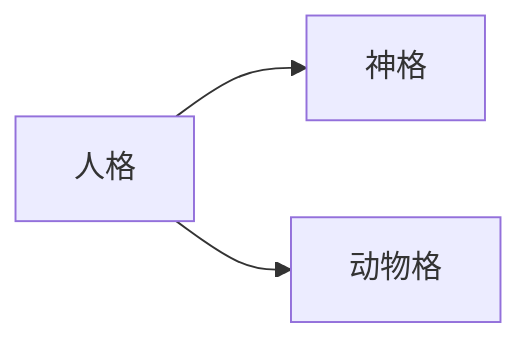
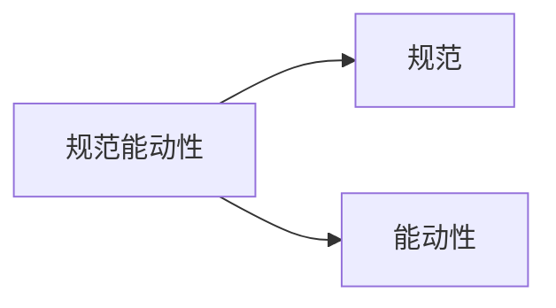
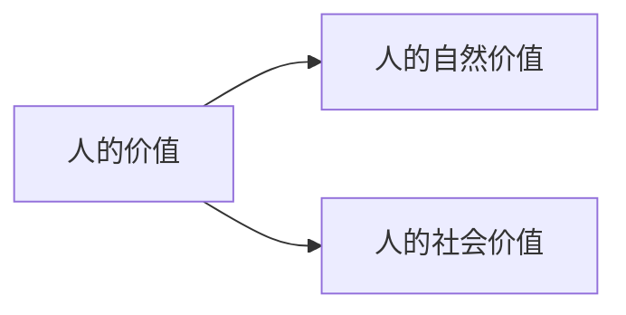
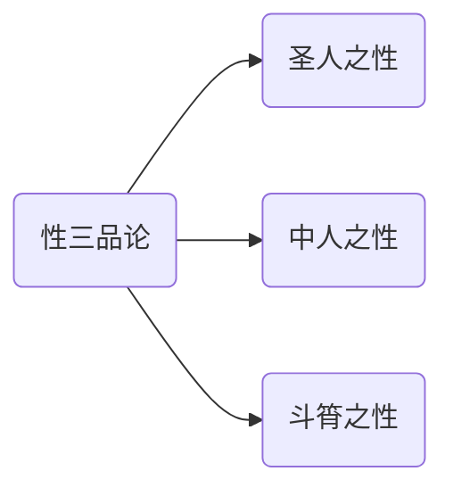

- [1. 问题和方法](#1-问题和方法)
  - [1.1. 形而上学的证明模式:](#11-形而上学的证明模式)
  - [1.2. 阐释学模式:](#12-阐释学模式)
- [2. 两种有代表性的人权观](#2-两种有代表性的人权观)
  - [2.1. 人格说](#21-人格说)
    - [2.1.1. 问题](#211-问题)
  - [2.2. 尊严说](#22-尊严说)
    - [2.2.1. 问题](#221-问题)
- [3. 平等主体的观念](#3-平等主体的观念)
  - [3.1. 主体观念](#31-主体观念)
  - [3.2. 平等观念](#32-平等观念)
- [4. 平等主体的观念](#4-平等主体的观念)
- [5. 人权观念的推动力](#5-人权观念的推动力)

## 0.1. 人权的理由

# 1. 问题和方法

美国1774年《独立宣言》: "我们认为下面这些真理是不言而喻的: 人人生而平等, 造物者赋予他们若干不可剥夺的权利, 其中包括生命权、自由权和追求幸福的权利. 为了保障这些权利, 人类才在他们之间建立政府, 而政府之正当权力, 是经被治理者的同意而产生的.  "

在《独立宣言》的起草人看来, 政府权力是需要证明的, 而人权是不需要证明的.  

人权的根本理由是什么？
1. 为什么作为一个人应当享有权利？
2. 为什么每个人都应当享有权利？ (为什么权利可以普遍化呢？) 

两种证明模式: 形而上学的证明模式、阐释学的证明模式. 

## 1.1. 形而上学的证明模式:  

1. 把人权作为一个静止的事物来看待, 去揭示它的确定而完备的逻辑和理据. 它是一个既已存在的事物, 寄寓在宇宙的结构、事物的自然秩序, 或者人类的天赋良知之中. 它是普适的、统一的, 在任何地方都不容有任何的歪曲和偏差. 它已经完善、不再发展, 没有历史性和时间维度, 永恒不变, 只是等待人去发现和运用.  
2. 人的实践就是把人权的法则运用于人自身, 但是不能参与和发展这一法则. 它作为一个客观的法则体系而存在, 人权意识是人的主观对这一存在的反映, 又是这一存在的证据.  
3. 形而上学的证明模式把人权的普遍性绝对化, 寻求具有绝对必然性的结论. 这样, 认识就有正确与错误之分, 错误的认识在于没有符合那些客观的法则.  
4. 形而上学的模式实际上是一种个体性的方法, 任何个体运用理性皆可认识那些法则, 而无需交流和对话. 

## 1.2. 阐释学模式:  

1. 把人权看作一个阐释性的概念, 看作一个既已存在、又动态发展的实践着的事物. 人权法则源于实践, 而非外于实践, 它的普遍性是有限的、又是可以扩展的；它的时间性是一定的, 又是可以延长的；它具有相对性, 又包含绝对的因素.  
2. 这种证明方式是从人权实践中揭示、阐明其内在的价值法则、逻辑和理据, 并加以丰富、充实、调协、深化. 适当的丰富、充实、调协、深化推动着它的自我生长. 对人权的阐释本身就是人权实践的组成部分.  
3. 阐释学的模式寻求有关人权的更好解释和更适当的结论, 而不是把某种结论作为作为唯一正确而完备的定论.  
4. 它从一个更为公共的立场看待人权, 鼓励交流和对话. 

> 不作为一个完备的定论 --> 人权是可以变化的, 人权是不确定的, i.e. 当社会进入一个物质极度丰富的时候便会出现人权的消失(?)
> 
> > 人权不再具有人权的意义, 没有存在的意义

人权是相关实践、价值和法则的统一体. 它是由相关观念和行动综合构成的实践. 它又表达了规范性的、有关社会关系和制度的价值. 它还包含了内在的法则, 从人性需求转化为人权的法则. 

> 人权是**实践**; 人权是复杂的多面体

阐释学的计划分为两步. 
1. 从人权的实践中阐释出一种可以作为人权内在理由的核心观念. 这样一种观念推动了人权的普遍化法则的生成和拓展. 
2. 从更广泛的背景去寻找可以解释这种人权观念、有助于推动这种观念形成和发展的其他因素. 

# 2. 两种有代表性的人权观

> 理由是什么？人权是什么？人权的根据是什么？

## 2.1. 人格说

詹姆斯·格里芬认为, 人权是建基于普遍人性之上的普遍性权利. 人权的根据主要地在于人格, 人格的核心是规范能动性 (normative agency) , 即作为一个自主的行动者, 在最低限度的资源和能力的保障条件下, 自由地选择和追求某种值得过的生活的设想. 

 ([英]格里芬: 《论人权》, 徐向东等译, 译林出版社2015年版, 第二章) 

> 人权根据为人格, 每个人都有人格所以每个人都应该有人权
> 
> > 什么是人格?
> >
> > 规范能动性

> 神格: 具有规范能动性的, 可以规划未来的, 计划理想并又能力去将其付诸实践的
> 
> > "自由地选择和追求某种值得过的生活的设想"
> 
> 动物格: 动物性的, 没有规范能动性的, 被动地接受现实的

> 规范能动性:
> - 规范:
> - 能动性:

### 2.1.1. 问题

> "最低限度的资源和能力的保障条件下"

i.e.

在这个情况下奴隶是有人权的, 需要去完成一个工作, 于是需要去计划去这个工作--规范, 于是需要去付诸实践--能动性. 于是这个时候在这个说法下奴隶是有人权的, 是有工作权和劳动权的

但是实际上, 奴隶是没有人权的, 他们是没有任何自由的.

⬇

无法对"最低限度的资源和能力的保障条件"进行规范, 不确定的, 未能说明的, 也无法讲清楚的

⬇

什么才是最低限度的资源和能力的保障条件?

同时还有另外一个问题:

i.e.

例如植物人, 胎儿, 婴儿, 精神障碍者等之类的没有没有主观能动性的, 就是没有人格的, 但是按照朴素的对人权的理解里面来看显然是不对的.

> 在实际的显示生活中实际上是要不断将人权去扩张到这些没有自主行为能力的人的身上的.

So:

这是没有阐述根据性的

## 2.2. 尊严说

德沃金提出, 人权的根据在于人的尊严. 每一个人都享有基本人权, 意即作为一个人, 一个其尊严具有根本重要性的人, 而受到对待. 

 ([美]德沃金: 《刺猬的正义》, 周望译, 中国政法大学出版社2016年版, 第36--373页) 

> 即: 每个人都有对尊严的需求, 人权是对尊严的需求的满足
> → 每一个有尊严需求的人都是有人权
>
> "每一个人都是有尊严感的"
>
> > i.e. 即使是一个狗也是有尊严的, 被树根绊倒和被人绊倒是不一样的, 被人绊倒是没有尊严的, 被树根绊倒是不影响尊严的

### 2.2.1. 问题

张三有尊严感, 李四也有尊严感 ...

# 3. 平等主体的观念

人权的根据可以归结为"平等的主体"这一观念, 即

- 主体观念
- 平等观念

## 3.1. 主体观念

人文主义观念: 人具有独立的价值. 

> 以人性对抗神性, 人有其本身的价值, 人的价值应该不是通过其做了什么来决定的, 每个人都有自己的价值, 人的价值不是通过其做了什么来决定的, 而是通过其本身来决定的.

康德的理论: 人是目的, 不可以仅仅被看作手段. 

> 人可以成为任何别人的手段, 但是人**不能仅仅**被作为手段, 同时人应该还是目的. 

1. 有关人神关系
    > 人**不仅仅**是神驱使的工具
    > 
    > 洛克的宗教观念: 神在创造了人之后便不会去影响人的生活, 只会在最后末日的时候的审判的时候去对人行驶神的权利 → 在这中间的人的生活是有其行动的自由性的
    >
    > 更进一步的到无神论的地步便更进一步地去掉了人的神的地位, 人的神的对人的影响
    >
    > 人权的发展就是神的地位的下降, 人的地位在上升的过程
2. 有关个人与社会关系
   > 在过去的社会中: 
   > - 古希腊社会: 通过参与社会活动产生人的价值
   > - 中国社会: 对家族的贡献来决定人的价值
   > 
   > 发展:
   > - 个人的贡献有价值, 而集体没有价值 → 个人的价值 → 为人权的产生奠定了其人的价值的基础
3. 有关子女与父母关系
   > 子女之于父母是不能主张权利的, 是**附属**的状态
   > 
   > 但是现在: 子女于父母在法律上是相互平等的, 子女有着独立的人格:
   > > 父母最子女有抚养的义务, 子女对父母有赡养的义务
   > > 父母有对子女主张赡养的权利, 子女对父母有主张抚养的权利

---

> 对于一个无神论者: 1. 没有任何障碍, 对于有神论者: 1. 需要对神的认知为一个自然神, 如果没有这样的观念, 认为神是决定社会上每个人的行为的, 那么人权的观念就不会诞生

---

社会的观念

- 社会是一个**有机体**, 是由不同的人集合起来的有机体, 在这个有机体之中每个人的价值不仅仅是物质上的价值, 还有各种的情感纽带, 在这个情况下, 不是个人的生活所决定的, 是社会的价值观的观念. 高度一致的伦理个道德观念
- 社会是一个**聚合体**, 社会是一样是由不同的人集合的, 但是确实完全以利益, 以物质来决定来聚合的, 这个社会是可以解散的, 是可以分解的. 由利益的计算决定而产生

⬇

在这个有机体中的人权观念难以出现, 而聚合体就容易产生, 易于阐述, 易于实践

从古代社会到现代社会就是从有机体(熟人社会)不断解体, 之后重组为聚合体的过程

在这个过程中, 人们便开始认为个人的价值不隶属于社会的价值, 于是才能诞生出人权的观念

---

义务

权利

> 当子女把父母告上法庭的时候就不再是传统的家庭的观念
>
> PS. 
>
> > 人情味的丧失, 人权的利与弊

## 3.2. 平等观念

1. 人格平等
   > 如今的人格不在是格里芬的规范能动性的人格, 而是作为一个人便有人格
   > 
   > > --恩格斯 *反杜林论*
   > > 
   > > 古代的平等观, 建立固定的生理和心理的规律的相似性上, 但是现代的平等观是建立在人之为人的基础上, 不论心理和生理的相似性.
   > > > 如果不抱持这样的观念, 就不可能有人格, 君子于小人不同, 那小人可以与君子获得同样的权利吗?
2. 意志平等
3. 道德平等
   > 不论个人的道德水平, 道德水平不同, 但是有着相同的道德本质, 都有着相同的可能性去做好事或者做坏事
4. 价值平等
   > 每个人斗因为其是人, 所以都会有一个平等的, 独立的价值.
   > 
   > 只有把人的价值分为两个部分, 一个是社会价值, 一个是自然价值, 才能产生人权, 人权的观念. 不能因为贡献大小的不同而改变他所获得得到权利的大小

---

- 圣人之性: 人之初性本善
- 中人之性: 人之初性本善, 但是可以被外界诱惑去做错误的事
- 斗筲之性: 人之初性本善, 但是很容易被外界诱惑去做错误的事, 且一旦做错了就很难改变

# 4. 平等主体的观念

这两个方面的观念结合在一起, 即"人是平等主体"这一信念. 既然每个人都是平等的主体, 那就应当尽量扩张人权上人的范围, 并使人充分地享受权利而不是仅仅承担义务, 以及使为一部分人所享有的权利至少扩展到生活在同一个法律制度之下的所有人. **在"平等主体"观念流行的地方, 也必定存在发达的人权观念和生动的人权实践；在欠缺这一观念的地方, 人权观念是淡薄的, 人权实践是贫乏的**. 

平等主体观念的深化: 

> 一种引申的主体信念——人不仅是外部关系中的主体, 而且是自身命运的主体, 和一种深化的平等信念——平等不仅指形式平等, 而且包括实质平等, 还可以用来为福利权和妇女受到特别保护的权利等引申的或派生的人权辩护
> > "外部关系中的主体": 人与家庭的关系, 人与社会的关系等

每个人都是平等的主体

# 5. 人权观念的推动力

马克思"历史向世界历史的转变": 

> 马克思认为: 所有民族的历史最后都会成为世界的历史, 不同民族的历史成为世界的一部分

现代生产方式、普遍的交往关系以及将不同国家联系起来的世界市场. 

马克思: "**人的依赖关系** (起初完全是自然发生的) , 是最初的社会形式, 在这种形式下, 人的生产能力只是在狭小的范围内和孤立的地点上发展着. **以物的依赖性为基础的人的独立性**, 是第二大形式, 在这种形式下, 才形成普遍的社会物质变换、全面的关系、多方面的需要以及全面的能力的体系. **建立在个人全面发展和他们共同的、社会的生产能力成为从属于他们的社会财富这一基础上的自由个性**, 是第三个阶段. 第二个阶段为第三个阶段创造条件. "

> 人的依赖关系的三大关系: 
> - 前资本主义社会: 奴隶与奴隶主的关系
> - 资本主义社会中的, 人的形式上的平等, 但是有着与物质生产有关的必要的依赖关系
> - 共产主义社会中的, 完全自由的关系

 (《马克思恩格斯全集》第30卷, 人民出版社1995年版, 第107-108页) 

前资本主义社会: 特殊化, 自然差别和社会差别反映为政治差别. 

> 特殊化: 特权, 政治法律政策上的差别
> 
> 自然差别: 肤色的差异等
> 
> 社会差别: 社会地位的差别等
>
> 完全没有普遍化

资本主义社会: 形式上的普遍化, 自然差别和社会差别不反映为政治差别, 但是影响着普遍人权的实际行使. 

> 政治差别: 法律上的差别
>
> 仅实现形式上的普遍化, 但是没有实现实质上的普遍化

共产主义社会: 形式上和实质上的普遍化, 人权的终结. 

> 由于此时已经完全实现形式上和实质上的普遍化, 此时人权就没有了存在的意义, 每个人都有人权了便没有的维护人权的必要