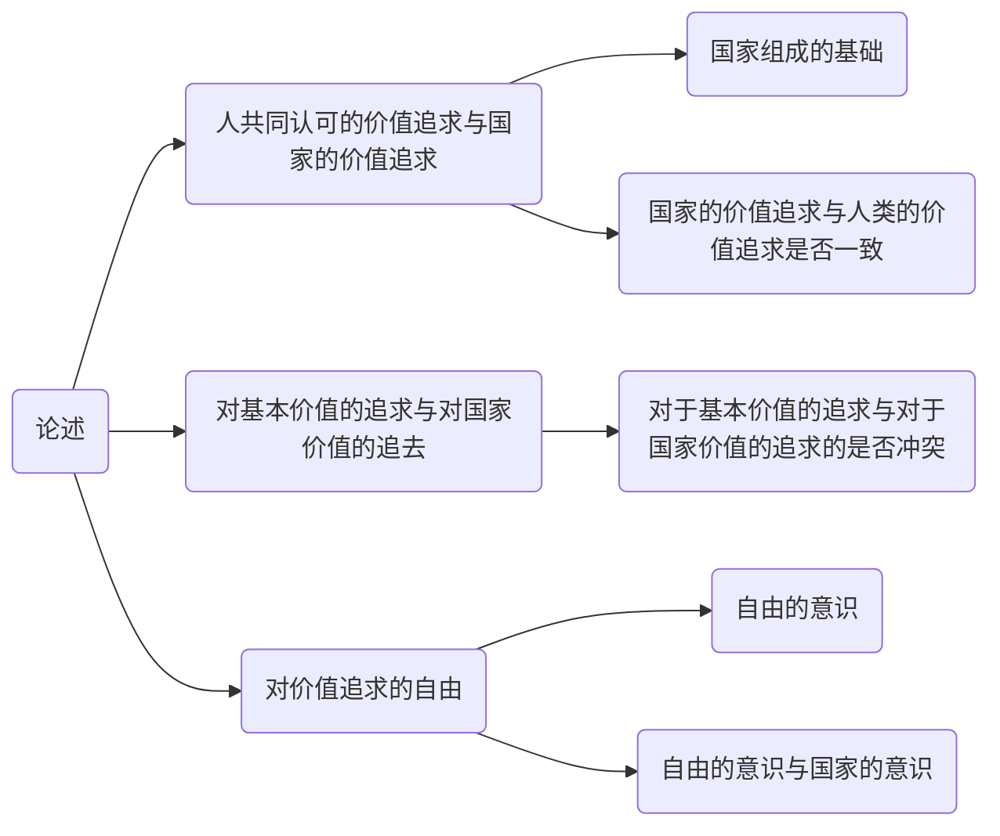

关于平等的讨论我认为最先要确定的关于自由的议题的讨论, "生命诚可贵, 爱情价更高, 若为自由故, 二者皆可抛", 我想提出一个问题, 各位对于为了爱情, 为了自由这种人的共同认可的价值去抛却自己生命的人, 对于他们的死亡, 需要给予什么补偿吗? 需要为了他们的这种必然合理的正义的价值的死亡去给予他们后代以特权的补偿吗? 

对于这个问题, 我像按照以下的思路进行论述

# 人共同认可的价值追求与国家的价值追求

首先, 必然可以确定的一点是人共同认可的价值, 比如爱情, 自由, 生存, 安全. 这些的追求必然是全体的人类所共同追求的, 所共同认可的, 其必然是正确的正义的, 这点是毋庸置疑的. 

其二, 现在来看国家的价值, 维持与上一论述的表述一致的结构, 即, 需要讨论两个内容, 一是国家的价追求是否是全体人类所共同追求的, 共同认可的; 而是其是否是正确的正义的. 通过以上的两项问题的讨论可以了解国家的权力的合理性.

## 问题一: 国家的价值追求是否是全体人类所共同追求的, 共同认可的

对于这个问题, 我希望可以回顾一下现代国家的组成方式, 即, 国家是如何成为国家的. 

对于这个问题的解答, 我希望先引入一个概念, 即: 生命政治学.

### 生命政治学

什么是生命政治学? 生命政治学是如何产生的, 其背景是什么?

#### 背景

