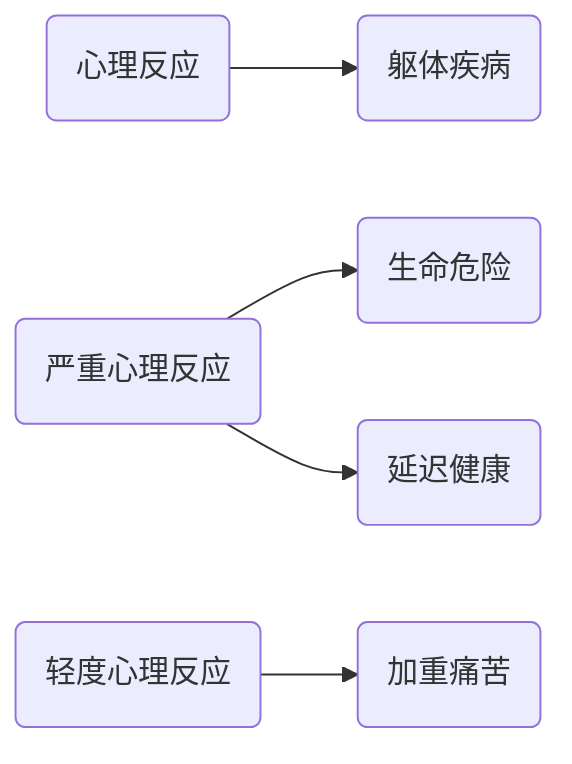

- [1. 概述](#1-概述)
  - [1.1. 躯体疾病与心理反应的关系](#11-躯体疾病与心理反应的关系)
  - [1.2. 心理生理障碍的概念](#12-心理生理障碍的概念)
  - [1.3. 心理生理医学的历史](#13-心理生理医学的历史)
  - [1.4. 心身医学的流行病学](#14-心身医学的流行病学)
  - [1.5. 心身疾病的范围](#15-心身疾病的范围)
- [2. 研究途径和现状](#2-研究途径和现状)
  - [2.1. 心身疾病的研究途径](#21-心身疾病的研究途径)
  - [2.2. 心身疾病的研究现状](#22-心身疾病的研究现状)
- [3. 发病机制](#3-发病机制)
  - [3.1. 从生理反应到心身疾病的发展过程](#31-从生理反应到心身疾病的发展过程)
  - [3.2. 从生理反应到心身疾病的变化途径](#32-从生理反应到心身疾病的变化途径)
  - [3.3. 身体器官的脆弱性](#33-身体器官的脆弱性)
- [4. 心身疾病诊断, 治疗和预防的一般原则与方法](#4-心身疾病诊断-治疗和预防的一般原则与方法)
  - [4.1. 心身疾病的诊断](#41-心身疾病的诊断)
  - [4.2. 心身疾病的治疗](#42-心身疾病的治疗)
  - [4.3. 心身疾病的预防](#43-心身疾病的预防)
- [5. 常见的心身疾病](#5-常见的心身疾病)
  - [5.1. 原发性高血压](#51-原发性高血压)
  - [5.2. 冠心病](#52-冠心病)
  - [5.3. 消化性溃疡](#53-消化性溃疡)
  - [5.4. 支气管哮喘](#54-支气管哮喘)
  - [5.5. 糖尿病](#55-糖尿病)
  - [5.6. 肥胖症](#56-肥胖症)
  - [5.7. 紧张性头痛和偏头痛](#57-紧张性头痛和偏头痛)
  - [5.8. 癌症](#58-癌症)
  - [5.9. 胃肠道功能紊乱](#59-胃肠道功能紊乱)
  - [5.10. 功能失调性子宫出血](#510-功能失调性子宫出血)
  - [5.11. 皮肤病](#511-皮肤病)
  - [5.12. 风湿性关节炎](#512-风湿性关节炎)

# 1. 概述

## 1.1. 躯体疾病与心理反应的关系

## 1.2. 心理生理障碍的概念

## 1.3. 心理生理医学的历史

- 中国医学和心理生理医学
- 心理生理医学的历史发展
- 我国身心医学概况

## 1.4. 心身医学的流行病学

## 1.5. 心身疾病的范围

- 消化系统心身疾病
- 心血管系统心身疾病
- 呼吸系统心身疾病
- 皮肤的心身疾病
- 内分泌代谢性心身疾病
- 神经系统心身疾病
- 泌尿系统心身疾病
- 其他

# 2. 研究途径和现状

## 2.1. 心身疾病的研究途径

- 心理动力学途径
- 心理生理学途径
- 行为途径

## 2.2. 心身疾病的研究现状

# 3. 发病机制

## 3.1. 从生理反应到心身疾病的发展过程

- 心身反应
- 心身紊乱
- 心身疾病

## 3.2. 从生理反应到心身疾病的变化途径

## 3.3. 身体器官的脆弱性

# 4. 心身疾病诊断, 治疗和预防的一般原则与方法

## 4.1. 心身疾病的诊断

- 全面了解病史和详细的体格检查
- 心理测验和性格评定
- 心理生理学检查
- 心理社会因素调查

## 4.2. 心身疾病的治疗

- 心理治疗
- 生物反馈和行为治疗
- 精神药物治疗

## 4.3. 心身疾病的预防

# 5. 常见的心身疾病

## 5.1. 原发性高血压

## 5.2. 冠心病

## 5.3. 消化性溃疡

## 5.4. 支气管哮喘

## 5.5. 糖尿病

- 支持性心理治疗
- 认知疗法
- 行为疗法

## 5.6. 肥胖症

## 5.7. 紧张性头痛和偏头痛

## 5.8. 癌症

## 5.9. 胃肠道功能紊乱

## 5.10. 功能失调性子宫出血

## 5.11. 皮肤病

## 5.12. 风湿性关节炎