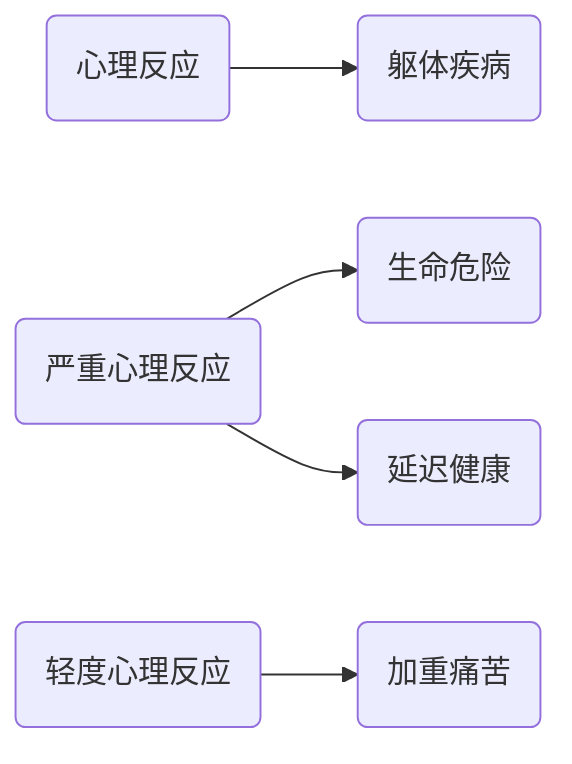

- [1. 躯体疾病与心理反应的关系](#1-躯体疾病与心理反应的关系)
- [2. 共病研究](#2-共病研究)
- [3. 疾病诊治过程中的心理反应](#3-疾病诊治过程中的心理反应)
  - [3.1. 疾病所致心理反应](#31-疾病所致心理反应)
    - [3.1.1. 疾病本身影响, 患者自身的心理机制产生](#311-疾病本身影响-患者自身的心理机制产生)
    - [3.1.2. 敏感性及耐受性受到社会因素影响](#312-敏感性及耐受性受到社会因素影响)
  - [3.2. 治疗环境中的心理反应](#32-治疗环境中的心理反应)
    - [3.2.1. 医疗仪式: 每个病人到医院看病必须经过的一定过程](#321-医疗仪式-每个病人到医院看病必须经过的一定过程)
    - [3.2.2. 住院病人](#322-住院病人)
  - [3.3. 治疗过程中的心理问题](#33-治疗过程中的心理问题)
    - [3.3.1. 治疗作用本身引起的不同心理反应](#331-治疗作用本身引起的不同心理反应)
- [4. 患者常见的特殊的心理, 行为特征](#4-患者常见的特殊的心理-行为特征)
- [5. DABIAN 22.04](#5-dabian-2204)
  - [5.1. 抑郁已成为临床各科的常见问题](#51-抑郁已成为临床各科的常见问题)
  - [5.2. 诊断和治疗之间差距的估计](#52-诊断和治疗之间差距的估计)
- [6. 外科常见的心理问题](#6-外科常见的心理问题)
  - [6.1. 影响手术病人心理变化的因素](#61-影响手术病人心理变化的因素)
  - [6.2. 术后抑郁和谵妄](#62-术后抑郁和谵妄)
    - [6.2.1. 谵妄的临床特点](#621-谵妄的临床特点)
    - [6.2.2. 器官移植病人的心理反应](#622-器官移植病人的心理反应)
  - [6.3. 术后心理反应的预防与处理](#63-术后心理反应的预防与处理)
  - [6.4. 引起精神活动改变的药物](#64-引起精神活动改变的药物)
  - [6.5. 颅脑损伤相关的心理问题](#65-颅脑损伤相关的心理问题)
- [7. 妇产科相关精神障碍](#7-妇产科相关精神障碍)
- [8. 肿瘤病人心理反应的分期于分类](#8-肿瘤病人心理反应的分期于分类)
- [9. 内科患者的心理问题](#9-内科患者的心理问题)
  - [9.1. 躯体症状在抑郁患者中非常普遍](#91-躯体症状在抑郁患者中非常普遍)
- [10. DABIAN 22.10](#10-dabian-2210)
  - [10.1. 抑郁伴发躯体症状的出现频率](#101-抑郁伴发躯体症状的出现频率)
  - [10.2. 综合医院躯体疾病共病抑郁障碍发病率高](#102-综合医院躯体疾病共病抑郁障碍发病率高)
- [11. 常见神经系统疾病伴发抑郁的流行病学](#11-常见神经系统疾病伴发抑郁的流行病学)
  - [11.1. 癫痫与抑郁的关系](#111-癫痫与抑郁的关系)
  - [11.2. 麻痹性痴呆](#112-麻痹性痴呆)
  - [11.3. 心血管疾病常见心理问题](#113-心血管疾病常见心理问题)
  - [11.4. 焦虑抑郁与心血管风险](#114-焦虑抑郁与心血管风险)
  - [11.5. 心内科焦虑抑郁的一般表现](#115-心内科焦虑抑郁的一般表现)
  - [11.6. 脑肠轴](#116-脑肠轴)
  - [11.7. 肾内科透析患者的心理反应](#117-肾内科透析患者的心理反应)
  - [11.8. 内分泌系统与心理](#118-内分泌系统与心理)
  - [11.9. 心理-神经-内分泌中介机制](#119-心理-神经-内分泌中介机制)
  - [11.10. CNS(中枢神经系统)效应(Effects of CNS)](#1110-cns中枢神经系统效应effects-of-cns)
  - [11.11. 监护病房病人心理反应分期](#1111-监护病房病人心理反应分期)
- [12. PS](#12-ps)

# 1. 躯体疾病与心理反应的关系

心理疾病, 情绪问题可能会加重或者延迟疾病的治疗.

反过来, 躯体疾病也会影响心理状态.

# 2. 共病研究

> - 台湾糖尿病患者中的焦虑障碍
>   - 2000年的患病率为12.88%
>   - 2004年则累计患病率达28.99%
> - 德国样本人群(N=1,456, 年龄60-85岁)的研究提示 (H GLAESMER et al. Psychosomatic Medicine 2011; 73:401-406)
>   - 老年有创伤经历者患躯体疾病的风险较无创伤经历者高(OR值: 1.37-5.12), 其中最常见的疾病为: 癌症, 卒中, COPD和冠心病等
>   - 有PTSD症状者患心血管疾病及其相关健康问题的风险增加(OR值: 1.41-3.76), 最常见疾病为: 高血脂, 高血压, 癌症, 甲状腺疾病和冠心病等
> - 加加拿大社区老年人群(≥55岁, N=12,792)躯体健康状况与焦虑障碍共病的研究
>   - 慢性疼痛(如关节炎, 背痛, 和偏头痛), 以及常见内科疾病(过敏, 胃肠病, 呼吸与心脏病等)与焦虑呈正相关
>   - 焦虑共病过敏, 关节炎和呼吸系统疾病往往导致主观生理与精神健康状况更差

# 3. 疾病诊治过程中的心理反应

## 3.1. 疾病所致心理反应

### 3.1.1. 疾病本身影响, 患者自身的心理机制产生

心理反应轻重取决于
- 病人对疾病的认识
- 病人的心理素质
- 不同性格
- 想象中的病情轻重

> 焦虑是正常的, 在乎引起焦虑
> 
> PS. 
> 
> 抑郁症: 没有诱因的焦虑
> > 如果有诱因, 比如失恋etc之后的情绪量表得分高, 但并不是抑郁症.
> 
> 需要注意的是情感与环境写不协调, 不论是过度淡漠, 开心还是悲伤, 都是不协调的.
> > i.e. 生病之后的淡漠也是不正常的

### 3.1.2. 敏感性及耐受性受到社会因素影响

周边的所见所闻(社会因素)会造成其敏感性及耐受性的影响

> 比如住院周围的人的过世, 状态等

## 3.2. 治疗环境中的心理反应

### 3.2.1. 医疗仪式: 每个病人到医院看病必须经过的一定过程

- 候诊时间
- 治疗的医师年龄物理和化验检查候诊时间
- 治疗医师年龄
- 物理和化验检查

> 医生的年龄, 看病的等待等等都是影响病人的心理状态的因素 --> 医疗仪式
> > 医生的年龄可以带来一定的安全感和信任感

治疗作用本身引起的不同心理反应

> 包括各种化验检查以及问诊等都包括在其中
>
> > PS.
> > 
> > 五羟色胺水平正常, 褪黑素水平下降 --> 单纯性失眠

### 3.2.2. 住院病人

- 生活内容受到限制
- 期待性焦虑和分离性焦虑
- 影响正常生活
- 人际关系
- 仪器效应

> 生活受到限制, 从正常的生活中脱离, 周边的病人的状态影响心理反应, 周围仪器的状态影响心理反应

## 3.3. 治疗过程中的心理问题

### 3.3.1. 治疗作用本身引起的不同心理反应

- 病人对治疗的认知评估
- 病人治疗依从性差
- 区分心理反应与疾病本身和治疗措施的关系

# 4. 患者常见的特殊的心理, 行为特征

- 行为退化
  > 敏感(比如家人之间的内的交谈就会担心是不是自己病情加重), 易怒(有时会会是谁对他好反而对谁发脾气)
- 情感脆弱, 易激惹
- 敏感性增强, 主观异常感觉增多
- 猜疑
- 自尊心强
  > 比如开始的状态出现有效果, 但是结果却是无法离开医院的结果便会引起相关的状态, 治疗与期望不符
- 焦虑, 恐惧
- 孤独感
  > 病重前, 重病后大抵不适用
- 抑郁, 悲观
- 失助感
- 期待
- 习惯性思维

# 5. DABIAN 22.04

## 5.1. 抑郁已成为临床各科的常见问题

## 5.2. 诊断和治疗之间差距的估计

# 6. 外科常见的心理问题

- 术前及术后的焦虑
- 术后的抑郁和谵妄
- 术后持续疼痛

## 6.1. 影响手术病人心理变化的因素

- 年龄
  - 儿童与老年人
    > 儿童: 没有经验, 无法理解, 无法控制
    > 老人: 有经验, 可以理解, 但是状态观念难以改变
- 家庭与社会环境
  - 丧亲
  - 经济损失
  - 家庭不和
  - 人际纠纷
- 手术方式
  - 心脏: 谵妄
  - 乳房, 盆腔: 抑郁
    > 影响外观或者影响功能的手术 --> 自卑与焦虑
    > > 乳房手术, 尿管手术, 肛门手术etc
  - 前列腺: 性功能障碍
  - 颌面: 焦虑, 抑郁, 自主神经
  - 结肠造瘘: 性格改变

## 6.2. 术后抑郁和谵妄

|抑郁|谵妄|
|:--:|:--:|
|子宫, 乳房切除术|创伤|
|甲状腺切除术|感染|
|绝育术|电解质紊乱|
|子宫全切术||
|肠切除||
|截肢||

> - 影响外观的手术
> - 激素水平的改变
>
> ---
>
> 70岁以后的病人常见, 骨外科等的都哦有多的, 感染创伤等的原因

### 6.2.1. 谵妄的临床特点

- 前驱症状
  - 坐立不安, 焦虑, 易激惹, 注意力不集中, 睡眠障碍
  - 儿童: 退行性行为
- 弥散的认知损害
  - 定向障碍: 医护人员; 近亲属; 自身; 地点定向障碍-常见
  - 注意缺陷: 涣散, 转移困难
  - 记忆损害: 即刻, 短时记忆受损明显
  - 视空间障碍: 画钟表测试
- 错觉或幻觉
- 思维和语言障碍: 接触性离题, 病理性赘述, 联想松弛 
- 情感的不稳定性: 焦虑, 惊恐, 害怕, 生气, 愤怒, 悲伤, 情感淡漠, 欣快
- 睡眠—觉醒周期紊乱
- 精神运动障碍: 混合性

> 注意力集中: "你说什么?" 听不清楚说什么的
>
> 周围环境的认知的问题: i.e. 不认识在哪里, 不认识周围的人
>
> 视空间障碍:
>
> 感知障碍: 即错觉或幻觉
> 
> > 错觉: 周围的家人不认识, 甚至会认为对自己有威胁
> > 
> > 幻觉: 特征性的, 比如墙上有蛇, 虫etc, 而且是色彩鲜艳的
> > 
> > > 这种状态的幻觉只有两种情况
> > > 
> > > 1. 谵妄
> > > 2. 中毒
> > >
> > > 这是视幻觉, 且多只有视幻觉, 如为听幻觉多为精神分裂症
> > 对周围的环境的恐惧, 尤其是夜晚, 会怀疑生命受到威胁
> 
> PS. 谵妄是会自我缓解的, 即使不需要治疗, 但是监护等的是困难的

### 6.2.2. 器官移植病人的心理反应

1. 异体物质期
   - 抑郁
   - 罪恶感
   - 强烈异物感
2. 部分同化期及完全同化期
   - 了解供者的情况
3. 术后心理反应
   - 欣快和再生感
   - 幻想的觉醒和抑郁
   - 得过且过综合征
   - 退缩性夸大狂样防御
   - 进展性轻躁狂样防御

> 过去的移植很多事罪犯, 或者其他的特殊情况死亡的
>
> 会变得对性格行为改变, 或者甚至会影响身体的排异反应
> 
> 也会有对供体人的行为的模仿等

## 6.3. 术后心理反应的预防与处理

- 术前咨询
  - 指导合作的共同参与模式
- 术前用药
  - 安眠药
  - 抗焦虑药
- 术后处理: 
  - 控制谵妄等精神病性症状
  - 抗焦虑药
  - 抗抑郁药
- 建立良好医患关系

## 6.4. 引起精神活动改变的药物

|药物|精神活动改变|
|:--:|:--:|
|中枢神经系统抑制剂, 地高辛, 西脒替丁, 抗胆碱能药|谵妄|
|致幻药物, 食欲抑制剂, 拟交感神经兴奋药, 皮质类固醇|精神病性症状
|抗高血压药, 口服避孕药, 抗精神病药, 抗癫痫药, 皮质类固醇, L-多巴, β-肾上腺素受体阻断剂|抑郁|
|抗抑郁药, 皮质类固醇, 异烟肼, 抗胆碱能药物|兴奋|

> 尤其是激素类药物
>
> 以及药物的戒断反应, 因为进入病房之后可能是需要换药的, 不一定是与镇静相关的药物

## 6.5. 颅脑损伤相关的心理问题

- 急性精神障碍
- **谵妄**
- **慢性精神障碍**
- 持久性认知功能障碍
  > 比如记忆, 情绪(该开心的时候没有开心etc)
- **人格障碍**
  > 偏执性的人格(易怒, 执拗)
- 颅脑外伤后精神病性障碍

# 7. 妇产科相关精神障碍

- 经前期综合征
- 妊娠期抑郁症
- 产后抑郁症
- 围绝经期抑郁症

# 8. 肿瘤病人心理反应的分期于分类

分期
- "情绪休克"期: 否认态度, 抗议愤怒
- 求索于退缩期: 逐渐减少对家庭于社会的义务, 专注自己
- 知命于平静期: 冷静面对, 晚期可能无望, 无助

# 9. 内科患者的心理问题

- 症状主诉和心理反应严重程度与疾病之间可能不一致
- 外向投射性心理反应
  - 病人在遇到自己不能接受的意念, 欲望或遭受精神挫折时, 将原因完全推诿与客观情况, 责己少, 责人多
- 内向投谁性心理反应
  - 自我压制, 压抑不能接受的意念, 感情和冲动
- 病人角色的习惯化
  - 有利于慢性疾病治疗; 但长期不利于病人康复, 影响社会功能恢复

## 9.1. 躯体症状在抑郁患者中非常普遍

- 初级保健机构的统计表明, 超过2/3的抑郁症患者以躯体症状为首发, 唯一主诉就诊
  > 65% 的抑郁症患者有躯体症状
- 躯体症状常导致抑郁症患者功能损害更重, 疗效更差

> 第一症状不一定时抑郁, 也可能是躯体症状, 多为躯体症状为就诊的原因

# 10. DABIAN 22.10

## 10.1. 抑郁伴发躯体症状的出现频率

## 10.2. 综合医院躯体疾病共病抑郁障碍发病率高

# 11. 常见神经系统疾病伴发抑郁的流行病学

抑郁症患病率5.8%
终身患病率17.1%

|disease|prevalence of depression|
|:-|:-|
|PD|20-60%|
|脑血管意外|15-60%|
|AD|18-66%|
|MS|6-63%|
|癫痫|15-40%|

> 开关现象, 每天的情绪波动会很大
> > 脑血管意外多(大脑的炎症反应: 白介素, 肿瘤坏死因子)

> 情感淡漠
> > AD
> 
> 早期的AD发生的时候一般都会有抑郁

## 11.1. 癫痫与抑郁的关系

研究表明相对普通人群, 癫痫患者抑郁发生率为前者的1.7倍, 自杀率更提高了4倍, 药物控制不佳的癫痫患者抑郁症终生患病率可达60%甚至更高; 抑郁症患者罹患癫痫的概率也较普通人群高4-7倍. 癫痫控制不佳可导致或加重抑郁症, 而抑郁症控制不好同样会加重癫痫发作. 

癫痫与抑郁症之间不是严格的单项性关系, 而是双向性的 , 提示二者还可能存在共同的神经生物学基础, 存在一定的共病机制. 

双向性的

**电休克**是最好的办法

> 由于因为癫痫对抑郁有缓解的作用从而发现
>
> 对一下的症状有很好的效果
> - 自杀倾向
> - 
>
> 但是只有短时间的

- 都是神经网络超同步化的结果
- 海马均存在不同程度的硬化, 萎缩或损伤
- 都有负责情绪管理的 自传记忆网 (AMM)和负责任务控制的 认知控制网 (CNN)失衡
- BDNF的表达与癫痫和抑郁均相关

## 11.2. 麻痹性痴呆

表现为脑萎缩, 神经细胞变性, 脱失皮质结构紊乱, 这可能也是导致痴呆出现精神症状的原因. 

- 精神症状
  1. 早期  以神经衰弱综合征最多见, 其次为性格改变; 
  2. 进展期  以日趋严重的智能及人格障碍为主, 常表现为知觉, 注意, 记忆, 计算, 思维等智能活动的衰退, 性格改变, 不守信用, 不负责任, 行为轻浮, 放荡不羁, 自私, 吝啬, 挥霍, 偷窃或违反社会道德, 情绪易激惹或强制性哭笑; 
  3. 晚期  痴呆日重, 情感淡漠, 意向倒错, 本能活动亢进. 

梅毒脑

## 11.3. 心血管疾病常见心理问题

造成心血管疾病患者抑郁焦虑的原因
1. 日常生活自理能力低或丧失.  
2. 对健康的定义缺乏了解, 自我评价水平低. 
3. 对治疗方法的知晓率低. 
4. 负性生活事件和较差的社会支持系统 . 
6. 长期医疗费用的投入和花费.  
7. 医院环境与人际关系陌生, 对疾病预后担心等 

## 11.4. 焦虑抑郁与心血管风险

## 11.5. 心内科焦虑抑郁的一般表现

心内科的焦虑抑郁患者大多会以不同的躯体不适作为主诉, 患者大多关注其躯体症状所致的痛苦及其不良后果, 一般并不主动诉及情绪体验. 

> 患者经常诉说睡眠不好、乏力、头晕、背痛、胸痛、血压升高、心律失常等躯体症状, 甚至急性发作性心悸、胸闷、呼吸困难、大汗、强烈的恐惧感、濒死感等, 有时常被误诊为冠心病急性发作. 
> > 容易伴发焦虑抑郁的心内科疾病: 冠心病、高血压、心律失常

## 11.6. 脑肠轴

胃肠道有一个独立于中枢神经系统的神经结构, 并且证实连接胃肠道和中枢神经系统的主要神经干, 包括迷走神经、内脏神经以及骶神经, 其在消化道功能的调节中具有传入和传出双重功能, 这种脑肠之间的相互联系, 称为脑肠轴. 

脑肠轴是肠和脑之间的信息交流系统, 由免疫、迷走神经和神经内分泌途径构成. 

大脑与肠道之间存在着双向的交流机制, 与社交行为、认知、表达恐惧和压力应答等过程密切相关. 

肠道微生物在生命初期的定植和下丘脑-垂体-肾上腺轴(HPA轴)的建立处于同一时期. 

微生物可通过多种作用参与脑肠轴的作用. 

微生物本身也可以被肠神经系统中的免疫受体识别, 通过免疫信号影响脑肠轴. 

迷走神经是微生物-脑-肠轴的重要组成部分, 也是肠道和大脑交流的关键节点. 谷氨酸可以激活这些迷走神经的通路, 血清素也广泛参与这些过程. 

肠道微生物目前已经被作为药物靶点来改善大脑. 

## 11.7. 肾内科透析患者的心理反应

1. 中毒期: 尿毒症的各种代谢紊乱所引起; 
2. 蜜月期: 第一次透析发生后, 1-3周, 淡漠减轻, 健康感增加, 时呈欣快状态; 
3. 平衡期: 3周-3月, 勇气减退准备放弃, 对机器和对医生依赖的冲突, 意识警惕或警戒; 
4. 适应期: 3-6月, 部分患者适应, 面对的是生存. 

## 11.8. 内分泌系统与心理

|结构|功能与作用|
|:-|:-|
|垂体腺|受丘脑控制, 与生长有关|
| .. |影响其它内分泌腺的功能|
|肾上腺|与焦虑水平有关|
| .. |调节生理平衡和情绪行为|
|甲状腺|与发育相关|
| .. |甲亢VS甲减|
|性腺|促进第二性征出现|
| .. |男性的性腺: 睾丸; 女性的性腺: 卵巢|

## 11.9. 心理-神经-内分泌中介机制

心理-神经-内分泌中介机制: 主要通过下丘脑-腺垂体-肾上腺(HPA)进行调节. 

## 11.10. CNS(中枢神经系统)效应(Effects of CNS)            

## 11.11. 监护病房病人心理反应分期

|分期|发生时间|原因|处理|
|:-|:-|:-|:-|
|焦虑期|第1-2天|原始心理防御机制|处理安慰, 抗焦虑药|
|否认期|第2天|保护性心理防御机制|解释, 协商|
|抑郁期|第5天||抗抑郁药|
|撤离病室时的焦虑|离开病房时|依赖|提早告知转室日期及其必要性|

# 12. PS

- 谵妄 vs. 痴呆

