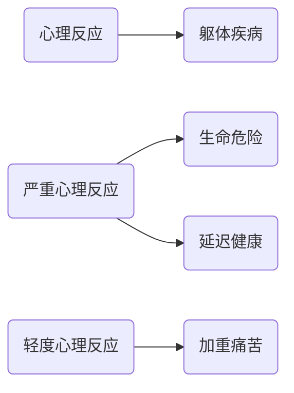

# 1. 躯体疾病与心理反应的关系

心理疾病, 情绪问题可能会加重或者延迟疾病的治疗.

反过来, 躯体疾病也会影响心理状态.

# 2. 共病研究

- 台湾糖尿病患者中的焦虑障碍
  - 2000年的患病率为12.88%
  - 2004年则累计患病率达28.99%
- 德国样本人群(N=1456, 年龄60-85)的研究提示
  - 老年有创伤经历 ...
- 加拿大社区来年人群(≥55岁, N=12792)躯体健康状况与焦虑障碍共病的研究
  - 慢性疼痛 ...

# 3. 疾病诊治过程中的心理反应

疾病本身影响, 患者自身的心理机制产生

> 焦虑是正常的, 在乎引起焦虑
> 
> PS. 
> 
> 抑郁症: 没有诱因的焦虑
> > 如果有诱因, 比如失恋etc之后的情绪量表得分高, 但并不是抑郁症.
> 
> 需要注意的是情感与环境写不协调, 不论是过度淡漠, 开心还是悲伤, 都是不协调的.
> > i.e. 生病之后的淡漠也是不正常的

周边的所见所闻(社会因素)会造成其敏感性及耐受性的影响

> 比如住院周围的人的过世, 状态等

医疗仪式: 每个病人到医院看病必须经过的一定过程

> 医生的年龄, 看病的等待等等都是影响病人的心理状态的因素 --> 医疗仪式
> > 医生的年龄可以带来一定的安全感和信任感

治疗作用本身引起的不同心理反应

> 包括各种化验检查以及问诊等都包括在其中
>
> > PS.
> > 
> > 五羟色胺水平正常, 褪黑素水平下降 --> 单纯性失眠

住院病人

> 生活受到限制, 从正常的生活中脱离, 周边的病人的状态影响心理反应, 周围仪器的状态影响心理反应

# 患者常见的特殊的心理, 行为特征

- 行为退化
  > 敏感(比如家人之间的内的交谈就会担心是不是自己病情加重), 易怒(有时会会是谁对他好反而对谁发脾气)
- 情感脆弱, 易激惹
- 敏感性增强, 主观异常
- 猜疑
- 自尊心强
  > 比如开始的状态出现有效果, 但是结果却是无法离开医院的结果便会引起相关的状态, 治疗与期望不符
- 焦虑, 恐惧
- 孤独感
  > 病重前, 重病后大抵不适用
- 抑郁, 悲观

# 抑郁已成为临床各科的常见问题

# 诊断和治疗之间差距的估计

# 外科常见的心理问题

# 影响手术病人心理变化的因素

- 年龄
  - 儿童与老年人
    > 儿童: 没有经验, 无法理解, 无法控制
    > 老人: 有经验, 可以理解, 但是状态观念难以改变
- 家庭与社会环境
  - 丧亲
  - 经济损失
  - 家庭不和
  - 人际纠纷
- 手术方式
  - 心脏: 谵妄
  - 乳房, 
    > 影响外观或者影响功能的手术 --> 自卑与焦虑
    > > 乳房手术, 尿管手术, 肛门手术etc

# 术后抑郁和谵妄

> - 影响外观的手术
> - 激素水平的改变
>
> ---
>
> 70岁以后的病人常见, 骨外科等的都哦有多的, 感染创伤等的原因

## 谵妄的临床特点

> 注意力集中: "你说什么?" 听不清楚说什么的
>
> 周围环境的认知的问题: i.e. 不认识在哪里, 不认识周围的人
>
> 视空间障碍:
>
> 感知障碍: 即错觉或幻觉
> 
> > 错觉: 周围的家人不认识, 甚至会认为对自己有威胁
> > 
> > 幻觉: 特征性的, 比如墙上有蛇, 虫etc, 而且是色彩鲜艳的
> > 
> > > 这种状态的幻觉只有两种情况
> > > 
> > > 1. 谵妄
> > > 2. 中毒
> > >
> > > 这是视幻觉, 且多只有视幻觉, 如为听幻觉多为精神分裂症
> > 对周围的环境的恐惧, 尤其是夜晚, 会怀疑生命受到威胁
> 
> PS. 谵妄是会自我缓解的, 即使不需要治疗, 但是监护等的是困难的

## 器官移植病人的心理反应

> 过去的移植很多事罪犯, 或者其他的特殊情况死亡的
>
> 会变得对性格行为改变, 或者甚至会影响身体的排异反应
> 
> 也会有对供体人的行为的模仿等

## 术后心理反应的预防与处理

- 术前咨询
  - 指导合作的共同参与模式
- 术前用药
  - 安眠药
  - 抗焦虑药

...

# 引起精神活动改变的药物

> 尤其是激素类药物
>
> 以及药物的戒断反应, 因为进入病房之后可能是需要换药的, 不一定是与镇静相关的药物

# 颅脑损伤相关的心理问题

- 急性精神障碍
- **谵妄**
- **慢性精神障碍**
- 持久性认知功能障碍
  > 比如记忆, 情绪(该开心的时候没有开心etc)
- **人格障碍**
  > 偏执性的人格(易怒, 执拗)
- 颅脑外伤后精神病性障碍

# 4th 妇

# 肿瘤病人心理反应的分期于分类

分期
- "情绪休克"期: 否认态度, 抗议愤怒
- 求索于退缩期: 逐渐减少对家庭于社会的义务, 专注自己
- 知命于平静期: 冷静面对, 晚期可能无望, 无助

# 内科患者的心理问题

- 症状主诉和心理反应严重程度与疾病之间可能不一致
- 外向投射性心理反应
  - 病人在遇到自己不能接受的意念, 欲望或遭受精神挫折时, 将原因完全推诿与客观情况, 责己少, 责人多
- 内向投谁性心理反应
  - 自我压制, 压抑不能接受的意念, 感情和冲动
- 病人角色的习惯化
  - 有利于慢性疾病的治疗, 但是...

# 躯体症状在抑郁患者中非常普遍

> 第一症状不一定时抑郁, 也可能是躯体症状, 多为躯体症状为就诊的原因

# 综合医院躯体疾病共病抑郁障碍发病率高

# 常见神经系统疾病伴发抑郁的流行病学

PD

> 开关现象, 每天的情绪波动会很大

脑血管意外多(大脑的炎症反应: 白介素, 肿瘤坏死因子)

> 情感淡漠

AD

> 早期的AD发生的时候一般都会有抑郁

# 癫痫与抑郁的关系

双向性的

电休克时最好的办法

> 由于因为癫痫对抑郁有缓解的作用从而发现
>
> 对一下的症状有很好的效果
> - 自杀倾向
> - 
>
> 但是只有短时间的

# 麻痹性痴呆

梅毒脑

# 谵妄 vs. 痴呆

