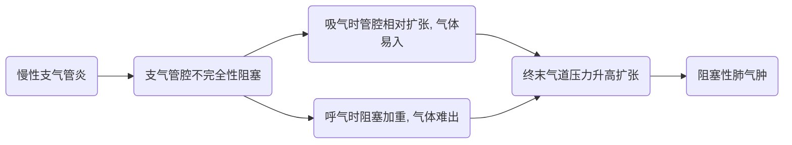
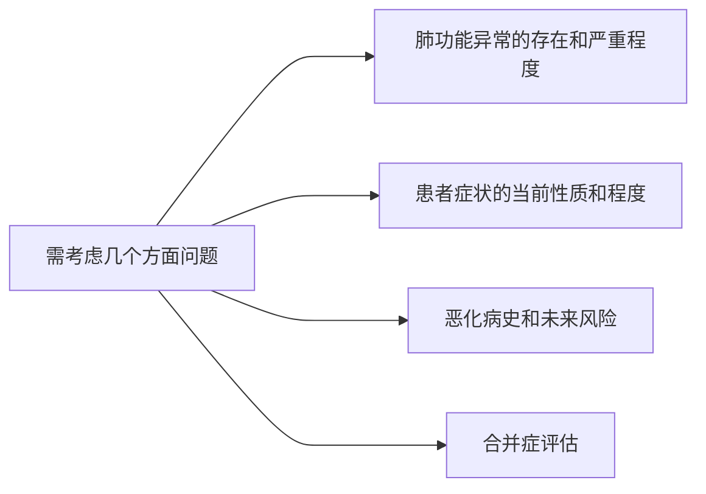

# 定义

- 慢阻肺是一种异质性肺部状态, 以慢性呼吸道症状(呼吸困难, 咳嗽, 咳痰, 急性加重)为特征, 是由气道(支气管炎, 细支气管炎)和/或肺泡(肺气肿)异常所导致持续性, 通常为进行性气流受限. 
- 慢阻肺病定义及急性加重定义不断更迭, 更加全面客观, 强调尽早诊断治疗
- COPD的主要危险因素是吸烟, 但其他环境暴露, 如生物燃料暴露和空气污染可能参与发病. 除暴露外, 个体宿主易感性也会导致COPD的发生. 其中包括基因异常, 肺发育异常和衰老. 
- 急性加重: COPD可伴有呼吸系统症状的急性恶化, 称为急性加重. 
- 大多数慢阻肺患者存在重大的共患慢性疾病, 会增加慢阻肺的致残率和死亡率. 

# 流行病学

# 危险因素

- 内因
  - 遗传因素: 
    > α1-抗胰蛋白酶缺乏, 谷胱甘肽S转移酶基因, 基质金属蛋白酶组织抑制物-2基因; 
  - 气道高反应性
  - 植物神经功能紊乱
  - 肺脏发育, 生长不良
- 外因
  - 吸烟
  - 职业性粉尘和化学物质
  - 大气污染
  - 生物燃料
  - 感染
  - 社会经济地位

## 根据危险因素分类

- **COPD-G** (遗传基因相关慢阻肺病)
  - α1-抗胰蛋白酶缺乏
  - 其他微效基因突变共同作用
- **COPD-D** (异常肺发育相关慢阻肺病)
  - 早年事件, 包括早产儿, 低出生体重
- 环境因素相关慢阻肺病
  - **COPD-C** (吸烟相关慢阻肺病)
    - 烟草烟雾暴露, 包括子宫体内暴露和被动吸烟
    - 电子烟
    - 大麻
  - **COPD-P** (生物燃料和空气污染相关慢阻肺病)
    - 室内污染, 室外污染, 野火烟雾, 职业暴露
- **COPD-I** (感染相关慢阻肺病)
  - 儿童期感染, 结合相关慢阻肺病, HIV相关慢阻肺病
- **COPD-A** (慢阻肺病哮喘重叠)
  - 特别是儿童期哮喘
- **COPA-U** (未知病因慢阻肺病)

# 发病机理

慢阻肺的特征是慢性气流受限, 由小气道疾病(阻塞性细支气管炎)和肺实质破坏(肺气肿)共同所致, 两者作用因人而异. 

慢性炎症导致结构性变化, 小气道狭窄和肺实质破坏, 导致肺泡支撑损失, 肺弹性回缩降低. 

重要的是要认识到, 慢性呼吸道症状可能会先于气流受限和可能与急性呼吸事件的发展相关. 慢性呼吸道症状可存在于 **肺功能测试正常** 的个体, 而相当多的吸烟者没有气流受限, 但存在 **肺气肿**, **气道壁增厚和气陷闭** 等不同程度肺部结构损害证据. 

## 有害颗粒和气体

> 香烟, 大气污染, 职业因素

discription: 

有害颗粒个气体, 如香烟, 大气污染和职业因素与机体因素如呼吸道感染和其他, 通过引起肺部炎症直接或间接, 如和危险因素一同抗氧化抑制氧化应激, 通过抗蛋白酶, 抑制蛋白酶活性, 共同作用下影响修复机制, 进而引起COPD病理变化.

### COPD炎症反应涉及的细胞和介质

# 病理变化

镜检肺泡壁很薄, 胀大, 破裂形成大泡, 血液供应减少

## 病理分类

- 全小叶型肺气肿
- 小叶中央型肺气肿

# 病理生理

## 分期

- 早期∶小气道(<2mm直径)功能发生异常, 大气道功能(如FEV1, 最大通气量等)正常, 常规肺功能检查正常
- 进一步发展: 肺功能异常

## 因素

- 肺泡壁因受压血供减少, 肺组织营养障碍 
- 支气管软骨破坏, 支架作用丧失
- 慢性气道炎症, 烟雾刺激释放蛋白分解酶增加
- 其它因素: 如α1抗胰蛋白酶缺乏

## 表现

- 通气不足
  > 小气道, 大气道阻塞, 通气功能下降, 残气量增加. 
- 通气/血流比例失调 
- 弥散障碍
  > 通气不足导致缺氧和二氧化碳潴留, 通气 /血流比例失调, 弥散障碍出现缺氧, 出现呼吸衰竭

# 临床表现

- 症状: 慢性起病, 反复发作和病程较长;
  - 特征性症状是慢性和进行性咳, 痰, 喘, 症状每日不同. 
    - 呼吸困难: 渐进, 持续性和特征性运动相关; 
    - 慢性咳嗽: 可能是间歇性的; 
    - 慢性咳痰: COPD患者常咳出痰液; 
- 体征: 早期无阳性体征, 并发感染时干湿啰音, 并发肺气肿时有相应体征 . 

> COPD临床症状严重程度与患者预后有关, 所以控制症状非常重要.  

## 临床病程

COPD患者由于气流受限, 从而导致气体陷闭, 肺过度充气, 进而引起气促, 呼吸困难. 呼吸困难会限制病人的运动耐力, COPD患者常常因为气促而减少活动. 

而活动的减少会使疾病进一步恶化, 最终COPD患者的健康相关的生活质量下降. 

COPD常伴有急性加重症状, 急性加重是一种疾病周期性的恶化表征, 常由于呼吸道感染引起. 

随着疾病的恶化, 病人更加容易发生急性加重, 从而使疾病更加严重. 

急性加重对于疾病有着长期的影响, 并且可以导致早期的死亡. 

## 临床分期

1. 急性加重期间
2. 稳定期

# 实验室和其他检查

1. 胸部影像学检查
   1. 肋间隙增宽, 
   2. 肋骨平行, 
   3. 膈降低且变平, 
   4. 两肺透亮度增加, 
   5. 心影狭长 
2. 肺功能检查
   - 主要检查: 用于诊断, 程度, 预后等判断; 
   - FEV1/FVC: 评价气流受限指标
   - FEV1占预计值%: 评价严重程度
   - 吸入舒张剂后FEV1/FVC<70%, FEV1占预计值%<80%, 表示不完全可逆; 
   - 其它还有RV, TLC和RV/TLC
3. 影像学检查
4. 心电图检查: 低电压, 但 *无诊断意义*
5. 血气分析: 判断呼吸衰竭
6. 血常规和痰检查 

# 诊断

## 诊断因素

症状: 咳嗽, 多痰, 呼吸困难
暴露于危险因素: 吸烟
职业: 户外/室外, 污染
肺功能测定: 最重要的因素

## 慢阻肺的评估

> COPD评估的目标是确定气流受限的水平, 其影响患者的健康状况和未来事件的风险(例如加重, 住院或死亡等), 以便最终引导治疗

> mMRC问卷

| mMAC 分级 | 呼吸困难症状 |
| --- | --- |
| 0 级 | 剧烈活动时出现呼吸困难 |
| 1 级 | 平地快步行走或爬缓坡时出现呼吸困难 |
| 2 级 | 由于呼吸困难, 平地行走时比同龄人慢或需要停下来休息 |
| 3 级 | 平地行走1.00米左右或数分钟后即需要停下来喘气 |
| 4 级 | 因严重呼吸困难而不能离开家, 或在穿衣脱衣时即出现呼吸困难 |

