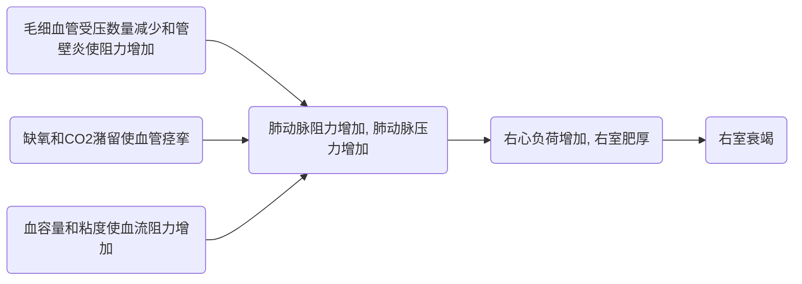

- [1. Abstract](#1-abstract)
  - [1.1. 定义](#11-定义)
  - [1.2. 概述](#12-概述)
- [2. 流行病学](#2-流行病学)
- [3. 肺源性心脏病](#3-肺源性心脏病)
  - [3.1. Abstract](#31-abstract)
  - [3.2. 病因](#32-病因)
- [4. 肺动脉高压](#4-肺动脉高压)
  - [4.1. Abstract](#41-abstract)
  - [4.2. 发病机制](#42-发病机制)
  - [4.3. 肺动脉高压的形成](#43-肺动脉高压的形成)
  - [4.4. 肺动脉高压标准](#44-肺动脉高压标准)
  - [4.5. 肺动脉高压分类](#45-肺动脉高压分类)
    - [4.5.1. PS](#451-ps)
  - [4.6. 肺动脉高压分级](#46-肺动脉高压分级)
  - [4.7. 发病机理](#47-发病机理)
  - [4.8. 临床表现](#48-临床表现)
    - [4.8.1. 肺动脉高压症状与体征:](#481-肺动脉高压症状与体征)
  - [4.9. 临床分级](#49-临床分级)
  - [4.10. 并发症](#410-并发症)
  - [4.11. 实验室和其他检查](#411-实验室和其他检查)
    - [4.11.1. 影像学](#4111-影像学)
    - [4.11.2. 心电图](#4112-心电图)
    - [4.11.3. 超声心动图检查](#4113-超声心动图检查)
    - [4.11.4. 心向量图检查](#4114-心向量图检查)
    - [4.11.5. 其他检查](#4115-其他检查)
  - [4.12. 鉴别诊断](#412-鉴别诊断)
  - [4.13. 缓解期治疗](#413-缓解期治疗)
  - [4.14. 急性期治疗](#414-急性期治疗)
  - [4.15. 其他治疗](#415-其他治疗)
- [5. 急性肺原性心脏病](#5-急性肺原性心脏病)
  - [5.1. 诊断要点](#51-诊断要点)
  - [5.2. 预后](#52-预后)
  - [5.3. Q](#53-q)
- [6. 肺脓肿](#6-肺脓肿)
  - [6.1. Abstract](#61-abstract)
  - [6.2. 病因和发病机理](#62-病因和发病机理)
  - [6.3. 分类](#63-分类)
  - [6.4. 临床分型](#64-临床分型)
  - [6.5. 临床表现](#65-临床表现)
  - [6.6. 辅助检查](#66-辅助检查)
  - [6.7. 诊断和鉴别诊断](#67-诊断和鉴别诊断)
  - [6.8. 治疗](#68-治疗)
    - [6.8.1. 抗生素使用注意](#681-抗生素使用注意)
    - [6.8.2. 慢性肺脓肿手术适应症](#682-慢性肺脓肿手术适应症)
  - [6.9. 预后](#69-预后)

# 1. Abstract

- 肺源性心脏病(简称肺心病)主要是由于支气管-肺组织或肺动脉血管病变所致肺动脉高压引起的心脏病. 
- 根据起病缓急和病程长短, 可分为急性和慢性两类. 临床上以后者多见. 
- 本病发展缓慢, 临床上除原有肺、胸疾病的各种症状和体征外, 主要是逐步出现肺、心功能衰竭以及其他器官损害的征象. 
- 慢性肺源性心脏病又称肺心病, 是由肺组织、肺动脉血管或胸廓的慢性病变引起肺组织结构和功能异常, 致肺血管阻力增加, 肺动脉压力增高, 使右心扩张、肥大, 伴或不伴有右心衰竭的心脏病. 
- 我国绝大多数肺心病患者是在慢性支气管炎或肺气肿基础上发生的. 

## 1.1. 定义

- 慢性肺源性心脏病最常见者为慢性缺氧血性肺源性心脏病, 俗称阻塞性肺气肿性心脏病, 简称肺心病, 是指由肺部胸廓或肺动脉的慢性病变引起的肺循环阻力增高, 致肺动脉高压和右心室肥大, 伴或不伴有右心衰竭的一类心脏病. 肺心病在我国是常见病, 多发病. 

## 1.2. 概述

# 2. 流行病学

- 我国肺心病发病率约为4‰,大于15岁人群约为 7‰ ,  我国肺心病患病率北方高于南方,农村高于城 市; 
- 居住在高原(如 东北、华北、西北), 日照不足又过于潮湿的西南地区及抽烟的人群患病率为高, 并随年龄的增长而增高;
- 本病占住院心脏病的构成比为46％-38.5％. 多数地区占第3、4位, 在气候严寒的北方 及潮湿的西南地区则为首位

# 3. 肺源性心脏病

## 3.1. Abstract

肺源性心脏病简称肺心病, 是由于呼吸系统疾病导致右心室结构和/或功能改变的疾病, 肺血管阻力增加和肺动脉高压是其中的关键环节. 主要临床症状是除原有支气管、肺和胸廓疾病的各种症状和体征外, 逐步出现肺、心功能障碍以及其他脏器功能损害等的表现. 

## 3.2. 病因

- 支气管肺疾病: 慢支、哮喘、支扩、肺结核、间质性肺疾病等;
- 胸廓运动障碍性疾病: 胸廓活动受限、支气管扭曲;
- 肺血管疾病: 少见, 多为结缔组织疾病或原因不明;
- 其他: 如睡眠呼吸暂停低通气综合征, 神经肌肉疾病引起肺泡通气不足, 缺氧, 肺血管阻力增加. 

# 4. 肺动脉高压

## 4.1. Abstract

- 肺动脉高压指肺动脉压力升高超过一定界值的一种血流动力学和病理生理状态, 可导致右心衰竭, 可以是一种独立的疾病, 也可以是并发症, 还可以是综合征. 
- 其血流动力学诊断标准为: 海平面静息状态下, 右心导管检测肺动脉平均压≥25mmHg. 

## 4.2. 发病机制

> 导致肺血管阻力升高和肺动脉压力升高的因素 

- 血管收缩: 属功能性, 多见于缺氧、高碳酸血症和酸中毒时: 可有多种原因, 只要其导致慢性长期改变
- 血管炎致管壁增厚、管腔狭窄甚至闭塞: 如慢支累及周围血管时
- 肺泡内血管受压: 如肺气肿时
- 肺泡毛细血管网毁损: 如肺气肿或肺大泡形成时
- 肺血管重建: 与缺氧等引起细胞因子分泌有关, 具体不详
- 血容量增多和血粘稠度升高

## 4.3. 肺动脉高压的形成

- 肺血管阻力增加的功能性因素
- 肺血管阻力增加的解剖学因素
- 血容量增多和血液粘稠度增加  　 

## 4.4. 肺动脉高压标准

- 由心、肺和肺血管疾病引起
- 海平面静息时肺A平均压≥ 35mmHg为显性肺A高压
- 静息时肺A平均压＜25mmHg, 运动后≥ 30mmHg为隐性肺动脉高压

## 4.5. 肺动脉高压分类

- 动脉型肺动脉高压: 特发性和家族性肺动脉高压; 
- 左心疾病相关肺动脉高压: 
- 呼吸系统疾病和(或)缺氧相关的肺动脉高压; 
- 慢性血栓和(或)栓塞性疾病引起的肺动脉高压; 
- 其他疾病引起的肺动脉高压

### 4.5.1. PS

- 病因分类: 
  - 原发性
  - 继发性
- 血液动力学改变分类: 
  - 毛细血管前性肺动脉高压
  - 高动力性肺动脉高压
  - 毛细血管后性肺动脉高压

## 4.6. 肺动脉高压分级

- 轻度: PAPm 32-44mmHg
- 中度: PAPm 45-55mmHg 
- 重度: PAPm > 55mmHg 

## 4.7. 发病机理

## 4.8. 临床表现

### 4.8.1. 肺动脉高压症状与体征: 

- 原发疾病的表现: 因病而异
- 肺动脉高压表现: 
  - P2亢进
  - 辅助检查: 如胸片肺动段突出、右下肺动脉干扩张等
- 右心室肥厚表现: 
  - 剑突下心脏搏动或心音增强
  - 活动后心悸
  - 辅助检查: 如胸片、心脏超声、心电图等
- 右心室扩大衰竭表现: 
  - 相对性三尖瓣关闭不全: 三尖瓣收缩期杂音
  - 上腔静脉回流受阻: 颈静脉充盈(?)
  - 下腔静脉回流受阻: 肝肿大(?)、下肢水肿、腹水
- 呼吸衰竭表现
  - 肺、心功能代偿期
    > 主要是慢阻肺的表现, 包括肺动脉高压和右室肥厚的表现
  - 肺、心功能失代偿期
    > 有呼吸衰竭和心力衰竭表现

## 4.9. 临床分级

|分级||
|:-:|:--|
|Ⅰ级|患者有肺动脉高压, 但体力活动受限, 一般体力活动不会引起呼吸困难、乏力、胸痛和头晕. |
|Ⅱ级|患者有肺动脉高压, 体力活动轻度受限, 休息是没有不适, 但一般体力活动可引起呼吸困难、乏力、胸痛和头晕. |
|Ⅲ级|患者有肺动脉高压, 体力活动明显受限, 休息是无不适, 但小于一般体力活动的运动量即可引起呼吸困难、乏力、胸痛和头晕. |
|Ⅳ级|患者有肺动脉高压并且任何活动都可引起症状的出现, 有右心功能衰竭的体征, 休息时可有呼吸困难和(或)乏力, 轻微体力活动即可引起明显的上述症状. |

## 4.10. 并发症

- 肺性脑病
- 酸碱失衡及电解质紊乱
- 心律失常
- 休克
- 消化道出血
- 弥散性血管内凝血(DIC)

## 4.11. 实验室和其他检查 

- 二图一片——协助诊断(主要是发现肺动脉高压、右心室肥厚、右心室扩大者)包括: 心电图、超声心动图和胸片
- 其他检查: 血气分析(了解呼吸衰竭情况)、血常规(感染血象)、肺功能检查(早期防治)、痰菌检查(用药)

### 4.11.1. 影像学

- 右下肺动脉干扩张, 其横径≥ 15mm; 经动态观察后动脉干横径增宽达２ｍｍ以上; 
- 中心肺动脉扩张与外周分支纤细两者形成鲜明对比, 呈"残根状". 
- 横径与气管横径之比值≥1.07; 
- 肺动脉段明显突出或其高度≥ 3mm 
- 右心室增大征: 心尖圆隆、上翘. 

### 4.11.2. 心电图

电轴右偏, 重度顺钟向转位, Rv1+Sv5 ≥1.05mV, 肺型P波

### 4.11.3. 超声心动图检查      

- 右心室流出道内径(≥30mm)
- 右心室内径(≥20mm)
- 右心室前壁的厚度(≥5mm)
- 左、右心室内径的比值(<2.0)
- 右肺动脉内径或肺动脉干及右心房肥大等指标. 

### 4.11.4. 心向量图检查

阳性率可达80-95%, 主要表现为右心增大图形

### 4.11.5. 其他检查

- 肺功能测定: 用于明确气道和肺实质病变, 重点参考一氧化碳弥散能力. 
- 肺通气/灌注扫描: 帮助判断有无肺栓塞. 
- 高分辨率CT和增强CT: 提供更详细的肺实质和肺血管影像学信息. 
- 磁共振成像: 能直接评估右室形态、大小和功能, 也能无创评估部分右心血流动力学特征. 
- 多导睡眠监测: 用于排除缺氧性肺动脉高压. 
- 心肺运动试验: 可评价心功能、气体交换能力, 最大氧耗量和EqCO2可用于预测预后. 
- 6分钟步行距离: 评价患者运动耐量的重要方法. 
- 右心导管检查和急性血管扩张试验: 右心导管检查是诊断肺动脉高压的金标准, 可准确获得肺循环及右心系统的血流动力学特征. 急性血管扩张试验用于判断患者是否对钙离子阻滞剂治疗有反应. 
- 肺动脉造影术: 排除肺栓塞、肺动脉肿瘤等. 
- 胸腔镜肺活检: 不推荐常规进行. 

## 4.12. 鉴别诊断

- 冠心病: 易合并存在
- 风心病
- 原发性心肌病: 指扩张型者

## 4.13. 缓解期治疗

> 缓解期治疗是防止肺心病发展的关键

> 原则:增强免疫力, 去除诱发因素, 减少或避免急性加重期的发生.

- 镇咳、祛痰、平喘和抗感染等对症治疗;
- 肺动脉高压治疗: 
  - 一般措施: 康复/运动和运动训练、社会心理支持、避孕、疫苗接种. 
  - 支持治疗: 抗凝药物、利尿剂、洋地黄、吸氧. 
  - 靶向药物治疗: 波生坦、安立生坦、伊洛前列素等; 
  - 介入治疗; 
  - 手术治疗: 肺动脉血栓内膜剥脱术、肺移植; 
- 康复治疗及开展家庭病 床工作能明显降低急性期的发作.  

## 4.14. 急性期治疗

- 积极治疗原发病和诱因: 感染是最常见诱因, 但也有其他如慢阻肺伴气胸时;
- 改善呼吸功能: 关键治疗措施
- 治疗心力衰竭: 上述措施效果不佳时或病情重时
  - 利尿剂: 有导致痰液粘稠不易咳出和电解质紊乱的副作用; 因此宜小剂量、作用轻、短疗程
  - 强心剂: 因耐受性差、易心律失常; 宜小剂量(1/2至1/3)、作用快排泄快静脉用药、掌握指征
  - 扩管剂: 顽固性心力衰竭者试用

## 4.15. 其他治疗

- 并发症的治疗: 主要与呼吸衰竭有关. 有肺性脑病、酸碱失衡与电解质紊乱、心律失常、休克、消化道出血和DIC. 后三种多为晚期并发症
- 营养支持治疗

# 5. 急性肺原性心脏病

本病主要由于来自静脉系统或右心的栓子进入肺循环, 造成肺动脉主干或其分支广泛栓塞, 且并发广泛肺细小动作痉挛, 使肺循环受阻, 肺动脉压急剧增高所引起的右心室急剧性扩张和右心衰竭. 

## 5.1. 诊断要点

- 病史: 常有产生栓子的原发病史; 起病急, 病人常感呼吸困难等症状等. 
- 体格检查: 肺栓塞征和心肺体征. 
辅助检查: 
  - 血白细胞数可正常或增高, 血沉增快. 
  - 心电图典型改变: 
  - X线示: 肺下叶卵圆形或三角形浸润影, 其底部连及胸膜, 亦可有胸腔积液影. 

## 5.2. 预后

- 肺心病住院病死率在15%左右;
- 主要死因依次为肺性脑病、呼吸衰竭, 心力衰竭、休克、消化道出血、弥漫性血管内凝血、全身衰竭等;
- 本病病程中多数环节是可逆的, 通过适当治疗, 心肺功能都可有一定程度的恢复, 发生心力衰竭并不表示心肌已丧失收缩力. 

## 5.3. Q

- 哪些疾病可以引起慢性肺源性心脏病?
- 试述慢性肺源性心脏病的诊断要点?
- 试述慢性肺源性心脏病急性加重期的治疗原则?

# 6. 肺脓肿

## 6.1. Abstract

- 肺脓肿(lung abscess)是由于多种病原菌引起的肺部化脓性感染, 早期为肺组织的感染性炎症, 继而坏死、液化, 外周有肉芽组织包围形成脓肿. 
  - 感染
  - 坏死性肺炎(有多个直径<2cm的空洞)
  - 多种病原菌
  - 高热、咳嗽、大量脓臭痰
  - X线示含气液平的空洞
  - 多发生于壮年, 男多于女

> 肺脓肿是指肺的局部区域液化性坏死.  

## 6.2. 病因和发病机理

- 病原菌为上呼吸道、口腔的定植菌, 需氧、厌氧和兼性厌氧菌, 多为混合型感染, 厌氧菌占主要地位. 
- 最常见病原菌: 厌氧菌(占80-90%)、金黄色葡萄球菌、化脓性链球菌、肺炎克雷伯杆菌、铜绿假单胞菌大肠埃希式菌、流感嗜血杆菌

## 6.3. 分类

- 吸入性肺脓肿
> 为最常见类型, 占60%左右. 病原体经口、鼻、咽腔吸入为肺脓肿发病的最主要原因, 常为单发性, 其发病部位与解剖结构和部位有关. 厌氧菌感染在吸入性肺脓肿中占有重要的位置,可达50-90%之多,其它还有葡萄球菌、链球菌、肺炎链球菌、梭形菌和螺旋体等混合感染. 
> 
> 好发部位: 右侧单发多见, 上叶的后段  或下叶背段. 
- 继发性肺脓肿
> 肺部病变的基础上继发感染引起; 还有异物、肺周围病变等. 
> 
> 好发部位: 临近原发病灶. 
- 血源性肺脓肿
> 常为两肺外周部的多发性病变, 致病菌以金黄色葡萄球菌、表皮葡萄球菌和链球菌为常见. 
> 
> 原发病灶可能是皮肤创伤、感染、疖痈或全身某器官组织感染灶等引起的败血症和脓毒血症, 其病原菌、脓毒栓子侵入血流进入肺循环栓塞肺小血管, 引起肺组织炎症、坏死, 形成肺脓肿. 
> 
> 好发部位: 两肺多发病灶, 常发生于两肺的外周边缘部. 

## 6.4. 临床分型

- 根据发病机制
  - 吸入性肺脓肿 (aspiration lung abscess)
  - 继发性肺脓肿 (secondary lung abscess)
  - 血源性肺脓肿 (hematogenous lung abscess)
- 根据病程长短
  - 急性肺脓肿 (acute lung abscess)
  - 慢性肺脓肿 (chronic lung abscess)
    > 迁延3个月以上不愈合

> 慢性肺脓肿三个特征
>
> 1. 脓肿部位开始时多居有关肺段或肺叶的表浅部; 
> 2. 脓腔总是与一个或一个以上的小支气管相通; 
> 3. 脓肿向外蔓延扩展, 到晚期则不受肺段、肺叶界限的限制, 而可跨段、跨叶、形成相互沟通的多房腔的破坏性病灶

## 6.5. 临床表现

急性起病, 且多数有齿、口咽部的感染灶、或手术、劳累、受凉等病史. 可有小量咯血或大咯血, 脓胸、气胸、胸膜炎等并发症. 

- 痰液分层

| 分层 | 状态 |
| --- | --- |
|上层|泡沫样痰|
|中层|粘液样成份|
|下层|坏死组织|

## 6.6. 辅助检查

1. 血WBC↑, N>90％, 慢性患者血WBC稍 升高, RBC, Hb下降; 血沉增快. 
2. 痰细菌学检查, 血培养
3. X 线检查
4. 纤支镜检查

## 6.7. 诊断和鉴别诊断

- 鉴别诊断
  - 细菌性肺炎
  - 空洞性肺结核继发感染
  - 支气管肺癌
  - 肺囊肿继发感染

## 6.8. 治疗

> 急性肺脓肿的治疗原则是抗菌和痰液引流. 

- 抗生素治疗: 首选青霉素, 强调早期、足量、疗程长. 
- 痰液引流
- 手术治疗
- 中医药治疗

### 6.8.1. 抗生素使用注意

- 肺脓肿常为需氧与厌氧混合感染, 即使培养仅有单一菌种, 选用抗菌药物也应考虑针对厌氧菌联合治疗; 
- 一般体温在治疗后3-10天降至正常, 疗程8-12周, 直至空洞和炎症消失; 
- 疗效不佳须考虑脓腔过大, 患者整体情况不良、支气管堵塞引流不畅、合并脓胸或抗菌药物选用不当等因素; 
- 并发脓胸及早胸腔闭式引流. 

### 6.8.2. 慢性肺脓肿手术适应症

- 病期在三个月以上, 经内科治疗病变未见明显吸收, 而且持续或反复发作有较多症状者; 
- 慢性肺脓肿有突然大咯血致死的威胁, 或大咯血经积极药物治疗仍不停止者, 应及时手术抢救; 
- 慢性肺脓肿如因支气管高度阻塞而感染难以控制者, 应在适当准备后进行肺切除; 
- 并发支气管胸膜瘘或脓胸, 经抽吸冲洗脓液疗效不佳者; 
- 慢性肺脓肿与其他病灶并存, 或不能完全鉴别, 如结核、肺癌、肺霉菌感染等, 也需要肺切除治疗. 

## 6.9. 预后

- 病死率约为5%-10%; 
- 预后差的情况: 
  - 脓腔较大, 尤其是直径大于6cm; 
  - 以相邻肺段内多发性小脓肿为特征的坏死性肺炎; 
  - 年龄较大, 免疫功能受损和衰弱者; 
  - 伴有支气管阻塞性的肺脓肿; 
  - 需氧菌(金葡菌和革兰氏阴性菌)所致的肺脓肿; 
  - 治疗耽误, 有症状时间超过6周者. 